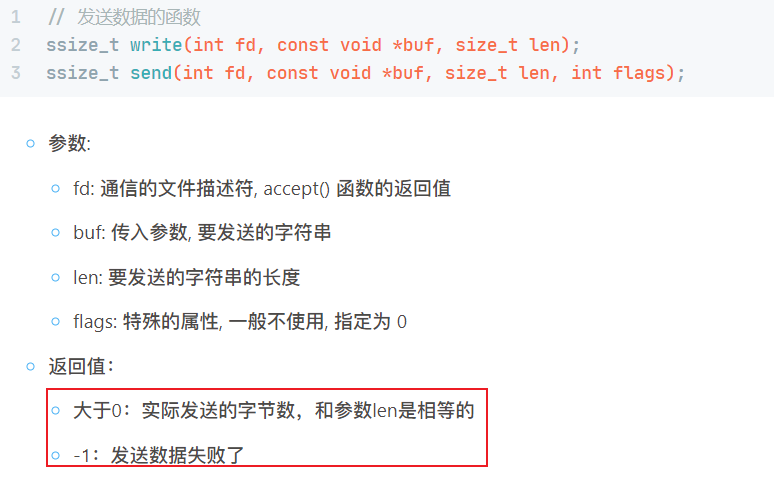
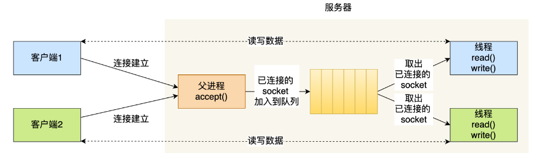

# 网络通信

- [网络通信](#网络通信)
  - [basics](#basics)
    - [1.解释端口号](#1解释端口号)
    - [2.解释一下socket](#2解释一下socket)
    - [3.解释字节序](#3解释字节序)
    - [4.IP地址转换](#4ip地址转换)
    - [5.TCP通信流程](#5tcp通信流程)
    - [6.socket API](#6socket-api)
    - [7.文件描述符与buffer](#7文件描述符与buffer)
    - [8.介绍常见结构体](#8介绍常见结构体)
  - [Code](#code)
    - [1.basic sever \& client](#1basic-sever--client)


## basics

### 1.解释端口号

**端口号就是在同一个操作系统内为区分不同应用程序（应用程序套接字）而设置的**，每个套接字对应一个port。
端口是`unsigned int`, 范围`0-2^16-1`, [0, 1023] are well-known port。一个端口只能给一个进程使用。不需要网络通信的进程就不需要绑定端口。
> 同一种套接字不可以使用相同的端口号，但tcp和udp之间可以。

### 2.解释一下socket

Socket是**应用程序和操作系统内部的协议栈**(TCP,UDP)之间的桥梁；
Socket是**应用层和传输层**之间的接口，即在传输层之上。
网络编程的大部分内容就是设计并实现**应用层**协议，根据程序特点决定服务器端和客户端之间的**数据传输规则**；而链路层、网络层和传输层已经由**套接字**自动处理了，使得程序员从这些细节中解放出来；
> 服务器是插座，等待客户端插头接入。一个插座由很多插孔，可以有很多的客户端接入。

### 3.解释字节序

网络字节序(network byte order)是大端字节序(big endian)
主机字节序(host byte order)是小端字节序(little endian)(Intel和AMD系列)

大端序(Big Endian): 高位字节放在低位地址
小端序(Little Endian): 高位字节放在高位地址

除了向socket_in结构体变量填充数据之外，其他情况无需考虑字节序问题，eg 传输数据的时候是自动转换的。

> 字节序的最小单位是字节(byte)，因此单字节没有字节序问题。而字符串是字符集合，故字符串也没有字节序问题。而int有4bytes，这种非单字节类型就得注意了。

二者之间的转换(`int..->int..`)

```c
#include <arpa/inet.h>
uint32_t htonl(uint32_t hostlong);
uint16_t htons(uint16_t hostshort);
uint32_t ntohl(uint32_t netlong);
uint16_t ntohs(uint16_t netshort);
```

IP地址(string)转换一般不用这个

> POSIX中定义的数据类型 (Portable Operating System Interface) for UNIX
>

### 4.IP地址转换

```cpp
// 适用于IPv4 6 兼容性强 用这个吧
#include <arpa/inet.h>
// 主机字节序的ip字符串 -> 网络字节序的整型ip
int inet_pton(int af, const char* src, void* dst);
// 网络字节序的整型ip -> 主机字节序的ip字符串
const char* inet_ntop(int af, const void* src, char* dst, socklen_t size);
```

```cpp
// 以下只能处理IPv4
#include <arpa/inet.h>
// 点分十进制 -> 大端整型 网络字节序
in_addr_t inet_addr(const char* string); // 还可用于检测ipv4有效性，无效返回INADDR_NONE

// 同上，使用更高频；自动将结果存于addr中； ascii to net
int inet_aton(const char* cp, struct in_addr* addr); 

// 网络字节序 -> 点分十进制
char* inet_ntoa(struct in_addr in);                 
```

### 5.TCP通信流程

  
服务器端：

- `int lfd=socket()`: 创建==监听==套接字(唯一), 这个套接字是一个文件描述符
- `bind()`: 将监听套接字与本地的IP和port进行绑定
- `listen()`: 设置监听(成功之后开始监听, 监听的是客户端的连接)
- `int cfd=accept()`: 等待并接受客户端的连接请求, 建立新的连接, 会得到一个新的==通信==套接字(N个)，**没有新连接请求就阻塞**
- `read(); write();`: 通信，读写操作默认都是**阻塞**的
- `close()`: 断开连接, 关闭套接字

客户端：

- `int cfd=socket()`: 创建一个==通信==的套接字
- `connect()`: 连接服务器, **需要知道服务器绑定的IP和端口**
- `read(); write();`: 通信，读写操作默认都是阻塞的
- `close()`: 断开连接, 关闭套接字

### 6.socket API

```c
#include <sys/types.h> 
#include <sys/socket.h>
int socket(int domain, int type, int protocol); // 返回一个用于监听的fd
int bind(int sockfd, const struct sockaddr* addr, socklen_t addrlen);
int listen(int sockfd, int backlog); // backlog指定当前可以*一次性*(还有第二次..)检测的连接请求数 maxVal=128 任务队列的容量是128
int accept(int sockfd, struct sockaddr *addr, socklen_t *addrlen); // 返回一个用于通信的fd
int connect(int sockfd, const struct sockaddr* addr, socklen_t addrlen);
// 两个读
ssize_t read(int fd, void* buf, size_t count);
ssize_t recv(int sockfd, void *buf, size_t len, int flags);
// 两个写
ssize_t write(int fd, const void *buf, size_t count);
ssize_t send(int sockfd, const void *buf, size_t len, int flags);
int close(int fd);
```

> 服务器端需要bind socket，客户端不需要，connect会自动分配采用匿名socket。

关于api的一些细节：

- bind()中的addr参数中的ip和port必须是大端模式;
- accept()的addr是客户端的地址，是一个**传出参数**，传出参数可以作为返回值来使用；当然如果你不感兴趣客户端的信息，可以写NULL(addrlen也要设置为NULL)。
- accept()的addrlen是一个**传入传出参数**，即使你可能不在乎传出的结果，但他就是要写进addrlen。
- accept()是一个**阻塞函数**，直到出现客户端向服务器发起连接，即监听fd的read buffer有请求数据。
- accept()每调用一次只能和一个客户端建立连接。
- connect()的addr和bind的addr都是const，说明不是传出参数，是一个**传入参数**，不会修改。他们的addrlen也是传入参数。
- 客户端需要绑定port吗？因为connect会自动为fd绑定一个随机的未被占用的port(ip直接使用自身即可)。服务端要固定端口，是因为客户端需要**主动**根据ip和port连接客户端。客户端随机绑定的端口会被服务端accept的传入参数addr拿到。（透彻）
- 当然如果客户端需要主动连接客户端（少见），你也可以在客户端的socket和connect之间整一个bind。
- read, recv, write, send详见: [url](https://subingwen.cn/linux/socket/)
- saddr.sin_addr.s_addr = INADDR_ANY; 方便起见指定宏INADDR_ANY，会自动读取网卡ip。这个宏实际值是0=0.0.0.0；注意不是让ip绑定为0，这是个符号。由于大小端没区别，因此无需htonl

> 传入传出参数(value-result argument)：在传递给函数时被读取，然后函数执行修改完再返回给调用者。

  
  

### 7.文件描述符与buffer

  

- 客户端监听fd只需要一个，N个客户端对应N个通信fd；客户端只有一类fd。
- **每一个文件描述符都对应内核中的两块内存**，一块内存是读缓冲区read buffer，另一块是write buffer；
- 在进行套接字通信时，调用的write, send和read, recv并不是直接把数据发送到网络中，或者直接从网络中接收数据。==而是，通过write, send把数据写入到了fd对应的内核写缓冲区中，或者通过read, recv把数据从读内核缓冲区读出来。==
- 当你write时，数据被写到fd对应的write buffer，此时，是怎么发出去的呢？我们不用关心，由内核维护。内核检测到write buffer内有数据就会自动发出去。对端接收到数据之后，数据就被存储到了fd对应的read buffer。此时，调用read或recv就可以从read buffer读出来了。
- **read和recv是阻塞函数**，当read buffer为空时。同样，**write和send是阻塞函数**，**当write buffer被写满时**。**accept是阻塞函数**，当监听fd对应的read buffer为空时（即没有客户端发送连接请求）。

> 至于应用缓冲区在什么地方，保留疑问。
> 总结：
> 1.服务端监听fd需要通过accept去进行read buffer数据检测
> 2.服务端通信fd需要通过read查看read buffer有没有客户端发送来的数据或write查看write buffer是否有剩余空间可以让我们写数据

### 8.介绍常见结构体

  

通用socket地址结构体sockaddr

```c
#include <bits/socket.h>
struct sockaddr {
    sa_family_t sa_family; // 地址族类型(sa_family_t) 16bit; 有大小原因只能用于ipv4
    char sa_data[14];
}
```

由于PF_INET地址需要6字节(16bit端口号 + 32bit ipv4地址) PF_INET6需要26字节(16bit端口，128bit ipv6, 32bit流信息, 32bit 范围ID)，所以上面的sa_data不够，so:

```c
#include <bits/socket.h>
struct sockaddr_storage {
    sa_family_t sa_family;
    unsigned long int __ss_align;
    char __ss_padding[128 - sizeof(__ss_aligh)]; // 最大128个char，即128byte；用来填充剩余空间
}
```

由于上面这个不方便使用，so搞了几个专门的socket地址结构体，IPv4，IPv6：
这些专用的结构体使用的时候，需要将其转换为sockaddr（将专用结构体指针转为sockaddr*）

```c
#include <sys/un.h>
// IPv4
struct sockaddr_in {
    sa_family_t sin_family;     // 地址族AF_INET
    uint16_t sin_port;         // 端口号 2byte 
    struct in_addr sin_addr;    // 地址结构体；设计成两个便于使in_addr被其他结构体共享复用
    char sin_zero[8];           // not use, 保证和sock_addr大小一致
}
struct in_addr {
    in_addr_t s_addr;           // ipv4地址 4byte 网络字节序
}

// IPv6
struct sockaddr_in6 {
    sa_family_t sin6_family;     // 地址族 AF_INET6
    uint16_t sin6_port;         // 端口号
    uint32_t sin6_flowinfo;     // 流信息         
    struct in6_addr sin6_addr;  
    uint32_t sin6_scope_id;     // scope id
}
struct in6_addr {
    unsigned char sa_addr[16];   // 字符数组(因为ipv6有字母!) 网络字节序
}
```

---

1.底层 I/O 函数与 ANSI 标准定义的文件 I/O 函数有何区别？

文件I/O/低级磁盘I/O，遵循POSIX相关标准。任何兼容POSIX标准的os上都支持文件I/O。
这些函数提供了对文件的基本操作，如打开、关闭、读取、写入和移动文件指针等。它们通常是操作系统提供的，**与特定的操作系统和文件系统相关**。例如，在 Unix/Linux 系统中，底层 I/O 函数可能包括 open()、close()、read()、write() 等函数。在 Windows 中，同样可以使用底层 I/O 函数（如 CreateFile()、ReadFile()、WriteFile()
> windows严格区分文件io函数和socket io函数

标准I/O/高级磁盘 I/O，遵循ANSI C相关标准。只要开发环境中有标准I/O库(eg stdio.h)，标准I/O就可以使用。
用于**实现跨平台的文件操作**。这些函数包括 fopen()、fclose()、fread()、fwrite() 等。这些函数提供了对文件的高级操作，同时也提供了对底层 I/O 函数的**封装**，使得在不同的操作系统上都能够使用相同的接口来操作文件。**抽象，可移植**。windows和linux都是这些函数

2.数据传输类型
面向连接的套接字(SOCK_STREAM)：可靠的、按序传递的、无数据边界的、基于字节的面向连接的套接字；
面向消息的套接字(SOCK_DGRAM)：不可靠的、不按序传递的、有数据边界的、以数据高速传输为目的的的套接字；
> IP层是面向消息的、不可靠的，只关注一个数据包的传输过程，不保证传输顺序；
> 底层使用简单的功能，不然你让UDP怎么办？

4.将服务器端ip设置为INADDR_ANY的作用：自动获取服务器端的ip地址；若由多个ip，只要端口一致，可以从不同ip接收数据；

5.Loopback address环回地址：用于向自身发送通信的一个特殊地址，为同一台设备上运行的应用程序之间的通信提供了一条捷径。同一台主机上的两项服务若使用环回地址而非分配的主机地址，就可以绕开TCP/IP协议栈的下层。通过ping环回地址，还可以测试本地主机上的TCP/IP配置。
> 只有当你希望将数据发送到同一台计算机上的另一个网络应用程序时，才会使用loopback地址。在这种情况下，数据从一个应用程序发送到网络堆栈，然后通过回环接口返回给同一台计算机上的另一个应用程序。

8.解释一下message boundaries 数据边界。

TCP v.s. UDP

- TCP do not preserve message boundaries (数据边界)
  - TCP收到数据后先存入buffer，只要不超过容量，则可能1次read读完全部数据，当然也可能多次read读取……即tcp中read和write调用次数没啥意义
- UDP preserves message boundaries
  - 存在数据边界意味着read次数 == write次数

所谓TCP粘包？发送方发送的若干包数据到达接收方时粘成了一包
其实并没有粘包这个词儿。。
TCP协议对于应用层来说，没有“包”的概念，只有“流”的概念，即TCP没有数据边界


## Code

TCP服务器种类：
1.单一服务器和单一客户端：即最基础的tcp服务器
2.多进程服务器：
3.多线程服务器
3.IO多路复用服务器
4.IO多路复用+多线程

1. 多进程服务器：每个客户端分配一个进程，通过fork()把父进程的东西全复制了，父进程负责监听socket，将已连接的通信socket交给子线程。
2. 多线程服务器：类似地，每个客户端分配一个线程，通过pthread_create()创建线程，将已连接socket交给线程即可；
   1. 可以考虑使用**线程池**来避免线程的频繁创建和销毁
      1. 线程池是对多线程的升级，线程的创建和销毁无需程序员进行维护。
      2. 优点：**更高效利用线程资源，避免手动管理**。
   2. 线程会共享进程的代码段、数据段、bss段、堆区和文件描述符，上下文切换的时候不用切换这些，只需要切换线程的私有栈区和寄存器，所以多线程服务器开销比多进程小很多。

  

### 1.basic sever & client

```cpp
#include <stdio.h>
#include <string.h>
#include <unistd.h> // read and write (TCP); sendto and recvfrom (UDP)
#include <arpa/inet.h> // 包含#include <sys/socket.h>

int main(int argc, char* argv[]) {
    // 1. 创建监听fd
    int fd = socket(PF_INET, SOCK_STREAM, 0); // AF_*和PF_*值完全相同，通常混用
    if (fd == -1) {
        perror("socket");
        return -1;
    }
    // 2. 绑定监听fd
    struct sockaddr_in saddr;
    memset(&saddr, 0, sizeof(saddr)); 
    saddr.sin_family = AF_INET;
    saddr.sin_port = htons(9999);
    saddr.sin_addr.s_addr = INADDR_ANY; // 宏INADDR_ANY(可以绑定本地)实际值是0=0.0.0.0；由于大小端没区别，因此无需htonl
    int ret = bind(fd, (struct sockaddr*)&saddr, sizeof(saddr));
    if (ret == -1) {
        perror("bind");
        return -1;
    }
    // 3. 设置监听
    ret = listen(fd, SOMAXCONN); // #define SOMAXCONN 128 // 最大监听队列长度 内部定义过来
    if (ret == -1) {
        perror("listen");
        return -1;
    }
    // 4. 阻塞并等待客户端连接
    struct sockaddr_in caddr;
    memset(&caddr, 0, sizeof(caddr));
    socklen_t caddr_len = sizeof(caddr);
    int cfd = accept(fd, (struct sockaddr*)&caddr, &caddr_len); // 返回通信fd
    if (cfd == -1) {
        perror("accept");
        return -1;
    }
    // 连接成功，打印客户端信息
    // char* ip; inet_pton(AF_INET, &caddr.sin_addr.s_addr, ip, sizeof(ip)); 亦可
    printf("client socket %d, Address: %s:%d\n", cfd, inet_ntoa(caddr.sin_addr), ntohs(caddr.sin_port));
    // 5. 通信
    while (1) {
        char buf[1024];
        int len = recv(cfd, buf, sizeof(buf), 0);
        if (len > 0) {
            printf("client say: %s\n", buf);
            send(cfd, buf, len, 0); // 长度指定为len 不要传多了
        } else if (len == 0) {
            printf("客户端已经断开连接...\n");
            break;
        } else if (len == -1) {
            perror("recv");
            break;
        }
    } // 跳出后说明通信结束
    close(cfd);
    close(fd);
    return 0;
}
```

```cpp
#include <stdio.h>
#include <string.h>
#include <unistd.h> // read and write (TCP); sendto and recvfrom (UDP)
#include <arpa/inet.h> // 包含#include <sys/socket.h>

int main(int argc, char* argv[]) {
    // 1. 创建通信fd
    int fd = socket(PF_INET, SOCK_STREAM, 0); // AF_*和PF_*值完全相同，通常混用
    if (fd == -1) {
        perror("socket");
        return -1;
    }
    // 2. 连接服务器
    struct sockaddr_in saddr;
    memset(&saddr, 0, sizeof(saddr)); 
    saddr.sin_family = AF_INET;
    saddr.sin_port = htons(9999);
    inet_pton(AF_INET, "127.0.0.1", &saddr.sin_addr.s_addr);
    saddr.sin_addr.s_addr = inet_addr("127.0.0.1"); // 或者直接指定ip: 172.31.78.11
    int ret = connect(fd, (struct sockaddr*)&saddr, sizeof(saddr));
    if (ret == -1) {
        perror("connect");
        return -1;
    }
    printf("socket connect successful!\n");
    // 3. 通信
    int number = 0;
    while (1) {
        char buf[1024];
        sprintf(buf, "hello, message number #%d...\n", number++); // sprintf将数据写入字符串 而非输出到标准输出流
        send(fd, buf, strlen(buf)+1, 0); // 注意这里不要发送sizeof(buf)，发送实际字符数+'\0'
        memset(buf, 0, sizeof(buf)); // 有必要清空buf的
        int len = recv(fd, buf, sizeof(buf), 0);
        if (len > 0) {
            printf("server say: %s\n", buf);
        } else if (len == 0) {
            printf("服务器已经断开连接...\n");
            break;
        } else if (len == -1) {
            perror("recv");
            break;
        }
        sleep(1); // 让客户端1秒发一条
    } // 跳出后说明通信结束
    close(fd);
    return 0;
}
```