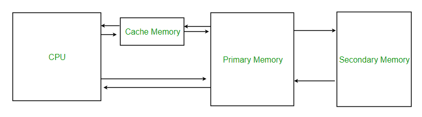
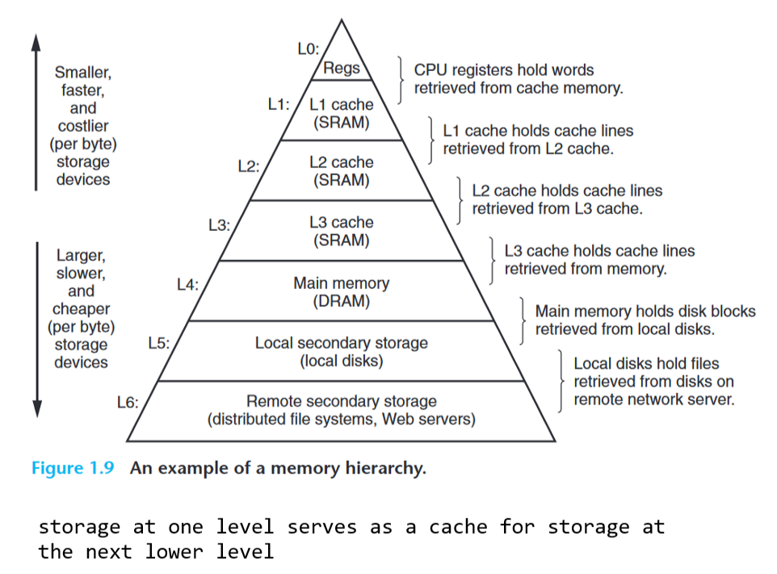
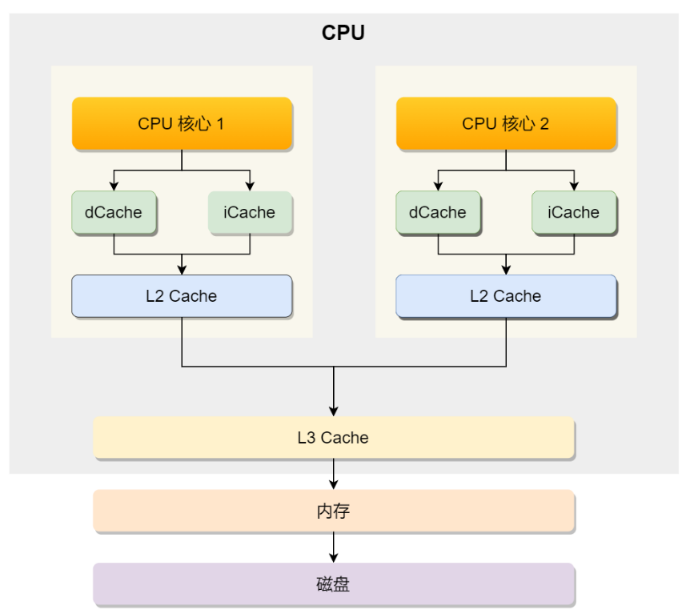

# 计算机组成原理笔记

- [计算机组成原理笔记](#计算机组成原理笔记)
  - [一、概述](#一概述)
  - [二、数据的表示和运算](#二数据的表示和运算)
  - [三、存储系统/Cache](#三存储系统cache)
  - [四、指令系统](#四指令系统)
  - [五、CPU](#五cpu)

## 一、概述

1. 冯诺依曼机的特点？

   1. 五个组成部分：运算器、控制器、存储器、输入设备、输出设备。
      1. 也有说CPU，存储器，输入设备，输出设备，总线的；
   2. 数据和指令以同等的地位存储在主存储器当中
   3. 指令和数据均用二进制代码表示，可按时间和地址区分
   4. 指令由操作码和地址码组成，操作码表示操作性质，地址码表示操作数所在位置
   5. 指令以顺序存放的。
   6. 早期冯诺依曼机以运算器为中心。

2. CPU内包括控制单元，逻辑运算单元和寄存器
   1. 控制单元(CU)：控制CPU工作（识别字符是数据还是指令，控制程序的流程）
   2. 逻辑运算单元(ALU)：负责算术运算和逻辑运算
   3. 寄存器：通用寄存器，程序计数器(PC)（存储CPU要执行的下一条指令的内存地址，可自动加一），指令寄存器（存放PC所指向的指令本身）
3. 总线：用于CPU和内存或其他设备之间的通信
   1. 地址总线：制定CPU将要操作的内存地址
   2. 数据总线：用于读写内存的数据
   3. 控制总线：用于发送和接收信号，e.g., 中断，复位，按键盘；
4. 线路位宽 & CPU位宽
   1. 线路位宽(数据/地址总线的宽度)：
      1. 数据总线位宽决定了一次能传输的数据量大小。
      2. 地址总线位宽决定了CPU能够寻址的内存容量。最好能一次性访问到所有的内存地址，如果想要操控4G内存，则需要32条地址总线。
   2. CPU位宽：指CPU一次能处理的数据位数。为了不降低效率，CPU位宽最好不小于线路位宽；
   > CPU: 32位和64位指的是cpu一次能处理的数据的长度（**字长**）（也就是寄存器的位数），源头的定义和数据总线和地址总线都没有关系（只有当计算超过 32 位数字的情 况下，64 位的优势才能体现出来）；反正32为CPU不意味着地址总线位宽为32吧，也就不意味着可处理内存最大是4G.

5. CPU结构（另一种划分方式）：
   1. 运算器Arithmetic unit：负责算数运算和逻辑运算,ALU（算术(Arithmetic)逻辑单元，运算器的核心）累加器ACC 乘商寄存器MQ（Multiply Quotient register） 通用寄存器组 移位器 计数器 变址寄存器IX(index) 基址寄存器BR 程序状态字寄存器PSW（Program State Word register）
   2. 控制器controller：
      1. 程序计数器PC（存放当前欲执行指令的地址，可自动加一形成下一条指令的地址，送到MAR）
      2. 指令寄存器IR（存放当前的指令，来自MDR，指令的操作码送到CU，地址码送到IR，用以取地址）
      3. 控制单元CU（指令译码器，时序系统，微操作信号发生器，现代有MAR MDR）

6. 什么是“存储程序”
   程序在运行前，都先存在主存储器当中，按照其在程序中的首地址执行第一条指令，然后就按照该程序规定的顺序执行其它指令，顺序程序结束。

7. 主存结构
   1. MAR（地址寄存器存放内存地址，位数对应存储单元的个数）
   2. MDR（数据寄存器暂存从存储器中读或写的信息，位数等于存储字长）
   3. 存储体（存放二进制信息，存储体由存储单元（由存储元件组成）组成）。

8. 计算机工作/程序执行的步骤？
   1. 把指令和程序装入主存储器
   2. 从程序的首地址运行程序（第一条指令的地址置于PC）
   3. 指令周期流水线
      1. Fetch取出第一条指令（PC->MAR->M->MDR->IR）
      2. Decode分析指令（OP(IR)->CU）
      3. Execution执行指令(AD(IR)->MAR->M->MDR->ACC)，完成这条指令后，计算下一条指令的地址。（我这里执行包括store数据写回(也可以单独算到4.)）
   > OP(IR): 指令操作码，指示指令类型
   > 如果是加法指令，将取出操作数地址AD(IR),送到MAR，再通过数据总线访问内存取出操作数到MDR，然后与累加寄存器ACC中的值进行加法计算，结果存回ACC。

   4.用新得到的指令地址，继续读取第二条指令执行。每条指令都是取指、译码、执行直到结束。

9. 语言
   1. 机器语言：纯二进制，机器唯一可以直接识别执行的语言
   2. 汇编语言：用单词充当助记符的机器语言。需汇编程序将其转化为机器语言
   3. 高级语言：需编译程序编译成汇编语言

10. 各种程序
    1. 汇编程序：将**汇编**语言翻译成**机器**语言的程序。
    2. 翻译程序：将**高级**语言翻译成如**汇编**语言和**机器**语言这样的程序。翻译程序包括，编译程序和解释程序。
    3. 编译程序：是将源代码**一次全部**翻译成目标代码的程序，它将一种代码文件翻译成另一种代码文件，如果源代码不修改，则不用重新编译。eg C C++
    4. 解释程序，是将源代码的**一条语句**翻译成机器代码，并立即执行。解释执行是，翻译一条源代码就执行一条，适合调试程序时使用。 eg Python JavaScript MATLAB

11. 字长
    1. 机器字长:计算机能直接处理的二进制数据的位数，一般等于内部寄存器的大小，它决定了计算机运算的精度
    2. 指令字长:是一个指令中包含的二进制代码的位数
    3. 存储字长:是一个存储单元包含的二进制代码的位数
    4. 指令字长一般是存储字长的整数倍

## 二、数据的表示和运算

   1. ASCII码：国际上用7位二进制码标识一个ASCII码，包括数字、字符、还有不可印刷的字符。

   2. 大端模式：大人高，先存高位有效字节，再存低位有效字节。与人类习惯顺序相同

   3. 常用校验码：奇偶校验码、汉明码、CRC循环码

   4. 解释各种机器数表示法的其含义表示的范围
      1. 原码：简单直观的机器数表示法。原码的0有两种表示方法
      2. 补码：正数表示和原码相同，负数等于原码的数值位取反再+1，补码加减法操作简单，0的表示唯一。（计算机使用补码表示负数）
      3. 反码：正数表示和原码相同，负数等于原码的数值位取反。
      4. 移码：常用来表示浮点数的阶码 ，它只能表示整数。移码保持了数据的顺序，便于比较大小。移码全0表示最小真值0，全1表示最大真值max
   5. 溢出的三种判别方法
      1. 采用溢出逻辑表达式
      2. 双符号位法。01正溢出、10负溢出
      3. 一位符号位判别法。如果符号位进位和最高数位相同，就没有溢出

   6. IEEE754：float有1位符号位，8位阶码(指数)，23位尾数，偏置值为127;double有1位符号位，11位阶码，52位尾数，偏置值为$2^{10}-1$;
      1. 指数位决定范围（最值）
      2. 尾数位决定小数的精度
      3. 注意：由于有一个**固定隐含位**，所以float有24个**有效**二进制位，double有53个。
         1. 隐含位：二进制浮点数的小数点左侧一定是一个1；节约一位空间；
      4. double的精度在十进制中是 15~16 位，float是 7~8 位

   7. 浮点数加减法：对阶（小阶向大阶看齐）、尾数求和、规格化、舍入

   8. 强制类型转化规则
      char->int->long->float->double，float->double最常见，转化过程没有损失。
      int转float可能有精读损失，int的32位全部用于表示数值，float有24位描述数值。

   9. 为何0.1 + 0.2 != 0.3 ?
      1. 十进制小数转为二进制：整数部分除2取余倒序，乘2取整法正序。但是：并非所有小数都有对应的二进制，比如0.1，乘2永远得不到1.0，即其二进制表示是无限循环的。由于计算机资源是有限的，故无法使用二进制精确表示0.1，只能使用近似值表示，即在有限精度的情况下，最大化接近0.1的二进制数，所以会有精度缺失的情况。（大多数计算机使用IEEE 754标准表示浮点数，该标准下的浮点数不能精确表示所有的十进制小数，比如float 23位尾数（转换为十进制的话7-8位吧maybe），double 52位）

## 三、存储系统/Cache

> 可以说cache是cpu核心和主存之前的桥梁，也可以说cache属于CPU（宽泛来看吧）
> cache是为了缓解cpu和main memory之间的差异，所以可以说cpu是比cache快的

1. 层次结构
   1. 寄存器：CPU内；32位CPU内的寄存器一般都可存储4字节；读写速度在半个时钟周期以内。
   2. Cache：SRAM
      1. L1 Cache：2-4时钟周期；分为指令缓存和数据缓存；几十KB；
      2. L2 Cache: 10-20时钟周期；几百KB
      3. L3 Cache: 30-60时钟周期；几MB
   3. 内存：DRAM：200-300时钟周期；
   4. SSD: Solid-State Disk; HDD: Hard Disk Drive
   > L1 Cache = 100 × main memory
   > main memory = 100 SSD
   > SSD = 70 × HDD
   > 大概来说: L1 Cache, RAM, SSD, HDD间隔均为100倍

2. 随机存储器RAM：任何一个单元都能随机存取，存取时间与存储单元的位置无关。主要用途是高速缓存或主存。**断电易失**。

   1. 静态SRAM（双稳态触发器）：贵，断电易失，非破坏性读出。无需刷新；Cache由SRAM制成。
   2. 动态DRAM（栅极电容）：便宜，断电易失，破坏性读出，需要刷新、再生，采用地址复用技术。主存由DRAM制成。

   只读存储器ROM：数据一次写入存储器后不能修改，只能读取，断电**非易失**。通常用来存储不变的常数、程序。ROM和RAM一起作为主存的一部分。

   串行访问存储器：对存储单元的读写要按照**物理位置的先后顺序寻址**。它包括顺序存取存储器（eg 磁带）和直接存取存储器（eg 磁盘）。

3. **时间局部性**：程序当前运行的指令或用到的数据，**在不久也可能会用到**。因为程序有循环结构。

   **空间局部性**：某个存储单元被访问，接下来它**临近的存储单元也可能被访问**。因为指令是顺序存放的，数组等数据结构所占的存储空间也是连续的。

4. 主存容量扩展方法（存储容量 = 存储字数(表示存储器的地址空间大小) * 存储字长(表示一次存取操作的数据量) ）
   1. 位扩展法（存储字长变大），使其数据位数与CPU的数据线数相同；
   2. 字扩展法（存储字数变大），高位作为片选线；
   3. 字位同时扩展法。

  

> 注意Cache是一块一块地从主存中读取数据的，而非按照单个元素。这一块叫做Cache Line（缓存块）

1. cache和主存的映射方法：（使得我们可以将大内存地址映射到很小的Cache地址里）
   1. 直接映射：只能放在固定位置（取模），命中率最低；
      1. 内存访问地址为：组标记（主存字块标记） + CPU Line索引（Cache字块标记） + 偏移量（字块内地址）；
      2. CPU Cache Line内数据：索引 + 有效位 + 组标记 + 数据块
   2. 全相联映射：随便放，命中率最高
   3. 组相联映射：能放在特定分组的随意位置

2. 如何写出CPU缓存命中率高的代码（读操作）？
   1. 提升数据缓存命中率：遍历二维数组时按照内存布局顺序访问，不要不连续、跳跃式访问。
   2. 提升命令缓存命中率：分支预测器：动态地根据历史命中数据对未来进行预测
   3. 提升多核CPU的缓存命中率：防止因为切换到不同的核心，而导致缓存命中率下降的问题，我们可以把线程绑定在某一个CPU核心上（L1和L2 cache是每个核心独有的）

3. 什么时机才把Cache中的数据写回内存？
   1. 写直达write through：把数据同时写入内存和Cache中（data同步，但开销大）
   2. 写回write back：新的数据仅仅被写入Cache Block，只在淘汰Cache块时才写回（通过脏位标记cache block和内存是否一致）（开销小，但不同步）
      1. 只有当缓存写不命中，且数据对应的cache block被标记为脏才会写回内存

4. 缓存一致性问题：两个核心的线程同时处理一个变量i，核心A更新了i还没有写回内存，此时B核心要去内存取i的话就是错误的；即A核心和B核心的缓存是不一致的。
   1. L1/L2 Cache是每个核心都有的。
   2. 如何同步不同核心中的缓存数据/实现CPU缓存一致性(总线嗅探、MESI协议)：
      1. 第一要 **写传播**write propagation：某核心cache数据更新时，要传播到其他核心的cache；
      2. 第二要 **事务的串行化**transaction serializaiton：保证不同核心对数据的操作顺序是一致的

5. cache写策略：
   1. 写命中：写直通法、写回法（只在淘汰Cache块时才写回，降低开销，但data不同步）
   2. 写不命中：写分配法（把主存块调入cache，在cache中修改，然后搭配写回法）、非写分配法（只写入主存，不调用cache，搭配写直通）

6. 伪共享 false sharing：多个线程同时读写同一个 Cache Line 的不同变量时，而导致 CPU Cache 失效的现象

7. Cache中主存块的替换算法：
   随机替换算法Random、先进先出替换算法FIFO、近期最少使用替换算法LRU、最不经常使用替换算法LFU。

7. 虚拟存储器和Cache的相同点和不同点
   相同点：1、为了提升系统性能。2、把整个存储器，划分为小的数据块，作为基本的交换单位。3、都有地址映射、替换算法、更新策略等问题。4、都是依据局部性原理，将使用频率高的数据放入高速部件中。

   不同点：1、Cache主要解决访问速度问题，虚拟存储解决主存容量问题。2、Cache全部由硬件实现，对程序员是透明的；虚拟存储器由操作系统和硬件共同实现，对系统程序员不透明、对应用程序员透明。3、不命中时，虚拟存储器不命中时对系统效率影响更大。
8.  Cache存主存块的副本数据，TLB存页表项的副本数据；

## 四、指令系统

32位操作系统是指操作系统中程序的指令是32位（os是一种程序）

0. 指令长 = 操作码 + 寻址特征 + 形式地址
1. **什么是指令？**
   指令是计算机执行某种操作的命令，是计算机运行的最小功能单位。指令包括操作码和地址码。操作码是识别指令、了解指令功能的关键信息。地址码指出被操作信息的地址。

2. 指令类型
   1. 按功能划分：
      1. 数据传输类型：store/load: 寄存器与内存之间数据传输；move: 一个内存地址的数据yidao另一个内存地址；
      2. 运算类型：加减乘除、比大小；
      3. 跳转类型：通过修改PC的值实现；if-else, switch-case, 函数调用；
      4. 信号类型：中断指令trap；
      5. 闲置类型：空转一个周期nop；

3. 数据按边界对齐和不按边界对齐的区别
   1. 数据按边界对齐时，无论数据的大小是字、字节、半字，都可以一次访存取出。虽然浪费了一定的存储空间，但可以提高取数据的速度。

   2. 不按对齐的方式存储，虽然提高了存储空间的利用效率，但是字长和半字长的数据容易存储在两个存储单元上，这样取数据的时候就好两次访存，还要调整高低字节的位置.

4. 寻址
   1. **相对寻址**：相对寻址是把PC内容加上形式地址A而形成操作数的有效地址。形式地址用补码表示。优点：操作数的地址不是固定的，它随着PC的值变化而变化，便于代码在程序内部的浮动。相对寻址广泛应用于转移指令。EA = (PC) + A

   2. **基址寻址**：基址寄存器BR的内容加上形式地址A而形成的操作数的有效地址。基址寄存器内容不变而形式地址可变。便于程序浮动，有利于多道程序设计。基址寻址面向os；EA = (BR) + A

   **变址寻址**：形式地址A加上变址寄存器的内容就是有效地址的内容。在程序执行过程中，形式地址不变，寄存器的数值不断改变，非常适合编写循环程序。变址寻址面向用户；EA = A + (IX)

5. CISC: 复杂；大于200条指令；指令字长不固定；微程序控制；X86

   RISC: 简单；小于100条指令；定长指令字长；只有load和store指令可访存；寄存器数量较**多**；组合逻辑控制；必须实现指令流水线；ARM和MIPS

6. 编译器在编译程序的时候，会构造指令，这个过程叫做指令的编码。CPU 执行程序的时候，就会解析指 令，这个过程叫作指令的解码。

## 五、CPU

1. 指令周期：CPU从主存中每取出和执行一条指令所需的全部时间称为指令周期。指令周期由机器周期组成，机器周期由时钟周期组成。指令周期可分为：取指周期、间址周期（取有效地址）、执行周期（取操作数）、中断周期（保存程序断点）。每个周期都有访存，只是目的不同。间址周期是为了取操作数的有效地址，执行周期是为了取操作数。
2. 计算机如何区分指令和数据
   从时间上讲取指令时间发生在取值周期，取数据阶段发生在执行周期；
   从空间上讲，指令取出送入控制器，数据取出送入运算器。

3. 周期
   1. **指令周期**是指CPU取出并执行一条指令所需要的时间；

   2. **机器周期**是在同步控制的机器中，执行指令周期中一步相对完整的操作所需的周期时间。（比如取址时间，译码时间...）

   3. **时钟周期**是指计算机主时钟的周期时间，它是计算机运行时最基本的时序单位。对应一个微操作所需的时间。
   > 时钟周期 = 1 / 主频
   > 程序执行时间 = 指令数 × CPI(Cycles per Instruction每条指令平均时钟周期) × 时钟周期

4. **硬布线控制器**：微操作控制信号由组合逻辑电路根据当前的操作码、时序和状态即时产生；RISC的cpu中;难扩充；繁琐；执行速度快；

   **微程序控制器**：微操作控制信号以微程序的形式存放在控制存储器中，执行指令时读出即可；cisc的cpu中
   一个指令对应一个微程序，微程序由多条微指令组成的，微指令转化成电路信号来操作各个部件，就是微命令。

5. **指令流水线**：将一条指令分为多个子过程，每个子过程与其它的子过程并行执行，以提高计算机吞吐率的手段。只需要少量的硬件，就可以使计算机的运行速度提高好几倍。是计算机经常使用的并行处理技术。

6. 影响流水线的因素：
   1. **数据相关**：在程序中，存在必须等待前一条指令执行完，才能执行后面一条指令的情况。解决方法：数据旁路技术；让后一条指令停会；

   2. **结构相关**：多条指令在同一时刻争用同一资源而形成的冲突称为结构相关。解决办法：后一条指令暂停一个时钟周期。资源重复配置（如数据cache和指令cache）

   3. **控制相关**：当流水线遇到转移指令和其它改变PC值的指令而造成的断流，会引起控制相关。解决办法：1、对转移指令进行分支预测，更好生成转移目标地址。2、取转移成功和不成功两个方向上的目标指令。
7. 总线
   1. 片内总线：cpu内
   2. 系统总线：功能部件间，分为数据总线、地址总线和控制总线
   3. 通信总线

8. 中断：系统用来响应硬件设备请求的一种机制，操作系统收到硬件的中断请求，会打断正在执行的进程，然后调用内核中的中断处理程序来响应请求。
   1. 中断处理程序要尽可能地快，一方面减少对正常进行的影响；另一方面，中断处理程序响应时，会临时关闭中断，其他设备的中断请求可能会丢失。
   2. 为了解决中断处理程序执行时间过长和中断丢失的问题，将中断过程分为两个阶段
      1. 上半部分直接处理硬件请求，即硬中断，负责耗时短的工作，快速执行。（会打断cpu正在执行的任务）
      2. 下半部分由内核触发，即软中断，完成上半部未完成的工作，耗时长，延迟执行。（以内核线程的方式执行，查询命令:`ps aux | grep softirq`）// soft interrupt