# IO多路复用

- [IO多路复用](#io多路复用)
  - [原理](#原理)
  - [Select](#select)
    - [单线程](#单线程)
    - [多线程](#多线程)
  - [Poll](#poll)
  - [Epoll](#epoll)
    - [epoll工作模式](#epoll工作模式)
      - [ET设置非阻塞模式](#et设置非阻塞模式)


## 原理

一个进程/线程实现并发

**select**: 跨平台：windows, linux都可；底层是**线性表**；有上限限制1024
poll: 底层是线性表，没有上限。
**epoll**: 底层是**红黑树**，效率高得多，没有上限。上限取决于服务器配置

在**一个**进程/线程中，我们知道服务端的`accept`, `read`, `write`是阻塞函数，如果某一个阻塞，另外两个就不能工作了，比如accept阻塞，我们就无法接收数据；当read阻塞，我们就无法检测客户端连接等等。
> 每一个fd都有一个read buffer和write buffer; refer to `network\网络通信.md`
>
> 1.服务端监听fd需要通过accept去进行read buffer数据检测
> 2.服务端通信fd需要通过read查看read buffer有没有客户端发送来的数据或write查看write buffer是否有剩余空间可以让我们写数据

因此，单线程时我们无法处理他们的阻塞，如果我们使用io多路复用技术，**这些read buffer和write buffer就不需要程序员维护了，交给了内核**。即os内核可以帮助我们同时检测若干个文件描述符，包括监听的和通信的read/write buffer。如果条件满足，就有了一个对应的事件，内核会把这些可以用于操作的fd**告诉/通知**程序员（告诉我们可读，可写），此时我们再去调用read/write就不存在阻塞了。
> 如果os通知同时有n个fd的read buffer可读，我们处理的时候是顺序执行的（单线程），或者你可以多线程并行。

即io多路复用技术就是**把本该由程序员处理的事情**(通过accept/read/write函数检测某个fd的read/write buffer是否可用)**交给了os内核**，由于内核可以同时检测多个fd的read/write buffer，然后通知程序员某事件。

---
IO多路复用与多线程并发的区别：

---

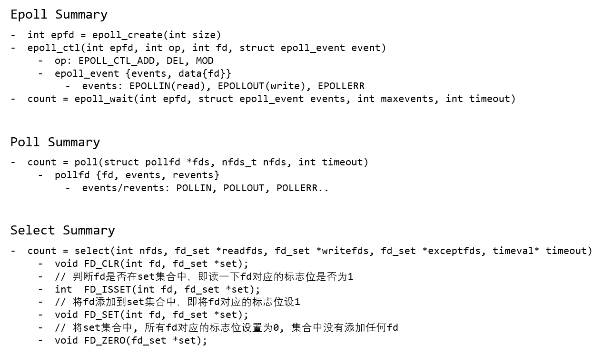  

## Select

### 单线程

我们调用select函数委托内核帮我们检测若干个fd的状态，其实就是检测这些fd对应的读写缓冲区的状态：

- 读缓冲区：检测里边有没有数据，如果有数据该缓冲区对应的fd就绪
- 写缓冲区：检测写缓冲区是否可以写(有没有容量)，如果可以，缓冲区对应的fd就绪
- 读写异常：检测读写缓冲区是否有异常，如果有，该缓冲区对应的fd就绪

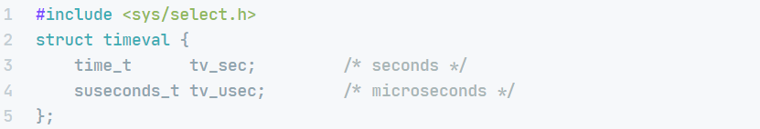  
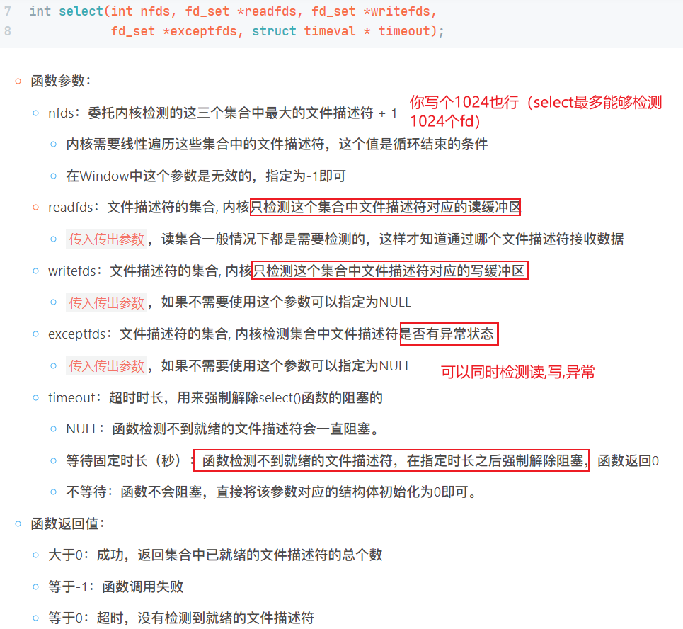
> 返回值代表集合中满足条件的fd的总个数（包括三个集合）
> timeout=NULL: 检测不到就绪的fd就一直检测（阻塞）

委托检测的fd被遍历检测完毕之后，已就绪的满足条件的fd会通过select的参数分为三个集合传出，我们就可以分情况处理这些集合了。

具体来说，select传入三个**集合地址**readfds/writefds/execptfds给内核，内核会将三个**集合拷贝**一份，然后基于线性表去遍历检测三个集合中fd的读、写、异常，然后将结果**写入到三个指针指向的内存地址**中，即内存中的数据被内核修改了。
> 三个参数是传入传出参数：需要初始化，函数处理后会将处理后的数据再次写回到对应参数

---

细节：
fd_set类型：sizeof(fd_set)=128B=1024bit，集合标志位为0代表不检测该fd状态，为1代表检测。

内核文件描述符表默认维护1024个fd
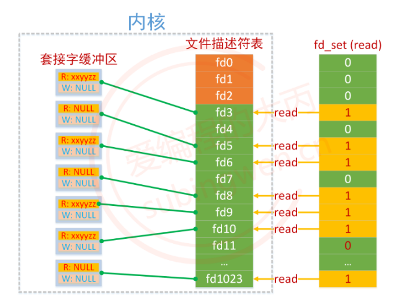  
内核拷贝一份，然后遍历，查看每一个的read buffer，然后把满足条件的fd重新写回到参数所指内存，标志位1代表read buffer有数据，0代表无。然后我们拿出1的代表read buffer有数据的fd，判断该fd是监听的还是通信的，完事儿就可以交给相应函数了。
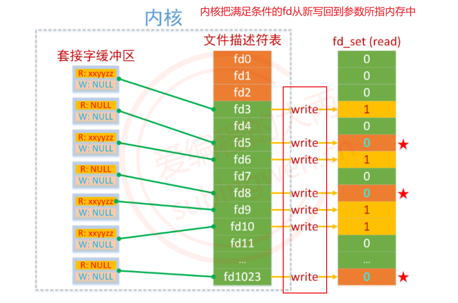  

```cpp
// 将某fd从set集合中删除，即将fd对应的标志位设为0        
void FD_CLR(int fd, fd_set *set);
// 判断fd是否在set集合中，即读一下fd对应的标志位是否为1
int  FD_ISSET(int fd, fd_set *set);
// 将fd添加到set集合中，即将fd对应的标志位设1
void FD_SET(int fd, fd_set *set);
// 将set集合中, 所有fd对应的标志位设置为0, 集合中没有添加任何fd
void FD_ZERO(fd_set *set);
```

### 多线程

基于select的**单**线程服务器虽然能够实现并发，但是**效率还是比较低的**。

基于单线程时，建立连接和通信过程是不能同时进行的，需要线性执行。如果有多个客户端同时与服务器通信，服务器需要依次处理请求，费时，so 基于select的**多**线程服务器。可以利用多核并行处理。

## Poll

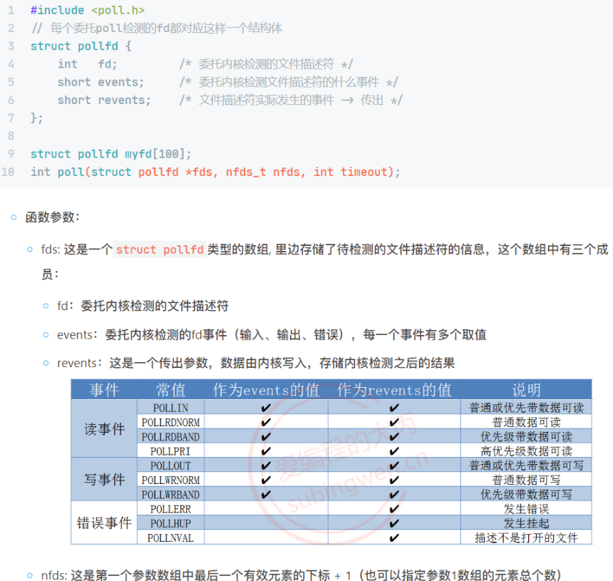  

select/poll缺陷重申：

1. 拷贝开销大：select会将读集合readfds,写集合writefds,异常集合exceptfds从用户区（堆区栈区全局数据区）**拷贝**到内核，然后内核修改完毕之后从内核**拷贝**回用户区。poll类似，会将用户去的pollfd数组拷贝到内核，改完拷贝回来。
2. 遍历开销大：内核在检测集合时是**线性遍历**的，内核改完传给用户去，用户也需要**线性遍历**。两次遍历开销很大。
3. select可检测的fd上限是1024，这是在内核中写死了的，除非你重新编译内核进行修改...poll没上限(上限是硬件能力)。但poll只能在linux上使用，select可以跨平台。

## Epoll

**如果fd数量并不是很高，大多数fd都是激活的，选择使用select或poll**，若并发量很高，采用epoll，但epoll无法跨平台。

**区别：**

1. epoll基于**红黑树**(特殊的平衡二叉树)；select基于线性表
2. epoll使用**回调机制**，不论集合大小，**效率不变**；select遍历线性表，集合增大，效率降低
3. epoll中的内核和用户区使用**共享内存**(基于mmap内存映射实现)，不进行数据拷贝操作；select会在用户区和内核区之间进行两次数据拷贝，低效。
4. epoll会直接你有几个fd就绪，且会告诉你是哪些fd就绪(通过传出参数events(里面的fd是我们在往树上添加节点时在event.data.fd中指定的))，无需遍历；select和poll会返回一个set/array，你依然不知道是**哪几个**fd就绪，依然需要在用户区进行一次遍历集合操作。
5. epoll没fd上限，取决于系统硬件，和poll一样；select上限1024个fd。

epoll将select/poll的一步操作拆分成多步完成
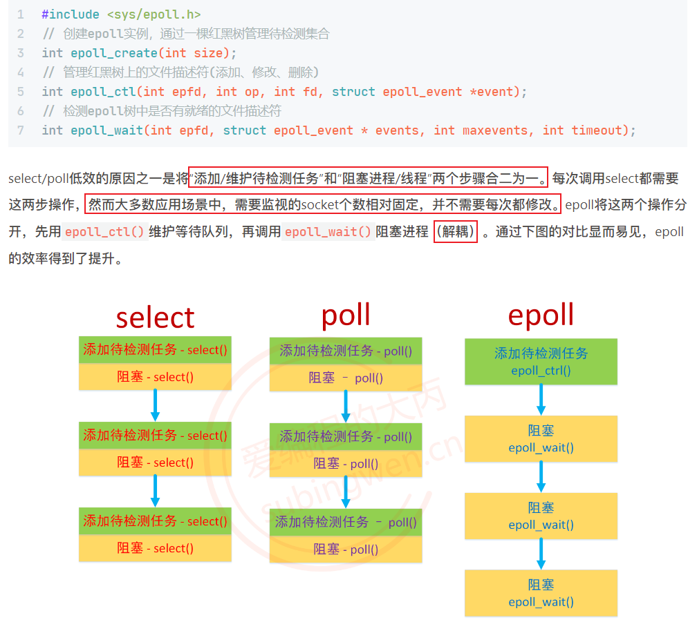  

---
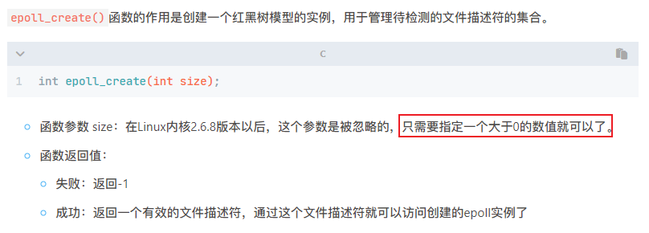  

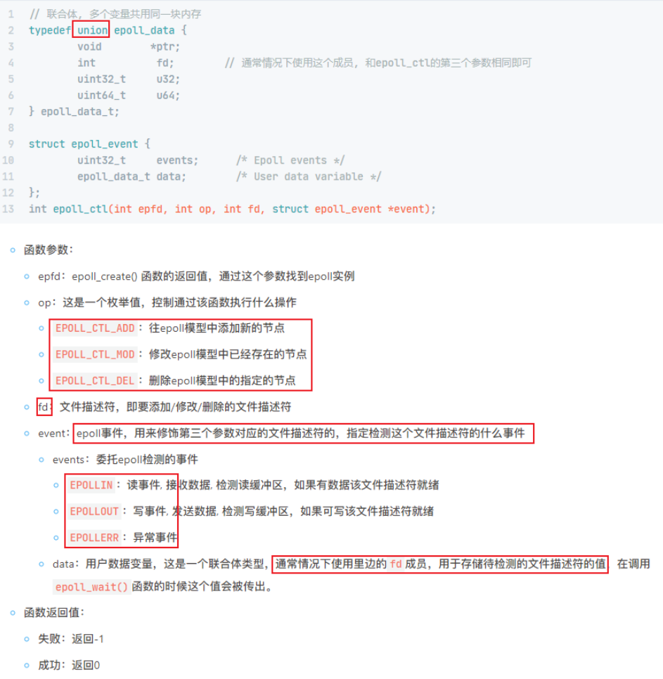  

epoll_ctl添加一个fd时，需要同时传入一个epoll_event结构体，内部会将这个fd和对应的epoll_event一并记录到epoll树上。

epoll_wait的events参数是传出参数，当wait函数检测到有就绪的fd时，会将这个fd对应的epoll_event传出（这个fd对应的epoll_event我们再epoll_ctl中设置了）
epoll_wait返回就绪fd个数。

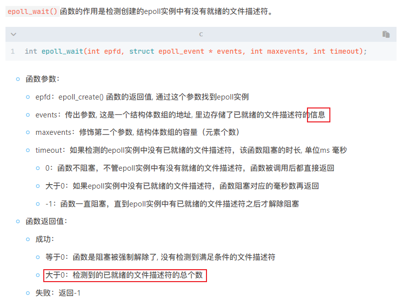  

### epoll工作模式

LT(level triggered) 水平触发模式(默认), 同时支持block和no-block socket.
ET(edge triggered) 边缘出发模式, 只支持no-block socket.

当我们epoll_wait检测到就绪的fd，如果我们不对这个就绪fd进行处理，LT模式每次检测都会通知用户(用户友好，但效率低)，ET模式只会通知一次用户，它假设使用者已经知道fd就绪了(高速，但代码复杂点)。ET模式很大程度上减少了epoll事件被重复触发的次数。
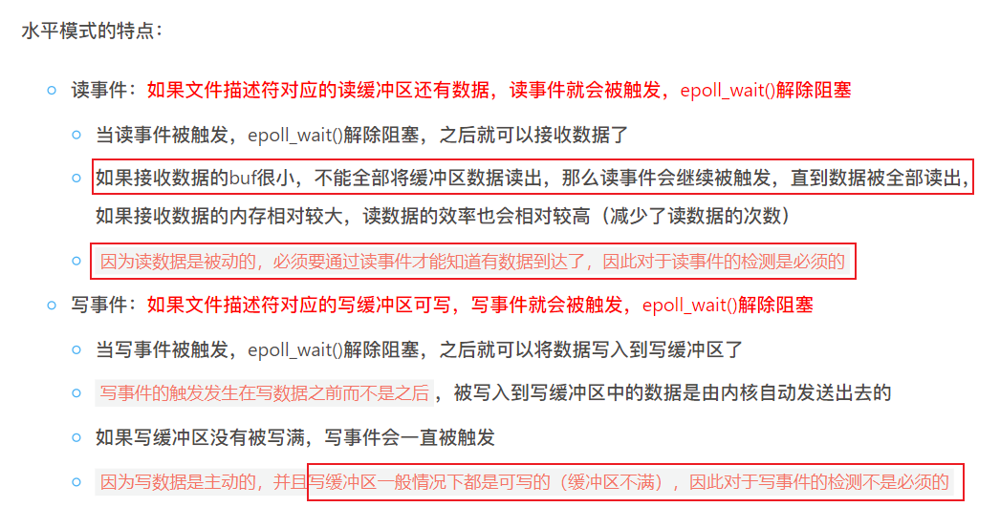  

---
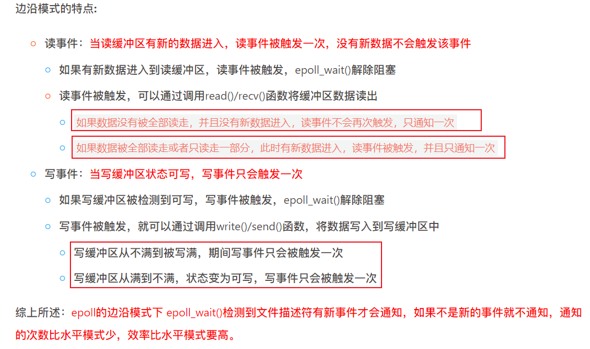  

设置边缘模式ET

```c
struct epoll_event env;
env.events = EPOLLIN | EPOLLET
```

> linux man: The events member is a **bit mask** composed by ORing together zero or more of the following available event types.
> 比如，假设 EPOLLIN 的二进制值是 00000001，EPOLLET 的二进制值是 00000010。那么 EPOLLIN | EPOLLET 的结果就是 00000011，它的二进制表示同时包含了第 0 位和第 1 位为 1。(cr chatgpt)

#### ET设置非阻塞模式

如果基于epoll的边缘模式接收数据一定要将fd改为非阻塞。
你还得知道什么时候数据接收完毕了：通过errno，recv返回的错误号是EAGIN.

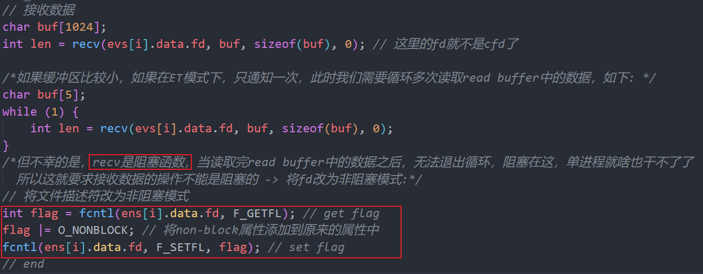  
