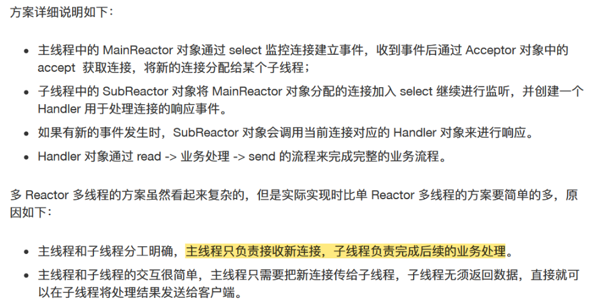

# 操作系统笔记

[toc]

  

## 一、概述

1. 开机：CPU -> 执行BIOS内的"很小的自举装入程序" -> 找到引导块并装入内存 -> 执行引导块中的“完整的自举装入程序” -> 读入FAT表的块 -> 读入根目录的块 -> 然后就可以创建文件或者运行程序了。

2. 计算机系统（Computer System）自下而上分为：硬件（hardware）操作系统（Operating System）应用程序（application）用户（User）

3. 操作系统的主要功能是什么？
   1. 处理机管理（processor management）（包括进程控制、进程同步、进程通信、调度）
   2. 存储器管理（Memory）（内存分配（静态/动态/连续/非连续分配）、地址映射（逻辑地址-->物理地址）、内存扩充（虚拟存储技术））
   3. 设备管理（device）（缓冲管理、设备分配、设备处理（启动设备、中断设备））
   4. 文件管理（file）（文件存储空间管理、目录管理、文件读/写保护

4. 操作系统的特征（characteristic）

   1. 并发 concurrence：可以在同一时间间隔处理多个进程，需要硬件支持（并发会产生一种并行的错觉）
   2. 共享 sharing：资源可被多个并发执行的进程使用
   3. 虚拟 virtual：将物理实体映射成为多个虚拟设备
   4. 异步Asynchronism：[æˈsɪŋkrəˌnɪzəm] 进程执行走走停停，每次进程执行速度可能不同，但OS需保证进程每次执行结果相同

5. **OS/Computer developing process**

   1. 无操作系统（人工操作方式）：用户独占、CPU等待人工；
      1. **1940s** ENIAC 逻辑门：真空电子管 存储器采用延迟线(delay lines) IO采用打孔纸带
      2. 能跑起来程序已经很牛逼了，程序直接使用指令操作硬件，无需画蛇添足的程序进行管理
   2. 单道批处理：内存只保存一道作业，多用户排队共享计算机
      1. **1950s** 逻辑门：晶体管；内存：磁芯；IO速度严重比cpu慢，中断机制诞生；Fortran诞生
      2. 批处理系统 = 程序自动切换（换卡片/程序）+ 提供库函数API
   3. 多道批处理：同时将多个程序载入内存，且可以灵活调度
      1. **1960s** 出现集成电路、总线；内存更大更快 -> 可以同时载入多个程序到内存，而无需换卡了；更丰富的IO设备；现代os诞生: Multics(MIT1965)
      2. 有了process的概念；丰富了进程管理的API
      3. 进程执行IO时，可以将cpu让给另一进程
         1. 虚拟存储使得多个进程之间进行地址隔离，防止一个程序的bug干掉整个系统
      4. 基于中断机制（eg时钟中断），os的调度策略进行程序定时切换
   4. **1970s** 基本具备了现在能干的所有事情：CISC指令集, PC, IO, 中断, 异常, 网络, PASCAL(1970), C(1972), Apple...
      1. UNIX(1969): 管道 grep socket procfs
         1. BSD(1977) GNU(1983) MacOS(1984) Windows(1985) Linux(1991) Debian(1996) Ubuntu(2004) iOS(2007) Android(2008) win10(2015)
            - > Linux is a kernel of OS, while GNU/Linux(Linux kernel + GNU project) is the whole OS.
            - > GNU include GCC(GNU Compiler Collection, for C), shell(Bash), etc, but do not have a kernel.
   5. **今天**的os：空前复杂, cpu, memory, io device, 应用需求更复杂

6. 特权指令Privileged instructions：IO指令、置中断指令 ----核心态（管态、内核态）kernel mode（操作系统在控制CPU）
   非特权指令：访管trap指令----用户态（目态） User mode（普通应用控制CPU）
7. 中断Interruption过程：关中断--保存断点--引出中断服务程序----保存现场--开中断--执行中断服务程序--关中断--恢复现场--开中断--中断返回

8. 系统调用：
   1. 运行在用户态的程序向os请求需要更高权限运行的服务，系统调用提供用户程序和os之间的接口。
   2. 系统调用由os核心提供，**运行在核心态**，而普通函数的调用由函数库或用户自己提供，运行在用户态。
   3. **凡是与资源有关的操作**都必须通过系统调用方式向os提出请求。

### OS结构

  

1. 内核：计算机是由各种外部硬件设备组成的，比如内存、cpu、硬盘等，如果每个应用都要和这些硬件设备对接通信协议，那这样太累了，所以这个中间人就由内核来负责，让内核作为应用连接硬件设备的桥梁，应用程序只需关心与内核交互，不用关心硬件的细节。
2. 内核的基本能力：
   1. 进程调度：管理进程、线程，决定哪个进程、线程使用 CPU；
   2. 内存管理：决定内存的分配和回收；
   3. 硬件通信：管理硬件设备，为进程与硬件设备之间提供通信能力；
   4. 提供系统调用：如果应用程序要运行更高权限运行的服务，那么就需要有系统调用，它是用户程序与操作系统之间的接口。
3. 内核空间vs.用户空间
   1. 内核空间：只给内核程序访问；用户空间：专门给应用程序访问；
   2. 用户空间的代码只能访问一个局部的内存空间，而**内核空间的代码可以访问所有内存空间**；
   3. 当进程/线程运行在内核空间时就处于内核态，而进程/线程运行在用户空间时则处于用户态。
   4. 应用程序要进入内核空间，需要通过系统调用：当应用程序使用系统调用时，会产生一个中断。发生中断后，CPU会中断当前在执行的用户程序，转而跳转到中断处理程序，也就是开始执行内核程序。内核处理完后，主动触发中断，把CPU执行权限交回给用户程序，回到用户态继续工作。
4. Linux内核设计理念：
   1. MultiTasK
      1. 并发concurrency：对于单核 CPU 时，可以让每个任务执行一小段时间，时间到就切换另外一个任务，从宏观⻆度看，一段时间内执行了多个任务。（虽然任务看起来是同时执行的，但实际上是通过快速地在任务之间切换来实现的，每个任务在任意时刻只能执行一部分）（**并发会产生一种在并行的错觉**）
      2. 并行parallelism：对于多核 CPU 时，多个任务可以同时被不同核心的 CPU 同时执行。
         1. **cpu核数=可同时运行进程数量**(并行)
         2. **进程数量>cpu核数时，进程将时分复用cpu**资源(并发)，但cpu极快，产生并行的错觉
      3.   

   2. **宏内核**：宏内核的特征是系统内核的所有模块，比如进程调度、内存管理、文件系统、设备驱动等，都运行在内核态。（Linux）
      1. 微内核架构的内核只保留最基本的能力，比如进程调度、虚拟机内存、中断等，把一些应用放到了用户空间，比如驱动程序、文件系统等。（稳定、可靠；但**频繁切换到内核态**，损耗性能；eg鸿蒙）
   3. **ELF 可执行文件链接格式**: (executable and linkable format)
   4. SMP 对称多处理
5. windows内核
   1. multiTask
   2. SMP 对称多处理
   3. **混合型内核**
   4. **PE 可移植执行文件**(portable executable)：扩展名.exe, .dll, .sys；所以windows和linux的可执行文件不能互相运行

## 二、进程管理

### 进程 线程

first of all: code只是存储在硬盘里的静态文件，编译后会生成二进制可执行文件，当我们运行该可执行文件，它会被装在到内存，接着cpu执行程序内的每一条指令，此时，这个运行中的程序，我们称之为process。

1. 进程(实体)组成：程序段program segment；数据段data segment；进程控制块process control block PCB
2. PCB：用来描述进程的数据结构，是进程存在的唯一标识。（**PCB放在所有进程共享的内核空间中，os在内核空间中通过链表管理所有进程的PCB**）
   1. PCB组成：
      1. 进程描述信息(pid, uid)
      2. 进程控制信息(进程**状态**, **优先级**)
      3. 资源分配清单(内存地址空间，虚拟地址空间，**文件列表fd**，**io设备**信息)
      4. CPU相关信息(**cpu内寄存器**的值)
   2. PCB是如何组织的?
      1. 将相同状态的进程PCB通过**链表**连接在一起形成“队列”，比如**就绪队列、阻塞队列**；（这里的“队列”不是queue，不遵循FIFO，应该就是单链表）
3. . **进程的五种状态**：创建态new；就绪态ready；运行态running；阻塞态blocked；终止态exit
   1. 
   2. 运行态->结束态：当进程已经运行完成或出错时，会被操作系统作结束状态处理；
   3. 其实还有一个挂起状态suspend，挂起状态不释放cpu，是一种主动行为; 阻塞状态释放cpu，被动行为; 分为两种：
      1. 阻塞挂起状态：进程在外存并等待某个事件的出现；
      2. 就绪挂起状态：进程在外存，但只要进入内存，即刻立刻运行；
   4. 进程各状态的控制：见p152 xiaolincoding
4. **CPU上下文切换**是：把前一个任务的CPU上下文（CPU寄存器和PC）存到系统内核(存在内核的某些数据结构中，比如pcb(内存))，然后加载新任务的上下文到这些寄存器和PC上，**然后跳转到PC所指的新位置**，执行新任务。根据任务的不同，可以分为进程上下文切换、线程上下文切换和中断上下文切换。
5. **进程上下文切换**：各进程之间是共享CPU的，在不同的时候进程之间需要切换，让不同的进程可以在CPU执行，那么一个进程切换到另一个进程运行，称为进程的上下文切换。(进程切换发生在内核态) **（过程需要重新整理）**
   1. 保存处理机上下文，包括PC和其他CPU寄存器
   2. 更新PCB信息（什么意思？？）
   3. 把进程的PCB移动到相应的队列，如就绪队列。
   4. 选择另一个进程执行，并更新其PCB。
   5. 更新内存管理的数据结构
   6. 恢复处理机上下文
6. 每一个**进程**对应一块虚拟地址空间（进程内多个线程共用）：
  

> 1.32位os的寻址空间/虚拟地址空间位32G(2^32)，即一个进程的最大地址空间为4G。
> 2.每个进程的4G地址空间中，最高1G都是一样的内核空间（即内核空间被所有进程共享），只有剩余的3G才归进程自己使用。
> 3.危险的特权指令只能在内核空间使用，进程运行在内核空间时就处于内核态。
> 4.每个进程的用户地址空间是独立的（似乎是通过虚拟内存管理使得不同进程可以共享相同的物理内存，然后每个进程都有用户区0G-3G(存疑，似乎是0-4G?)，使得每个进程都认为自己拥有整个地址空间。），但内核空间是每个进程共享的。
> 5.寄存器位于cpu内，而非虚拟地址空间

---
  

进程有自己独立的虚拟地址空间, 多个线程共用同一个地址空间。节省资源，开销少。
**==多个线程共享代码段(text)，数据段，bss段，堆区(stack)，打开的文件（文件描述符(PCB中，内核空间)）==**
**==每个线程都有自己的栈区和寄存器（内核管理）==**
7. 线程Thread：同一个进程内多个线程之间可以共享代码段、数据段、打开的文件等资源，但每个线程各自都有一套独立的**寄存器和栈**，这样可以确保线程的控制流是**相对独立**的。
   
   线程控制块TCB：包括PC，栈指针，寄存器；用户级TCB由线程库函数维护，内核级TCB由os内核维护。
8. **进程和线程的区别？**

进程是系统进行资源分配和调度的**基本**单位。
线程是os能够进行运算调度的**最小**单位，线程是进程的子任务，是进程内的执行单元。一个进程至少有一个线程，一个进程可以运行多个线程，这些线程共享同一块内存。引入线程是为了获得更好的并发性。

- **资源开销**：
  - 进程：由于每个进程都有独立的内存空间，创建和销毁进程的开销较大。进程间切换需要保存和恢复整个进程的状态，因此上下文切换的开销较高。
  - 线程：(同一进程内的)线程共享相同的内存空间，创建和销毁线程的开销较小。线程间切换只需要保存和恢复少量的线程上下文(栈和寄存器)，开销较小。
- **通信与同步**：
  - 进程：由于进程间相互隔离，进程之间的通信需要使用一些**特殊机制**，如管道、消息队列、共享内存等（比较复杂，详见进程通信section）。
  - 线程：由于线程共享相同的内存空间，它们之间可以直接访问共享数据(比如直接使用全局变量等)，线程间通信更加方便。（当然，需要一些互斥同步机制：互斥锁、条件变量、信号量；当然，进程通信的共享内存也需要同步机制：信号量、信号等）
- **安全性**：
  - 进程：由于进程间相互隔离，一个进程的崩溃不会直接影响其他进程的稳定性。
  - 线程：由于线程共享相同的内存空间，一个线程的错误可能会影响整个进程的稳定性。

9.线程的上下文切换：

   1. 当进程只有一个线程时，可以认为进程就等于线程；
   2. 当进程拥有多个线程时，这些线程会共享相同的虚拟内存和全局变量等资源，这些资源在上下文切换时是不需要修改的；
   3. 另外线程也有自己的私有数据，比如栈和寄存器。
   4. 所以线程的上下文切换：
      1. 如果两个线程不属于同一进程，那切换过程等同于进程上下文切换。
      2. 如果属于同一进程，由于虚拟内存是共享的，所以只需要切换线程的私有数据、寄存器等不共享的数据。故而线程的上下文切换开销比较小。

11.线程的实现方式有哪几种？

 1. 内核级线程kernel thread：在内核中实现的线程（由os内核管理）
    1. 在一个进程中，如果某内核线程发起系统调用而阻塞，不影响其他内核线程的运行。
    2. 线程的创建、终止和切换都是通过系统调用的方式来进行，因此对于系统来说，系统开销比较大。
 2. 用户级线程user thread：在用户空间实现的线程
     1. 由用户态的线程库实现和管理，整个线程管理和调度，os内核是不直接参与的。无需用户态和内核态的切换，速度快。
     2. 一个线程发起了系统调用而阻塞，那进程中所包含的用户线程都不能执行了。
 3. 轻量级进程light weight process：内核支持的用户线程，

12.管程是什么？
   由一组数据及对这组数据操作的定义组成的模块。同一时间只能有一个进程使用管程，即管程是互斥使用的，进程释放管程后需唤醒申请管程资源的等待队列上的进程。进程只有通过进入管程并使用管程内部的操作才能访问其中数据

<!-- 13.处理机的三级调度：

- 高级调度（作业调度）：把作业从**外存**中取出，给它分配内存和其它资源，让它称为一个进程，使其能具备竞争处理机的条件。它是主存和辅存之间的调度。
- 中级调度（内存调度）：作用是提高**内存**利用率。将那些不能运行的进程挂起到外存，如果他们已经具备运行条件，又稍微有些空闲，由中级调度决定外存上的进程重新调入内存，并修改为就绪态。
- 进程调度（进程调度）：是操作系统最基本的调度。按照某种方法从就绪队列中选取一个进程，将**处理机**分配给它。频率最高。 -->

14.不能进行进程调度和切换：中断；原子操作；进程在内核临界区。

#### 调度算法

**处理机/CPU/进程调度**dispatch/scheduling方法：当cpu空闲时，os选择内存中某个就绪状态的进程，给其分配CPU。

1. 先来先服务（First Come First Served, FCFS）(非抢占式)：对长作业有利，适合cpu繁忙型作业的系统（可以最大化利用cpu资源），不适合io繁忙型作业的系统（io会长时间占用cpu，cpu资源利用不足，而调度算法是想要充分利用cpu的）。
2. 短作业优先（Shortest Job First, SJF）:对长作业不利
3. 高响应比优先（Highest Response Ratio Next, HRRN）:权衡了长作业和短作业
   1. $响应比优先权=\dfrac{等待时间+要求服务时间}{要求服务时间}$
4. 时间片轮转（Round Robin, RR）：最古老、最简单、最公平、适用范围最广的算法。(假设所有进程同等重要)
   1. 如果时间片设置过短，那么就会造成大量的上下文切换，增大了系统开销。
   2. 如果过⻓，就退化成 FCFS 算法了。
5. 最高优先级调度（Highest Priority First, HPF）：从就绪队列选择优先级最高的进程。
6. 多级反馈队列（Multilevel Feedback Queue）：是RR和HPF的综合和发展
   1. 「多级」表示有多个队列，每个队列优先级从高到低，同时**优先级越高时间片越短**。
   2. 「反馈」表示如果有新的进程加入优先级高的队列时，立刻停止当前正在运行的进程，转而去运行优先级高的队列；

---

**内存页面置换**算法：当出现缺页异常时，需调入新页面，但此时内存已满，此时需要**选择一个物理页面换出到磁盘，然后把需要访问的页面换入到内存**。目标是尽可能减少换入换出次数。

1. 最佳置换算法 optimal replacement algorithm (OPT)：被淘汰页面是之后最长时间不访问的页面。**理想**情况，无法实现。
2. 先进先出置换算法 FIFO：会产生belady异常
   1. Belady异常：分配物理块数增大，缺页次数不减反增。
3. 最近最久未使用 least recently used (LRU)：最近没用，未来用的概率不大。
   1. 是堆栈类算法，因为他要看看之前的东西，需要寄存器和栈的硬件支持。性能接近于opt算法，但是开销较大，现实中很少使用。
   2. OPT算法是向“未来”看，LRU是向“历史”看
4. 时钟置换算法clock：性能接近LRU，开销小一些。
5. 最不常用算法 least frequently used (LFU): 将**访问次数最少**的那个页面淘汰

---

**磁盘调度算法**：优化磁盘的**访问请求顺序**，来提高磁盘的访问性能（此处指机械硬盘）
> 一次磁盘读写时间 = **寻道**时间（磁盘调度算法） + **旋转延迟**时间（交替编号、错位命名） + **传输**时间
> 一般会给一系列请求序列，代表磁道的位置。因为**寻道时间是磁盘访问最耗时的部分**，所以我们追求减少不必要的寻道时间。
> 磁道从外往内从0开始编号，一般有300-3000个磁道

1. 先来先服务FCFS：公平
2. 最短寻找时间优先算法（Shortest Seek First,SSF）：眼前最优未必总体最优
   1. 可能产生饥饿现象：因为磁头可能在一小块区域来回移动
3. 扫描SCAN算法/电梯算法：磁头移动到**最外侧磁道**才往内移动。利于端头一侧。反向移动的途中会响应请求。
4. 循环扫描CSCAN算法：规定磁头单向移动，使个位置磁道的响应频率平均。反向移动的途中不响应请求。
5. LOOK算法/改进SCAN：规定磁头移动到**最远的请求位置**，然后立即反向移动，而不需要移动到磁盘的最始端或最末端，反向移动的途中会响应请求。
6. C-LOOK算法：反向移动的途中不会响应请求。

<!-- **面向过程与面向对象的区别：（问题保留）**
面向过程让计算机有步骤地顺序做一件事，是过程化思维，使用面线过程语言开发大型项目，软件复用和维护存在很大问题，模块之间的耦合严重。面向对象相对面向过程更适合解决较大的问题，可以拆解问题复杂度，对现实事物进行抽象并映射为开发对象，更接近人的思维。
举例：大象装进冰箱。
面向过程：打开冰箱 -> 存储大象 -> 关上冰箱
对于面向过程思想，强调的是过程（动作）.语言：C。
面向对象：冰箱打开->冰箱存储大象 ->冰箱关上
对于面向对象思想，强调的是对象（实体）。语言：C++、Java、C#
特点：1. 面向对象就是一种常见的思想，符合人们的思考习惯。
1. 面向对象的出现，将复杂的问题简单化。
2. 面向对象的出现，让曾经在过程中的执行者，变成了对象的指挥者。 -->

### 进程间通信与线程间通信

#### 进程间通信 (***)

进程通信就是进程间的信息交换；进程的同步与互斥本质上也是一种进程通信(传输的是信号量，通过修改信号量使得进程之间建立联系，协调工作)
==进程的同步与互斥是对进程通信的保护机制，并非用来传输进程中真正的通信内容，但由于他们会传输信号量，所以也被纳入进程通信范畴，称作**低级通信**。==
> 少数情况下进程间只需要交换某个状态信息，这就很适合信号量；大多数情况下，进程间需要交换大量数据，也就需要其他进程通信方式了。

==每个**进程的用户地址空间都是独立**的，一般而言是不能互相访问的，但**内核空间是每个进程都共享**的，所以进程之间要通信**必须通过内核**==。 (见p197 小林总结 还不错)

> ==summary==: 匿名管道(只能用于父子进程)->命名管道(只能传输无格式字节流)->消息队列(频繁拷贝费时,无法传输大文件)->共享内存(最快，但可能冲突)->进程同步与互斥(信号量、信号)

1. **管道**pipeline：linux中的|就是管道，将前一个命令的输出作为后一个命令的输入，**单向**（半双工），如果需要相互通信(全双工)需要创建两个管道；
   1. > linux命令执行之后应该就是一个进程/线程
   2. **管道就是内核里面的一串缓存**。从管道的一端写入的数据，实际上是缓存在内核中的，另一端读取，也就是从内核中读取这段数据。
   3. |是匿名管道，用完了就销毁了；匿名管道只能用于**父子进程**之间的通信。（因为匿名管道没有实体文件，只能通过fork来复制父进程的文件描述符fd）详见p187
   4. 还有一种命名管道(FIFO)，`makefifo mypipe` ->`echo "helle" > mypipe` -> `cat mypipe`
      1. 命名管道的读取和写入操作都是阻塞的。如果没有数据可读，读取进程将被阻塞，直到有数据可用
      2. 命名管道可以在不相关的进程建通信，因为他有fd可以随意使用；
2. **消息队列**：用于解决管道不适合进程间频繁交换数据（通信效率低）的问题，克服了管道通信的数据是**无格式的字节流**的问题；消息队列是**保存在内核中的消息链表**；消息本质上是自定义的数据**结构**；
   1. 对比管道：消息队列允许多个进程写入或读取消息；可以实现随机访问(无需FIFO)；
   2. 消息队列通信过程中，**存在用户态与内核态之间的数据拷贝开销**，因为进程写入数据到内核中的消息队列时，会发生从用户态拷⻉数据到内核态的过程，反之亦然。因此，消息队列会造成频繁的系统调用，**不适合大数据**的传输。
   3. 消息队列无需避免冲突，共享内存需要。
3. **共享内存**：为了避免消息队列的频繁拷贝与系统调用开销，拿出一段虚拟地址空间，将其映射到**相同**的物理地址。(==question: 共享内存是mmap区域吗 还是在内核中==)
   1. 共享内存是**最快**的进程间通信方式：因为**只需要在建立共享内存区域时需要系统调用**，一旦建立共享内存，所有的访问都可作为常规内存访问，无需借助内核。
   2. 问题：多个进程**同时**修改同一共享内存可能引起**冲突**，所以保护机制：**信号量**上场。
   3.   
4. **信号量**：实现**进程间**的互斥与同步，本质上是一个**整形计数器**。（保证多个进程或线程能够按照一定的顺序访问共享资源。）
5. **信号**：信号是一种在软件层面上用于进程间通信或者内核向进程通知事件发生的机制。（与信号量完全不同）p192
   1. 信号是进程通信机制中**唯一的异步通信机制**，它可以在任何时候发送信号给某个进程。通过发送指定信号来通知进程某个异步事件的发送，以迫使进程执行信号处理程序。信号处理完毕后，被中断进程将恢复执行。用户、内核和进程都能生成和发送信号。
6. **Socket**：前面提到的全都是在同一台主机上进行进程间通信，那要想跨网络与不同主机上的进程之间通信，就需要 Socket通信了（当然，socket也可以用于主机内进程通信）。

#### 线程间通信

**线程**间的同步与通信类型有哪些？

由于同一进程内的线程共享进程的代码段、数据段、堆等内存地址空间，所以线程间通信比进程间通信更容易实现，直接共享全局变量即可（线程间没有像进程通信中的用于数据交换的通信机制（存疑）），但需要同步与互斥机制进行保护。

> 线程间通信主要是共享内存，侧重点在同步与互斥

 1. 互斥锁`pthread_mutex_t`
 2. 条件变量`pthread_cond_t`
 3. 信号量机制`sem_t`

详见后文。

### 多线程同步

> 实操见`os\多线程和线程同步.md`

我们知道进程是资源分配的基本单位，线程是调度的基本单位。线程会共享进程的资源，比如代码段、堆空间、数据段和打开的文件等。此外，每个线程也会有自己独立的栈和寄存器。
那么如何让多个线程在共享资源的时候不造成混乱呢？

**临界区**critical section：访问共享资源的代码段，一定不能让多线程同时执行。

**互斥**mutual exclusion / mutex：间接制约关系，当一个线程(进程)进入临界区，其他的必须被阻止进入临界区（等待）。
> 互斥并非仅针对多线程，多进程竞争共享资源的时候也可以使用互斥避免混乱。

---

我们知道在多线程里，每个线程并不一定是顺序执行的，它们基本是以各自独立的、不可预知的速度向前推进，但有时候我们又希望多个线程能密切合作，以实现一个共同的任务。

**同步**Synchronism：直接制约关系，两个线程(进程)在一些关键点上可能需要互相等待与互通消息（在时间上有先后关系）。

> 同步好比是操作A应该在操作B之前执行；互斥好比是操作A和操作B不可同时执行。
> 同步的四个准则：空闲让进，忙则等待，让权等待，有限等待

<!-- 1. 对临界资源访问过程：进入区（entry section）临界区（critical ）退出区（exit）剩余区（remainder） -->

进程/线程互斥：通过锁或者信号量实现
进程/线程同步：通过信号量实现

#### 锁

任何想进入临界区的线程，必须先执行**加锁**操作。若加锁操作顺利通过，则线程可进入临界区；在完成对临界资源的访问后再执行**解锁**操作，以释放该临界资源；

锁可以分为**忙等待锁**和**无忙等待锁**

- 忙等待锁（自旋锁spin lock）：在使用忙等待锁时，线程会反复检查锁是否可用，如果锁被其他线程持有，当前线程就会一直循环检查直到锁可用为止。这种方式会占用大量的处理器时间，因为线程会持续执行循环检查的操作。
- 无忙等待锁：将线程在无法获取到锁时放入等待队列，然后将cpu让给其他线程，直到锁可用时再唤醒线程。

#### 信号量

1.信号量semaphore是os提供的协调共享资源访问的方法；信号量表示共享资源的数量，本质上是一个整形计数器。

2.什么是PV操作？
P操作：将信号量sem减1，如果此时sem<0，表明资源已被占用，进程/线程需要阻塞等待；如果sem>=0，表明还有可用资源，进程/现成可继续执行。
V操作：将信号量sem加1，如果此时sem<=0, 表明当前有处于阻塞中的进程/线程，会将该进程唤醒；如果sem>0, 表明没有阻塞中的进程。

  

3.如何利用信号量实现临界区的互斥访问？
只需要对每一类共享资源设置一个初值为`1`的信号量`s`，表示该临界资源未被占用。然后后续在申请该资源之前进行`P(s)`操作，之后进行`V(s)`操作进行释放。
对于两个并发线程，互斥信号量的值仅取1、0和-1:
1: 表示没有线程进入临界区
0: 表示有一个线程进入临界区
-1: 表示一个线程进入临界区，另一个线程等待进入

4.如何利用信号量实现事件同步？
设置初值为`0`的信号量`s`，然后申请事件的时候P(s)，事件准备好的时候会V(s);

5.生产者-消费者问题
一个初始为空大小为n的缓冲区，
只有缓冲区没满时生产者才可以把消息放入缓冲区，否则等待； -> 同步关系 `fullBuffers=0`
只有缓冲区非空时消费者才可以从中取出消息，否则等待。 -> 同步关系 `emptyBuffers=n`
缓冲区是临界资源，任何时候只允许一个生产者或消费者进入。 -> 互斥关系 -> `mutex=1`

code比较简单；

6.哲学家进餐问题
5个哲学家和5根筷子，如果让一名哲学家拿到左右两根筷子而不造成死锁或者饥饿现象。
> 「哲学家进餐问题」对于互斥访问有限的竞争问题（如 I/O 设备）一类的建模过程十分有用
> 思维精髓是：不能贪心，要考虑后续后果。如果每人都拿一根那就死锁了。

多种方法：

- 最多允许4位同时进餐；
- 仅当一名哲学家左右两边的筷子都可拿时才拿；
- 对哲学家顺序编号，奇数号哲学家先拿左边筷子，再拿右边筷子。偶数哲学家刚好相反；

7.读者-写者问题
读者只会读取数据，不会修改数据，而写者即可以读也可以修改数据。
描述：
「读-读」允许：同一时刻，允许多个读者同时读
「读-写」互斥：没有写者时读者才能读，没有读者时写者才能写
「写-写」互斥：没有其他写者时，写者才能写
解法略 参考王道os

<!-- 1. 实现临界区互斥的基本方法：单标志法、双标志先检查、双标志后检查、皮特森算法。硬件方法（中断屏蔽和TSL指令）。信号量法。 -->

<!-- 1. 管程monitor：是由一组数据及定义在这组数据上的对数据的操作组成的软件模块，这组操作能初始化并改变管程中的数据和同步进程。
   管程的组成：局部于管程的数据，对数据结构的操作，对局部于管程的数据设置的初始化语句。（class） -->

### 各种锁

加锁的目的：保证共享资源在任意时间里只有一个线程访问。

基础：**互斥锁(mutex)**和**自旋锁(spinlock)**
当一个线程对某共享资源加锁(申请)后，其他线程加锁就会失败。二者对于加锁失败后的处理方式不同：

1. 互斥锁：加锁失败后，线程会释放cpu进行**线程切换**。
   1. 线程释放cpu，即线程被阻塞（==阻塞会释放cpu，从用户态陷入内核态，因为需要内核来管理状态，在合适的时候重新将其调度为可执行状态==），锁释放后os内核会在合适的时机唤醒线程。但这其中开销不小：**两次线程上下文切换的成本**：运行->阻塞->就绪
   2. 上下切换的耗时大概在几十纳秒到几微秒之间，如果你锁住的代码执行时间比较短，那**可能上下文切换的时间都比你锁住的代码执行时间还要⻓**。
   3. 所以：**如果你能确定被锁住的代码执行时间很短，应该选用自旋锁代替互斥锁**
2. 自旋锁：加锁失败后，线程会**忙等待**，直到拿到锁
   1. 自旋锁在用户态完成加锁解锁操作，不会主动产生线程上下文切换
   2. 基于CAS(compare and swap)原子指令
   3. 自旋锁比较简单，一直自旋，利用CPU周期，直到锁可用。需要注意，在单核CPU上，需要**抢占式的调度器**（即不断通过时钟中断一个线程，运行其他线程）。否则，自旋锁在单CPU上无法使用，因为一个自旋的线程永远不会放弃CPU。（大概是说还是可以调度给其他线程使用，但一调度到自个儿的这段时间，就是一直在自旋利用cpu）

> 忙等待：不断循环检查某个条件是否满足，而不进行实质性的工作，却不断占用cpu进行检查

---

读写锁：用于能明确区分读操作和写操作的场景
> 读写锁是一把锁，但可以做两件事情。可以锁定读和锁定写操作。

读写锁的工作原理是：（读锁共享，写锁独占，写优先级高）
1.当**写锁**没有被线程持有时，多个线程能够并发地持有**读锁**，这大大提高了共享资源的访问效率， 因为读锁是用于读取共享资源的场景，所以多个线程同时持有读锁也不会破坏共享资源的数据。
2.一旦**写锁**被线程持有后，读线程的获取**读锁**的操作会被阻塞，而且其他写线程的获取**写锁**的操作也会被阻塞。
> 跟读者写者问题一毛一样：允许读读，互斥读写，互斥写写
> 即写锁是**独占锁**，读锁是**共享锁**
> 读写锁**在读多写少的场景有优势**

1. 读优先锁：当读线程A先持有了读锁，写线程B在获取写锁的时候，会被阻塞，并且在阻塞过程中，**后续来的读线程C仍然可以成功获取读锁**，最后直到A和C释放读锁后，B才可以成功获取写锁。
   1. 读锁能被更多的线程持有，以便提高读线程的并发性；会导致写线程饥饿
2. 写优先锁：当读线程A先持有了读锁，写线程B在获取写锁的时候，会被阻塞，并且在阻塞过程中，**后续来的读线程C获取读锁时会失败**，于是读线程C将被阻塞在获取读锁的操作，这样只要A释放读锁后，写线程B就可以成功获取读锁。
   1. 优先服务写线程，会导致读线程饥饿
3. 公平读写锁：用队列把获取锁的线程排队，不管是写线程还是读线程都按照先进先出的原则加锁即可，不会出现饥饿

---
乐观锁与悲观锁

1. **悲观锁**：假定多线程同时修改共享资源的概率比较高，很容易出现冲突，所以访问共享资源前，先要上锁
   1. 包括互斥锁、自旋锁、读写锁
2. **乐观锁**：假定冲突的概率低：**先修改完共享资源，再验证这段时间内有没有发生冲突**，如果没有其他线程在修改资源，那么操作完成，如果发现有其他线程已经修改过这个资源，就**放弃**本次操作
   1. 你会发现乐观锁全程并没有加锁，所以它也叫**无锁编程**
   2. **git**实际上就使用了乐观锁的思想：先让用户编辑代码，然后提交的时候，通过版本号来判断是否产生了冲突，发生了冲突的地方，需要我们自己修改后，再重新提交
   3. 乐观锁虽然不用加锁解锁，但一旦发生冲突，重试的成本非常高，所以只有在**冲突概率非常低**，且**加锁成本非常高**的场景时，才考虑使用乐观锁。

### 死锁

在**多线/进程编程**中，我们为了防止多线程竞争**共享资源**而导致数据错乱，都会在操作共享资源之前加上**互斥锁**，只有成功获得到锁的线程，才能操作共享资源，获取不到锁的线程就只能等待，直到锁被释放。
如果互斥锁应用不当，可能会造成**两个线程都在等待对方释放锁**，所谓死锁。

0. **死锁deadlock**：**多个进程在竞争系统资源时，由于互相等待对方释放资源而无法继续执行的状态**。（僵局，需要外力）
   1. 原因：对互斥资源分配不当；进程推进顺序不当。
1. 死锁的四个必要条件：
   1. 互斥条件: 多个进/线程不能同时使用同一资源
   2. 请求与保持条件: 一个线程因为请求资源而阻塞的时候，不会释放自己的资源
   3. 不可剥夺条件: 资源不能强制性地从一个进程中剥夺，只能由持有者自愿释放
   4. 循环等待条件: 存在一种进程资源的循环等待链，链中每个进程已获得的资源同时被链中下一个进程所请求。
2. 死锁排查：`pstack: 查看指定进程的栈跟踪信息(函数调用过程)` + `gdb`
3. 如何避免死锁？
   1. 破坏请求与保持条件：一次性申请所有的资源。
   2. 破坏不可剥夺条件：占用部分资源的线程进一步申请其他资源时，如果申请不到，可以主动释放 它占有的资源。
   3. 破坏循环等待条件：靠按序申请资源来预防（**资源按序分配法**）。让所有进程按照相同的顺序请求资源，释放资源则 反序释放。
4. 死锁deadlock与饥饿hunger的区别？
   1. 都是资源分配问题
   2. 死锁是等待永远不会释放的资源，而饥饿申请的资源会被释放，只是永远不会分配给自己
   3. 一旦产生死锁，则死锁进程必然是多个，而饥饿进程可以只有一个
   4. 饥饿的进程可能处于就绪状态，而死锁进程一定是阻塞进程

## 三、内存管理

### （一）基础：将多个进程保存到内存中

1. 内存管理功能：内存空间的分配与回收、地址转换（VA->PA）、扩充内存空间（虚拟存储技术逻辑上扩充）、存储保护（利用界地址寄存器保护os不受用户进程影响）。

> - C语言中使用`printf("%p", (void*)&variable)`打印变量的地址时，&variable返回的是变量的虚拟地址。这是因为：程序的视角：从程序的角度来看，它只知道虚拟地址。物理地址是由操作系统和硬件层面处理的，程序本身无法直接访问。安全和隔离：暴露物理地址会带来安全风险，也会破坏进程间的隔离性。
> - 之所以采用虚拟地址：
> (1) 进程隔离：每个进程都有自己的虚拟地址空间，互不干扰。
> (2) 内存保护：操作系统可以控制进程对内存的访问权限，防止非法访问。
> (3) 灵活的内存管理：可以更容易地进行内存分页和交换，提高内存使用效率。

1. **C语言运行过程/源程序->目标程序**：

   源程序(hello.c )->可执行文件(hello)
   1. 预处理阶段（预处理器cpp）：对#开头的命令进行处理，eg #include <stdio.h>将.h文件插入程序。输出文件hello.i;
   2. 编译阶段（编译器ccl）：生成汇编语言源程序hello.s；
   3. 汇编阶段（汇编器as）：将hello.s翻译成机器指令，打包成一个可重定位目标文件hello.o；**目标文件都从0开始编址，都是独立的==逻辑地址==/相对地址**
   4. 链接阶段（链接器ld）：将多个目标文件和所需库函数**打包**为一个可执行目标文件hello.exe；**可执行模块具备完整的==逻辑地址==**
   5. 装入：由装入程序把exe文件装入内存运行；**将逻辑地址转为物理地址（地址重定位），装入到实际的物理地址**

<!-- 3. 内存保护的方式：

   1. 上下限寄存器法：存放用户作业在主存中的上下限地址。
   2. 重定位寄存器（基址寄存器）和界地址寄存器（限长寄存器）组合法。
      1. 界地址寄存器含有逻辑地址的最大地址，是用来“比较”的；重定位寄存器含有物理地址最小值，是用来“加”的。 -->

1. 逻辑地址virtual 与 物理地址physical：

   1. **逻辑地址（虚地址/相对地址/人的视角）**：编译(汇编)后每个目标模块都从0开始编制，叫做相对地址或逻辑地址。

   2. **物理地址（实地址/机器视角）**：是地址转换后的最终地址。装入程序将代码装入内存，必须将逻辑地址变成物理地址，称为**地址重定位**。
      1. os如何管理VA和PA之间的关系？内存分段和内存分页。

---

1. 有哪些**连续**分配内存管理方式？

   1. 单一连续分配：将内存分成系统区（低地址）和用户区。优点：简单、无外部碎片；缺点：适用于**单道程序**（整个用户只存放一道程序），有**内部碎片**，内存利用率非常低。
      1. 内部碎片：**已分配**给某进程的内存空间大于该**进程实际需要**的空间。
      2. 外部碎片：内存中已分配的分区外的存储空间越来越多的碎片难以利用。一般都是进程退出后留下的小块空闲块。
   2. 固定分区分配：将内存空间划分成大小固定的分区，每个分区只装入一个作业。分区大小可以相等也可以不等。优点：可以多道程序; 缺点:分区固定不变，程序不能太大，否则放不进去，有**内部碎片**；内存利用率低。
   3. 动态分区分配：不预先划分分区，而是等进程装入内存时再动态建立分区。优点是：可以使分区大小刚好合适。缺点是：会产生较小的**外部碎片**分配不出去。
      1. 动态分区分配的四种算法：
         1. 首次适应 first fit：空闲分区按地址递增链接。
         2. 最佳适应 best fit：空闲分区按容量递增链接。
         3. 最坏适应 worst fit：按容量递减。会留下很多外部碎片。
         4. 邻近适应 next fit：从首次适应基础上，在上次查找结束位置继续查找。

2. **非连续**分配管理：将一个程序**分散地装入不相邻的内存分区**（当然需要额外空间存储各区域的索引作为代价）
   1. 按照分区大小是否固定分为：分页存储管理方式和分段存储管理。
   > 分页存储管理方式根据作业时是否把作业的所有页面都装如内存才可运行分为：基本分页 + 请求分页(虚拟内存)。
3. 页式内存管理中的**页表**是什么，多级页表呢？
   1. 页表：进程页号 -> 物理内存块号（mapping）
      1. 页表项 = 进程页号 + **内存物理块号**
         1. 所以页表项中的内存物理块号 + 逻辑地址中的页内偏移量共同组成物理地址；
      2. 一个进程对应一张页表。（一个进程对应一个自己的虚拟地址空间）
   2. ⻚表一定要覆盖全部虚拟地址空间，不分级的⻚表就需要有 100 多万个⻚表项来映射，而二级分 ⻚则只需要 1024 个⻚表项（此时一级⻚表覆盖到了全部虚拟地址空间，二级⻚表在需要时创建）

4. 描述**页式存储管理**。
    1. 把主存空间物理上划分为大小相等且固定的块（页框/页帧）；与固定分区相似，不会产生外部碎片，但这里的块相比于分区要小得多。只有在为进程最后一个不完整的页申请主存块的时候才会产生大概半个块的内部碎片，洒洒水啦。
    2. 每个进程逻辑上以块（页/页面）为单位划分，在执行时以块为单位申请主存中的块空间。
    3. 逻辑地址Logical address = 进程页号 + **页内偏移量**；(地址结构决定了虚拟内存的寻址空间大小)
    4. 进程的页映射到物理内存的块

   逻辑地址 -> 物理地址(核心在于**先找到页表项PA**，然后concat(表项的物理块号, LA的页内偏移量)即可)：
   1. 根据页面大小L，计算出逻辑地址LA的页号(LA/L)和页内偏移量(LA%L)。
   2. 由逻辑地址中的页号与PTR中的页表长度对比，若大，则越界，发生中断。
      1. 页表寄存器PTR中存放页表内存始址 + 页表长度（页表项个数）
   3. 若页号合法：页表项地址 = 页表始址 + 页号 * 页表项长度（页表项(页地址)占用存储空间）。
   4. 物理地址PA = 页表项中块号 + 逻辑地址中的偏移量。
5. 介绍一下快表TLB：
    1. 由于页式存储管理在地址变换时，需要两次内存访问：访问页表（确定所需要的数据或者指令的PA）+ 取数据/指令；故设置快表TLB，充当页表的cache，一个专门的高速缓冲存储器。与之相对的主存中的页表称作慢表。
    2. 引入TLB的地址变换：
       1. 首先将页号与快表的所有页号进行比较，如果命中，直接取出物理块号。即可与LA的页内偏移量形成PA；（仅一次访存）
       2. 若未命中，还是去访问主存中的页表，**同时将其存入快表**。
          1. 一般快表命中率可达90%；又是局部性原理咯。
6. 介绍多级页表：
    1. 当逻辑地址空间很大时，页表长度会大大增加。需要一块比较大的连续物理空间存储，这不好。
    2. 二级页表时 逻辑地址 = 一级页号 + 二级页号 + 页内偏移量
    3. 缺点就是增加了一次访存时间。
7. 描述**段式存储管理**。
    1. LA = 段号 + OFF
    2. 段表项 = 段号(**不占空间(why)**) + 段长 + 本段在主存中始址
    这种管理方式考虑到了程序员的感受，以满足方便编程、信息保护和共享、动态增长及动态链接等要求。它按用户进程中的自然段划分逻辑空间，每个段从0开始编址，并分配连续的地址空间。段内连续，段之间可以不连续。

    逻辑地址->物理地址（与页式类似）
    - 段表项地址 = 段表起始地址 + 段号 × 段表项长度
    - 物理地址 PA = 页表项中本段起始地址 + LA中段内偏移量

### （二）虚拟内存管理

（所以虚拟地址在虚拟内存之前就出现了？那么va的本意是？）
为了在多进程环境下，使得进程之间的内存地址不受影响，相互隔离，于是操作系统就为每个进程独立分配一套虚拟地址空间，每个程序只关心自己的虚拟地址就可以，实际上大家的虚拟地址都是一样的，但分布到物理地址内存是不一样的。作为程序，也不用关心物理地址的事情。
既然有了虚拟地址空间，那必然要把虚拟地址「映射」到物理地址，这个事情通常由操作系统来维护。 那么对于虚拟地址与物理地址的映射关系，可以有分段和分⻚的方式，同时两者结合都是可以的。

1. 为什么要引入虚拟内存？
   1. 主要目的是为了扩展计算机的内存空间，使得可以运行更大的程序或处理更多的数据。
   2. 为每个进程提供了一个独立的虚拟内存空间，使得进程以为自己独占全部内存资源。避免内存冲突。

2. 我们在上面介绍了各种内存管理策略，目的在于同时将多个进程保存在内存中，实现多道程序设计。但他们存在一定的缺陷（总而言之，许多在程序运行中不用或暂时不用的程序或数据占据了大量内存，造成浪费）：
   1. 一次性：作业必须一次性全部装入内存后才可开始运行。
      1. 作业很大内存不够就跑不了；
      2. 作业很多的话，不够同时运行多个作业了。
   2. 驻留性：作业被装入内存后会一直驻留在内存中，直至运行结束。

3. **虚拟存储器**：基于**局部性原理**，将程序的一部分装入内存，而将其与部分留在外存，就可以启动运行程序。在执行过程中，程序要访问的信息不在内存，由操作系统将所需的部分调入内存执行。操作系统将暂时不用的内容换出到外存上，空闲空间存放从外存换入的信息。这样操作系统就**好像**为用户提供了一个比实际内存大得多的存储器。
   1. 之所以叫做虚拟存储器：是因为os提供了部分装入、请求调用和置换功能后，给用户的感觉好像是存在一个比实际物理内存大得多的存储器。
   2. 虚拟存储器的大小由计算机的地址结构决定，而非内存和外存的求和。虚存实际容量≤内存+外存；虚存最大容量≤计算机的地址位数能容纳的最大容量。
   3. 虚拟存储器与前面的内存策略不同，有三个主要特征
      1. 多次性：无需在作业运行时一次性全部装入内存
      2. 对换性：无需再作业运行时一直常驻内存，允许作业进行换进和换出
      3. 虚拟性：从**逻辑上**扩充了内存的容量，使得用户看到的内存容量远大于实际内存

4. 虚拟存储技术所需硬件支持：页表(段表)机制、缺页中断机构、地址变换机构、一定容量的内存和外存。
5. 虚拟内存的三种实现方式与前面对应，称作：请求分页存储管理、请求分段存储管理和请求段页式存储管理
6. 介绍一下请求分页存储管理
   1. 请求分页存储管理 = 基本分页存储管理 + 请求调页功能 + 页面置换功能
   2. 页表项 = 进程页号 + 内存物理块号 + 状态位(是否已调入内存) + 访问字段(访问次数或时间，供置换算法) + 修改位(页面调入内存后是否修改) + 外存地址(供调页使用)
   3. 地址变换机构：先查快表，若命中直接形成PA，否则 -> 查慢表，若命中形成PA，否则 -> 发生中断，请求调页。
7. 页面置换算法（决定换入哪页，换出哪页，输入io操作）：
   1. 见第二章
   <!-- 1. 最佳置换算法 optimal replacement algorithm：被淘汰页面是之后最长时间不访问的页面。**理想**情况，无法实现。
   2. 先进先出置换算法 FIFO：会产生belady异常
      1. Belady异常：分配物理块数增大，缺页次数不减反增。
   3. 最近最久未使用 least recently used（LRU）：最近没用，未来用的概率不大。
      1. 是堆栈类算法，因为他要看看之前的东西，需要寄存器和栈的硬件支持。性能接近于opt算法，但是开销较大。
   4. 时钟置换算法clock：性能接近LRU，开销小一些。 -->

8. 驻留集resident set：分配给进程的物理页框数。
9. 工作集working set：某时间间隔内，进程要访问的页面集合。
10. 抖动/颠簸page jitter：刚刚换出的页面又要换入主存。

**总结**
为了避免不同的进程操控到同一块物理内存地址，遂引入虚拟地址进行抽象和隔离，每个进程都有一块独立的虚拟内存空间，不同进程的虚拟空间会映射到不同的物理内存上（地址变换机构借助页表实现这件事情，即使相同的逻辑地址也可以映射到不同的物理地址），由于总的虚拟内存空间肯定比物理内存大的多（而且我们需要实现多道批程序设计，不能让每一个进程完全装在到内存中），我们会为进程按需分配内存；还有当物理内存不足的时候，我们会进行页面置换。
对于虚拟内存中，为了减少页表空间占用，引入多级页表；为了加速地址变换，引入快表。

## 四、文件管理

### 目录结构：索引节点 目录项 目录

文件系统是os中负责管理持久数据(磁盘)的子系统，基本数据单位是**文件**。
Linux中一切皆文件：包括块设备、管道、socket等。

Linux为每个文件分配两个数据结构：
1.**索引节点inode**(index node): 记录文件元信息(描述数据属性的信息)，比如**唯一inode编号**、**数据在磁盘的位置**、文件大小、权限、创建\修改时间等。**索引节点是文件的唯一标识**。位于磁盘的索引节点表中。
> 查看命令`stat`, `ls-l`

2.**文件目录项dentry**(directory entry): 记录文件名、**inode编号/指针**、与其他目录项的层级关系。目录项是有内核维护的一个数据结构，缓存在**内存**中而非磁盘。
> 文件目录项应该可文件控制块FCB是一样的。创建一个新文件，os将分配一个FCB并存放在文件目录中，成为目录项。

一个文件可以有多个目录项，但只有一个索引节点（即硬链接不会重新分配inode）。即dentry和inode是多对一的关系。**硬链接本质上是：==多个目录项，指向同一个索引节点==(stat返回的inode一致, ls -l可以查看到硬链接计数)。**。

**目录**也是文件，也用索引节点唯一标识(当然也可以stat)，目录文件中存着子目录(你甚至可以使用vim dir/查看里面内容，但是不可修改)。存储在磁盘中。和目录项（缓存在内存）不是一个东西。为了避免频繁读取磁盘，os会把读过的目录用目录项缓存在内存中。

  
磁盘进行格式化的时候会被分为三个存储区域：
**超级块**：存储文件系统的详细信息，比如块个数、块大小、空闲块等
**索引节点区**：存储索引节点
**数据块区**：用来存储文件或目录数据

---

### 虚拟文件系统

**虚拟文件系统VFS**：文件系统种类繁多，os给我们整了个统一接口，即在用户层和文件系统层中引入这个中间层。屏蔽底层的区别。

  
Linux 支持的文件系统也不少，根据存储位置的不同，可以分为三类：
1.**磁盘的文件系统**：直接把数据存储在磁盘中，比如windows中：NTFS(default), FAT32(闪存); linux中：ext4(default), ext3, ext2, XFS等

> `df -lh` disk free
> `lsblk -f` 查看磁盘挂载，一个分区对应一个文件系统。我当然可以给一块磁盘分区之后，不同分区整不同的文件系统，一个FAT32一个NTFS(windows)
> `fdisk -l` 查看磁盘物理信息
> `mount /dev/name /created_dir` 挂载name磁盘到指定目录

2.**内存的文件系统**：数据不是存储在硬盘的，而是占用内存空间，比如/proc和/sys，**读写这类文件，实际上是读写内核中相关的数据**。
3.**网络的文件系统**：用来访问其他计算机主机数据的文件系统，比如NFS、SMB等等。 

文件系统首先要先**挂载**到某个目录才可以正常使用，比如Linux系统在启动时，会把文件系统挂载到根目录。
> 挂载mount是将一个文件系统连接到文件系统目录树的过程。使得文件系统中的文件和目录可以被用户访问和操作

### 文件的使用

  

文件描述符file descriptor：os会为每个进程维护一个**打开文件表**，文件描述符指向打开文件表的一个表项。

**系统打开文件表(系统内唯一)**：维护所有进程打开文件的状态和信息，每个打开文件有以下信息：
1.文件读写指针：**上次读写位置**，**对某个进程来说是唯一**的
2.文件打开计数器：为了节省空间，os会重用打开文件表条目。计数为0，系统关闭文件，删除该条目。
3.文件磁盘位置：因为可能修改文件数据
4.访问权限：以便os能够允许拒绝IO请求

**进程打开文件表**：指向系统打开文件表中相应条目即可。
> `lsof`: 查看系统打开文件表
> `lsof -p <PID>`: 查看进程PID的打开文件表
> 打开文件表是内核为管理**进程打开的文件**而维护的动态数据结构,而索引节点inode是文件系统为**管理磁盘上文件**而维护的静态元数据结构

  

### 文件的存储/物理结构(非空闲磁盘块的管理)

1. 连续分配：FCB中记录起始块号和数量（**长度**），支持随机访问。
   1. 优点：读写效率高
   2. 缺点：磁盘空间外部碎片和长度不易扩展
2. 链接分配：离散分配，消除了外部碎片，提高了利用率。目录包括文件第一块的指针和最后一块的指针。
   1. **隐式连接**分配每个块都有next指针。块号的LA到PA的转换需访问磁盘。（访问i号需要依次访问0~i-1号磁盘）不支持随机访问。
   2. **显式链接**分配把 指向各物理块的指针 显式地存在**文件分配表FAT(内存中)**中。即块号的逻辑地址到物理地址的转换无需访问磁盘。（即可以通过遍历内存中的FAT实现**随机访问**（访问i号无需一次访问0~i-1号磁盘））
      1. 缺点：整个表都存放在内存中，它的主要的缺点是不适用于大磁盘
3. 索引分配：索引表，FCB中包括索引块的地址。支持随机访问。(多层索引与混合索引)
   1. 虽然显式链接分配也支持随机访问，但是有点蠢，需要遍历FAT进行地址转换。索引分配的索引块直接存放文件逻辑块到物理块的映射。
   2. 且显式链接分配耗内存。

  

---
对空闲磁盘块的管理
空闲表法、空闲链表法、位示图法和成组链接法
略了

---

### hard link & symbolic link

硬链接和软链接方式的比较

1. 硬链接（基于索引节点的共享方式）：本质：多个目录项指向同一个索引节点。
   1. 只有所有文件硬链接以及源文件时，文件才会被彻底删除（文件索引节点有一个计数器）。
   2. 优点：实现了异名共享。
   3. 缺点：由于不同文件系统有各自的inode信息，所以硬链接无法跨越文件系统。
  

2. 软连接（利用符号链实现文件共享）：本质：新建一个文件（当然该文件拥有独立的inode），文件内容(数据块)是另一个文件的路径，所以访问该文件相当于访问了另一文件。只有文件拥有者拥有指向索引节点的指针。
   1. 删除了源文件，链接文件还在，只不过没用了（指定文件找不到了）。
   2. 优点：软连接可以跨越文件系统。拥有者可以删除。
   3. 缺点：开销大。

  

实践

创建硬链接(hard link): `ln source_file link_to_file`，stat返回的inode一致。
> 不可对dir创建hard link: hard link not allowed for directory
> hard link不可跨  
越文件系统，只能在同一分区内建立数据关联：Invalid cross-device link
> 删除原始文件不影响硬链接和数据块，硬链接还稳稳滴连接着数据块。

创建软连接(symbolic link)：`ln -s source target`
> 可以连接不同文件系统的文件
> 删除软连接的时候不要使用`rm -rf target/`，会删除掉source/内的所有文件。很恐怖的。最好使用`unlink target`或者`rm target`.

注意磁盘上**多个分区对应多个文件系统(UUID是文件系统唯一标识符)，可以有不同的类型(fstype, eg ext3 ext4)**

```shell
(base) xiahao@rtx5:/data/xiahao$ lsblk -f
NAME   FSTYPE LABEL UUID                                 FSAVAIL FSUSE% MOUNTPOINT
sda
├─sda1 ext4         b314edd4-7332-4670-8dcc-9cc9edb42185  206.3G    21% /
├─sda2 ext4         f0a5ed95-c420-4a9a-be5d-02341d91166a    1.1T    34% /home
└─sda3 ext4         0339e5cb-8856-4a87-9407-2454a56374e4   83.6G    94% /data
nvme0n1
       ext4         3f4de30c-81c1-4a10-9fe9-4218e85b4e69    176G    85% /ssdata
```

---

### 文件I/O (见网络部分)

见网络部分

## 五、IO系统

每个IO设备都有相应的设备控制器（相当于一个小cpu），设备控制器中有一些寄存器，分别是状态寄存器、命令寄存器和数据寄存器，CPU通过他们和设备打交道。
通过写入这些寄存器，os可以命令设备发送接收数据、开启或关闭等操作。
通过读取这些寄存器，os可以了解设备的状态。

此外，对于块设备（比如磁盘）对应的设备控制器中还有数据缓冲区。

---

我们知道每种设备都有一个设备控制器（小CPU），它可以自己处理一些事情，但问题是，当CPU给设备发送了一个指令，让设备控制器去读设备的数据，它读完的时候，要怎么通知CPU呢？

1. IO控制方式：
   1. 直接控制方式/程序查询方式（轮询等待）：CPU每读取一个字，就要对外设状态进行轮询检查。CPU和IO只能串行工作，cpu利用率低。  由于CPU的高速性和IO设备的低速性，致使CPU大部分时间都处于等到IO设备的循环，造成CPU资源的极大浪费。
      1. 让cpu一直查询控制器中寄存器的状态；很蠢
   2. **中断驱动**方式。CPU在向IO设备发出读命令后，可以转去做其它的事情，等到IO设备数据就绪，由IO设备主动发出中断请求打断CPU。这样是CPU和设备都可以尽量忙起来。
      1. 频繁中断(如磁盘这种频繁读写设备)对cpu并不友好
      2. 依然需要cpu亲自参与数据搬运过程
   3. **DMA**(Direct Memory Access)方式。DMA方式基本思想是，在主存和IO设备之间直接开辟数据通路，彻底解放CPU，使得设备可以不依靠cpu的情况下自行把输入放到主存。其特点是基本单位是数据块，所传送的数据是从设备直接送入内存的。仅仅在一个或多个数据块传输开始或结束时才需要CPU的干预，这个数据块的传输是在DMA控制器的控制下完成的。
   <!-- 4. 通道控制方式。IO通道是指专门负责输入输出的处理机。它可以进一步减少CPU的干预。 -->

2. 设备驱动程序：虽然设备控制器**屏蔽**了设备的众多细节，但每种设备的控制器的寄存器、缓冲区等使用模式都是不同的， 所以为了**屏蔽**「设备控制器」的差异，引入了设备驱动程序；


> 设备控制器不属于os范畴，它是属于硬件，而设备驱动程序属于os的一部分，os内核代码可以像本地调用代码一样使用设备驱动程序的接口
> 不同的设备控制器虽然功能不同，但是设备驱动程序会提供统一的接口给os，允许不同的设备驱动程序以相同的方式接入os
> 设备驱动程序中包含中断处理程序

3.linux存储系统io的层次

- 文件系统层：包括虚拟文件系统和其他文件系统的具体实现，它向上为应用程序统一提供了标准的文件访问接口，向下会通过通用块层来存储和管理磁盘数据。
- 通用块层：包括块设备的I/O队列和I/O调度器，它会对文件系统的I/O请求进行排队，再通过I/O调度器，选择一个I/O发给下一层的设备层。
- 设备层：包括硬件设备、**设备控制器和驱动程序**，负责最终物理设备的I/O操作。

4.当我们在键盘上敲击字母"A"时，操作系统内部会发生以下过程：

- 键盘控制器检测到键盘输入事件,并将对应的扫描码放入键盘控制器的寄存器中。
- 键盘控制器通过总线向CPU发送中断请求
- cpu收到中断请求后，os会保存被中断进程的cpu上下文，然后调用键盘的**中断处理程序**
- 中断处理程序会根据扫描码查找对应的ASCII字符码,并将其放入**读缓冲区队列**
- 显示设备驱动程序会定期从读缓冲区队列读取数据到写缓冲区队列, 并将其写入到显示设备的控制器的寄存器/数据缓冲区，最后将其显示到屏幕上。
- 显示出结果后，回复被中断进程的上下文。

<!-- 4. IO系统层次结构：用户层io软件 -> 设备独立层软件 -> 设备驱动程序 -> 中断处理程序 -> 硬件
1. 假脱机技术 SPOOLing技术：为了缓和cpu的高速性和io设备低速性之间的矛盾，该技术利用专门的外围控制机，将低速IO设备的数据传送到高速磁盘上或者相反。**SPOOLing技术将一台物理I/O设备虚拟为多台逻辑I/O设备。**
   特点：提高了IO的速度，将独占设备改造成共享设备，实现了虚拟设备的功能。结构：输入井和输出井、输入缓冲区和输出缓冲区、输入进程和输出进程。 -->

## 六、网络系统

### Linux收发流程

1. linux接收网络包流程
   1. 当网卡NIC收到一个网络包时，会通过DMA这种io控制方式，将网络包放入一个环形缓冲区（ring buffer）；
      1. ring buffer是系统分配的一块内核内存空间
      2. io控制方式是将数据从io设备传到内存
   2. 网卡发起**硬件中断**，执行网卡硬件中断处理函数，然后暂时屏蔽中断，唤醒**软中断**来轮询处理数据，直到没有新数据时才恢复中断，这样就可以一次中断处理多个网络包。
   3. 软中断是怎么处理网络包的？
      1. 从ring buffer拷贝数据到内核structured sk_buff缓冲区，从而可以把这个网络包交给网络协议栈进行逐层处理了。
      2. 网络接口层：检查报文合法性，非法丢弃；合法则分辨出上层协议(ipv4 or v6?)，去掉帧头帧尾，交给网络层
      3. 网络层：判断网络包是否需要转发，如不需要，从ip头中分辨出上层协议(UDP or TCP?)，去掉ip头，交给传输层
      4. 传输层：取出TCP/UDP头，根据ip和端口找到对应的socket，将包内的应用数据拷贝到socket的接收缓冲区
      5. 应用层：调用socket接口，从内核中的socket接收缓冲区读取数据到应用层

  

2.linux发送网络包流程

- 应用程序调用socket发送数据包的接口（系统调用），**从用户态陷入内核态的socket层**，socket层会将应用数据拷贝到socket发送缓冲区
- 网络协议栈从socket发送缓冲区取出数据包，从上往下进行逐层封装
  - 如使用TCP，在传输层增加TCP包头，然后交给网络层，网络层会增加IP头，然后通过**查询路由表确认下一跳的IP**，并按照MTU大小进行**分片**
  - 分片后的网络包被送到网络接口层，通过**ARP协议获得下一跳的MAC地址**，然后增加帧头和帧尾，放到ring buffer中
- 触发软中断通知网卡驱动程序，网卡驱动程序通过DMA从发包队列中读取网络包到NIC的队列，然后发送。

3.传统的糟糕的文件传输方式（从磁盘取文件读取文件，给到网卡）
使用以下两个系统调用:

```cpp
read(fd, buf, len);
write(socket, buf, len);
```

具体操作如图所示

问题：
2次系统调用发生了4次用户态和内核态之间的切换，需要进行上下文切换，造成消耗。
发生4次数据拷贝，两次DMA拷贝，两次CPU拷贝

这种简单又传统的文件传输方式，**存在冗余的上文切换和数据拷贝，在高并发系统里是非常糟糕的**，多了很多不必要的开销，会严重影响系统性能。

所以**如何优化**呢？
a.想要减少上下文切换次数，就要减少系统调用（之所以要发生上下文切换，是因为用户空间没有权限操作磁盘或网卡，这些操作设备的过程都需要交由操作系统内核来完成）
b.如何减少数据拷贝的次数？砍掉用户缓冲区（因为在文件传输任务中，用户空间并不会对数据再加工）

### 零拷贝 PageCache

4.如何实现**零拷贝**
首先减少两次数据拷贝次数，通过`mmap + write`

```cpp
buf = mmap(file, len);
write(socket, buf, len);
```

mmap系统调用会直接把内核缓冲区的数据**映射**到用户空间，可以避免os内核与用户空间进行数据拷贝。
具体过程：

- 应用进程调用mmap()后，DMA会把磁盘的数据拷贝到内核缓冲区里。此时，应**用户进程跟os内核「共享」这个缓冲区**
- 应用进程再调用write()，os直接将内核缓冲区的数据拷贝到 socket缓冲区中，这一切都发生在内核态，由CPU来搬运数据
- 最后，把内核的socket缓冲区里的数据，拷贝到网卡的缓冲区里，由DMA搬运的。

  

> 但是注意多了一次cpu拷贝奥(2号) 所以mmap只减少了一次拷贝

ok 解决了数据拷贝的问题 还剩下冗余的上下文切换

```cpp
ssize_t sendfile(int out_fd, int in_fd, offset, count)
```

> 我的webserver中使用了sendfile将服务器的内容发送给browser

sendfile系统调用可以替代read()和write()这两个系统调用，可以减少一次系统调用，2次上下文切换的开销
其次，该sendfile本身可以直接把内核缓冲区里的数据拷⻉到socket 缓冲区里，不再拷⻉到用户态。
所以sendfile就2次上下文切换和3次数据拷贝
  

如果你的网卡支持SG-DMA技术，可以再减少一次拷贝，全程无需cpu拷贝。
  
这就是所谓的**零拷贝**Zero-copy技术，全程没有通过CPU来搬运数据，所有的数据都是通过DMA来进行传输的
零拷贝差不多给文件传输加速了一倍

5.PageCache有什么用
所谓的pageCache（磁盘高速缓存）即使前面所说的内核缓冲区
由于读写磁盘比读写内存慢多了，所以又是根据局部性原理，使用一块内存当做PageCache**缓存**最近被访问的数据。（也有选择与淘汰）
还有一个作用是**预读**

针对大文件的传输，不应该使用PageCache，也就是说不应该使用零拷⻉技术，因为可能由于PageCache被大文件占据，而导致「热点」小文件无法利用到PageCache，这样在高并发的环境下，会带来严重的性能问题。

分辨一些概念：
同步IO：进程（线程）遇到io操作时（比如从磁盘读写文件，发送网络数据）会等待IO完成才进行下一步工作，即当前进程被阻塞。
异步IO：当需要执行IO操作时，只发出IO指令，不等待IO结果，非阻塞。

直接IO：绕开PageCache，直接将数据从磁盘控制器拷贝到**用户**缓冲区。（大文件难以命中PageCache缓存）
缓存IO：使用PageCache，磁盘控制器->内核缓冲区(PageCache)->用户缓冲区

故而
传输大文件，使用**异步I/O + 直接I/O**
传输小文件，使用**零拷贝技术**
Kafka和Nginx都有实现零拷贝技术，大大提高文件传输的性能。
零拷贝技术是基于PageCache的

### 文件I/O

**缓存IO vs 非缓存IO**
根据是否利用标准缓冲库（标准库内部实现的缓冲），把文件I/O划分为缓存IO和非缓存IO。

**直接IO vs 非直接IO**
  

**阻塞IO vs 非阻塞IO**
==阻塞I/O(Blocking)==：比如线程在read时阻塞，等待**内核准备好数据** && **把数据从内核缓冲区拷贝到应用缓冲区**，read才成功返回。
==非阻塞I/O(Nonblocking)==：在数据未准备好的情况下立即返回，及时应用程序可以继续，此时应用程序不断轮询内核，直到数据准备好&&内核缓冲区数据拷贝到应用缓冲区，read调用才可拿到结果。
> 通过`O_NONBLOCK`可以将fd设置为非阻塞，eg `fcntl(connfd, F_SETFL, O_NONBLOCK);`，fd默认是阻塞I/O。

  

因此，**==无论read和send是阻塞I/O，还是非阻塞I/O都是同步I/O(Synchronous)调用==**。因为在 read 调用时，内核将**数据从内核空间拷⻉到用户空间的过程都是需要等待**的，也就是说这个过程是同步的，如果内核实现的拷⻉效率不高，read调用就会在这个同步过程中等待比较⻓的时间。

此外，非阻塞IO一直轮询内核太呆了，应用程序啥也干不了，所以出现IO多路复用，如 select、poll，它是通过 I/O 事件分发，当内核数据准备好时，再以事件通知应用程序进行操作。这改善了应用程序对cpu的利用率

==异步I/O(Asynchronous)==: 内核数据准备好 && 数据从内核态拷贝到用户态，这俩过程都不用等待。内核缓冲区的数据会**自动拷贝**到用户缓冲区，应用程序无需主动发起read拷贝动作。
  

---

总结：
I/O分为两个过程：
1.数据准备的过程
2.数据从内核空间拷⻉到用户进程缓冲区的过程

阻塞I/O会阻塞在过程1和过程2
非阻塞I/O和基于非阻塞I/O的多路复用只会阻塞在过程2，所以这三个都可以认为是同步I/O。
异步I/O则不同，过程1和过程2都不会阻塞。

  
> 妙的啊!
> 所以，异步I/O比同步I/O好，两个过程都不用等。
> 同步不一定阻塞，阻塞一定同步；即阻塞是同步的子集。
> Reactor是非阻塞同步网络模式，Proactor是异步网络模式。

### I/O多路复用 select/poll/epoll

socket编程用来在使客户端和服务端在网络间通信的，也是一种进程间通信（不过是跨主机的，有点特殊咯）

首先，众所周知socket调用的过程(TCP)：
服务端：socket() -> bind() -> listen() -> accept()阻塞等待客户端连接 -> read()阻塞等待客户端发送数据->clpse()
客户端：socket() -> connect()->write()->close()
> 服务端read接收数据：从网卡进来->内核缓冲区->用户缓冲区->处理数据

在TCP连接的过程中，服务器的内核实际上为每个Socket维护了两个队列：
1.**TCP半连接队列**：还没完全建立连接的队列，没有完成三次握手的连接，此时服务端处于`syn_rcvd`的状态
2.**TCP全连接队列**：已完成建立连接的队列，完成了三次握手的连接，此时服务端处于`established`状态

**上面的调用流程是最简单、最基本的，基本只能一对一通信**，因为使用的是**同步阻塞**的方式，当服务端在还没处理完一个客户端的网络I/O时，或者读写操作发生阻塞时，其他客户端是无法与服务端连接的。
所以得改进，服务更多的客户端
服务器单机理论最大能连接多少个客户端？
理论上：最大TCP连接数 = 客户端IP数 (32bit) × 客户端端口数(16bit) = 2^48个
实际受限于：
**文件描述符限制**：在Linux下，**单个进程**打开的文件描述符数是有限制的，默认为1024
> 通过`ulimit -n`查询和修改
**内存限制**：每个TCP连接在内核中都有对应的数据结构，意味着每个连接都是会占用一定内存的

改进：**p354 xiaolin 这里记得不全 去看一下**

1. 多进程模型：每个客户端分配一个进程，通过fork()把父进程的东西全复制了，父进程负责监听socket，将已连接的通信socket交给子线程。

2. 多线程模型：类似地，每个客户端分配一个线程，通过pthread_create()创建线程，将已连接socket交给线程即可；
   1. 可以考虑使用**线程池**来避免线程的频繁创建和销毁
   2. 线程会共享进程的代码段、数据段、bss段、堆区和文件描述符，上下文切换的时候不用切换这些，只需要切换线程的私有栈区和寄存器，所以多线程服务器开销比多进程小很多。
  
多线程模型

```cpp
while(1) {
  connfd = accept(listenfd);  // 阻塞建立连接
  pthread_create(doWork);  // 创建一个新的线程
}
void doWork() {
  int n = read(connfd, buf);  // 阻塞读数据
  doSomeThing(buf);  // 利用读到的数据做些什么
  close(connfd);     // 关闭连接，循环等待下一个连接
}
```

我们知道单进程/线程会在read处阻塞（所谓的阻塞IO），多线程模型看起来不错，但这**还不是真正的非阻塞IO，仅仅是使用多线程的手段使得主线程没有卡在read处不往下走罢了（这是用户层的小把戏）**，即此时的read依然是阻塞的。而且线程上下文切换也挺难顶的（虽然可以使用线程池数组解决一下，但依然是用户层的把戏）。
所以我们需要os提供点内核层的把戏。

既然每个客户端请求分配一个进程/线程不合适，那就只是用一个进程/线程来维护多个socket，即**I/O多路复用技术**。

> 在之前，一个进程/线程想要处理多个fd(客户端socket), 光靠应用程序进行处理，在跟第一个fd交流时会发生阻塞，其他客户端fd直接卡在后面（这种串行效率太低）。
> 把fd一股脑扔给os内核（从应用程序丢给内核），然后让内核监视着他们，有可以读写的fd时你告诉我（可以返回多个组成列表），我来处理（我处理一个很快，处理完就处理其他的）

---

please read again: [link](https://mp.weixin.qq.com/s/XiU4dG9EKTVvUOV7U7D_Yg)

**io多路复用**类似于一个cpu并发运行多个进/线程，一个进程任一时刻只处理一个请求，但时分复用，即并发运行多个请求，有了并行的假象。
Linux提供了三种IO多路复用的系统调用API：select, poll, epoll，进程可以通过一个系统调用函数从内核中获取多个事件。

> **多路复用快的原因在于，操作系统提供了这样的系统调用，使得原来的 while 循环里多次系统调用，变成了一次系统调用 + 内核层遍历这些文件描述符。**
> IO复用的基本思想是**事件(event)驱动**，服务器同时和多个客户端IO连接，当这个IO有可读或者可写事件发生时，服务器进行响应。

select 和 poll 并没有本质区别，它们内部都是使用「线性结构」来存储进程关注的 Socket 集合。poll去掉了select只能监听1024个fd的限制。

在使用的时候，首先需要把关注的Socket集合通过select/poll系统调用**从用户态拷⻉到内核态**，然后由内核检测事件，当有网络事件产生时，内核需要**遍历**进程关注Socket集合，找到对应的Socket，并设置其状态为可读/可写，然后把**整个Socket集合从内核态拷⻉到用户态**，用户态还要继续**遍历**整个Socket集 合找到可读/可写的Socket，然后对其处理。
select和poll的缺陷在于，当客户端越多，也就是Socket集合越大，Socket集合的两次遍历和两次拷⻉会带来很大的开销，因此也很难应对C10K。
> 注：将fd集合从用户态拷贝到内核态是指：用户区（堆区、栈区、全局数据区）的数据(readfds,writefds,exceptfds,pollfd array)拷贝到内核中

epoll是解决C10K问题的利器，通过两个方面解决了select/poll的问题。

- epoll在内核里使用**红黑树**来关注进程所有待检测的Socket，红黑树的增删查一般时间复杂度是O(logn)，通过对这棵黑红树的管理，不需要像select/poll在每次操作时都传入整个Socket集合，减少了内核和用户空间大量的数据拷⻉和内存分配。
- epoll使用事件驱动的机制，内核里维护了一个**链表**来记录就绪事件，只将有事件发生的Socket集合传递给应用程序，不需要像select/poll那样轮询扫描整个集合（包含有和无事件的 Socket ）， 大大提高了检测的效率。

  

### 高性能网络模式

#### Reactor

Reactor模式: Redis, Nginx, Netty
Reactor模式：来了一个事件，Reactor会有相对应的反应/响应。(所以叫 反应堆)
也叫做Dispatcher模式: I/O多路复用监听事件，**收到事件后，根据事件类型分配(Dispatch)给某个进程/线程**。

Reactor模式主要包括两部分:
1.Reactor：负责监听和分发事件，事件类型包含连接事件、读写事件；
2.处理资源池：负责处理事件，如read->业务逻辑->send；

Reactor模式是灵活多变的：
1.Reactor的数量可以只有一个，也可以有多个；
2.处理资源池可以是单个进程/线程，也可以是多个进程/线程；

组合产生了四种类型：
单Reactor单进程(Redis)/线程
单Reactor多进程/线程
多Reactor单进程/线程（没应用）
多Reactor多进程/线程(Netty, Memcache)

---

单Reactor单进程/线程
C语言是单Reactor单进程，从程序运行后就是独立的进程；
java是单Reactor单**线**程，因为java程序在java虚拟机这个进程上，Java程序只是其中一个线程。

单Reactor单进程(Redis)
  

方案：

1. Reactor对象通过select监听事件，收到事件后通过dispatch进行分发，具体分发给Acceptor对象还是Handler对象，还要看收到的事件类型；
2. 如果是连接建立的事件，交由Acceptor对象进行处理，Acceptor对象会通过accept方法获取连接，并创建一个Handler对象来处理后续的响应事件；
3. 如果不是连接建立事件，则交由当前连接对应的Handler对象来进行响应；
4. Handler对象通过read->业务处理->send的流程来完成完整的业务流程。

缺点：

1. 只有一个进程，无法充分利用**多核CPU**的性能
2. Handler对象在业务处理时，整个进程是无法处理其他连接的事件的，如果业务处理耗时比较⻓，那么就造成响应的延迟

所以，单Reactor单进程的方案不适用计算机密集型的场景，只适用于业务处理非常快速的场景。

---

单Reactor多**线**程
  

方案：

1.2.3完全一样
4.Handler对象**不再负责业务处理，只负责数据的接收和发送**，Handler对象通过read读取到数据后，会将数据发给**子线程里的Processor对象**进行业务处理；
5.子线程里的Processor对象就进行业务处理，处理完后，将结果发给主线程中的Handler对象，接着由Handler通过send方法将响应结果发送给client；

优势：**充分利用多核CPU的能力**
困难：多线程竞争资源的问题，所以在操作共享资源(此处主线程的Reactor)前需要上互斥锁，用完释放。

至于单Reactor多**进**程，其中的进程间通信比线程间通信复杂得多，所以实际应用中不用。

最后，**单Reactor**的模式还有个问题，因为**一个Reactor对象承担所有事件的监听和响应**，而且只在主线程中运行，在面对瞬间高并发的场景时，容易成为性能的瓶颈的地方，所以多Reactor来咯。

---

多Reactor多**线**程
  

方案：
  

#### Proactor

先去回顾一下同步异步阻塞非阻塞概念。

Reactor是**非阻塞同步**网络模式，感知的是**就绪可读写事件**。在每次感知到有事件发生（比如可读就绪事件）后，就需要应用进程主动调用 read 方法来完成数据的读取，也就是要应用进程主动将 socket 接收缓存中的数据读到应用进程内存中，这个过程是同步的，读取完数据后应用进程才能处理数据。

Proactor是**异步**网络模式，感知的是**已完成的读写事件**。
