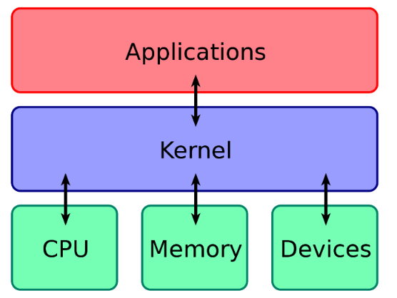
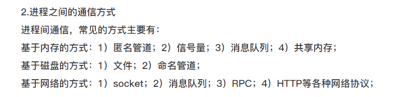
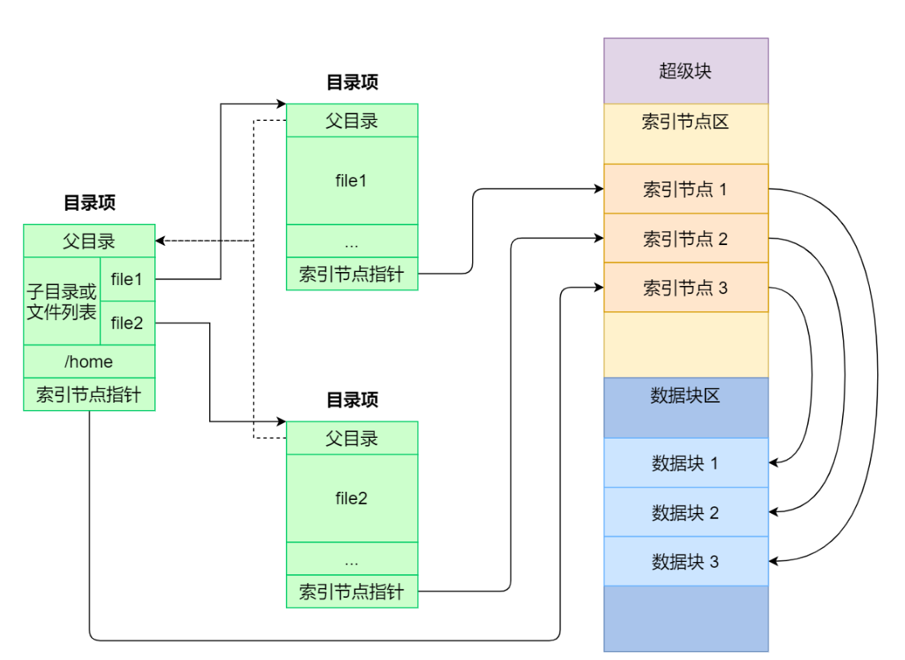
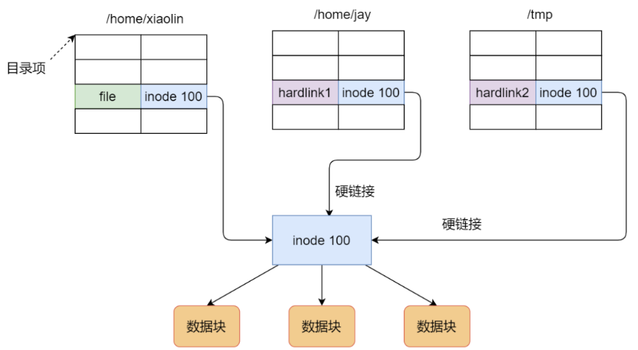
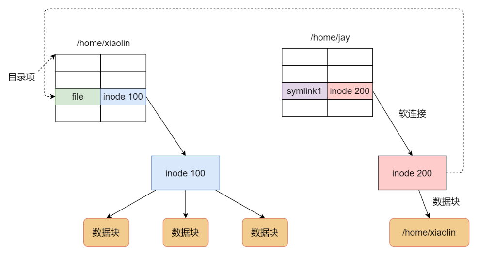
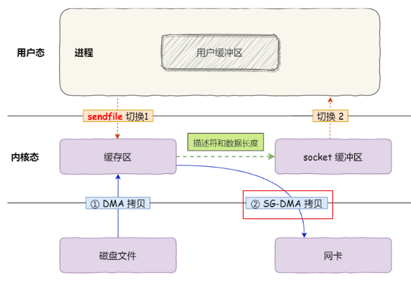

# 操作系统笔记

- [操作系统笔记](#操作系统笔记)
  - [一、概述](#一概述)
    - [OS结构](#os结构)
      - [用户态 User Mode vs. 内核态 Kernel Mode ☆](#用户态-user-mode-vs-内核态-kernel-mode-)
      - [中断 vs. 异常 ☆](#中断-vs-异常-)
  - [二、进程管理](#二进程管理)
    - [进程 线程](#进程-线程)
      - [进程调度算法 ☆](#进程调度算法-)
      - [内存页面置换算法 ☆](#内存页面置换算法-)
      - [磁盘调度算法 ☆](#磁盘调度算法-)
    - [进程间通信与线程间通信](#进程间通信与线程间通信)
      - [进程间通信 ☆](#进程间通信-)
      - [线程间通信 / 线程同步方法 ☆](#线程间通信--线程同步方法-)
    - [多线程同步](#多线程同步)
      - [信号量](#信号量)
        - [信号量实现互斥/同步](#信号量实现互斥同步)
        - [生产者消费者](#生产者消费者)
        - [哲学家进餐](#哲学家进餐)
        - [读者写者问题](#读者写者问题)
  - [三、内存管理](#三内存管理)
    - [基础：将多个进程保存到内存中](#基础将多个进程保存到内存中)
      - [连续分配内存](#连续分配内存)
      - [非连续分配内存](#非连续分配内存)
      - [什么是内存分段和分页](#什么是内存分段和分页)
    - [虚拟内存管理](#虚拟内存管理)
      - [什么是虚拟内存 为何需要虚拟内存](#什么是虚拟内存-为何需要虚拟内存)
  - [四、文件管理](#四文件管理)
    - [文件 目录 目录项 索引节点](#文件-目录-目录项-索引节点)
    - [hard link vs. symbolic link](#hard-link-vs-symbolic-link)
  - [五、IO系统](#五io系统)
  - [六、网络IO](#六网络io)
    - [零拷贝](#零拷贝)
    - [Linux 5种IO模型 ☆](#linux-5种io模型-)
      - [阻塞IO vs. 非阻塞IO](#阻塞io-vs-非阻塞io)
    - [服务器处理并发请求有哪些方式](#服务器处理并发请求有哪些方式)
    - [I/O多路复用](#io多路复用)
      - [select](#select)
      - [poll](#poll)
      - [epoll](#epoll)
      - [epoll事件通知机制 ET vs. LT](#epoll事件通知机制-et-vs-lt)

核心：
进程与线程简单介绍，区别，以及进程间通信方式，线程同步方式
用户态和内核态
内存管理：分页分段，虚拟内存，空闲地址管理方法
死锁：死锁的必要条件，死锁的检测与恢复，死锁的预防，死锁的避免

TODO:

* Linux默认的CPU调度算法是什么

## 一、概述

1. 中断Interruption过程：关中断--保存断点--引出中断服务程序----保存现场--开中断--执行中断服务程序--关中断--恢复现场--开中断--中断返回

2. 系统调用：
   1. 运行在用户态的程序向os请求需要更高权限运行的服务，系统调用提供用户程序和os之间的接口。
   2. **系统调用由os核心提供，运行在核心态**，而普通函数的调用由函数库或用户自己提供，运行在用户态。
   3. **凡是与资源有关的操作**都必须通过系统调用方式向os提出请求。

### OS结构

{width=40%}

1. **内核**：计算机是由各种外部硬件设备组成的，比如内存、cpu、硬盘等，如果每个应用都要和这些硬件设备对接通信协议，那这样太累了，所以这个中间人就由内核来负责，让内核作为应用连接硬件设备的桥梁，应用程序只需关心与内核交互，不用关心硬件的细节。
   1. **宏内核**：宏内核的特征是系统内核的所有模块，比如进程调度、内存管理、文件系统、设备驱动等，都运行在内核态。（Linux）
      1. 微内核架构的内核只保留最基本的能力，比如进程调度、虚拟机内存、中断等，把一些应用放到了用户空间，比如驱动程序、文件系统等。（稳定、可靠；但**频繁切换到内核态**，损耗性能；eg鸿蒙）
2. 并发concurrency：单核CPU让每个任务执行一小段时间，时间到就切换另外一个任务，从宏观⻆度看，一段时间内执行了多个任务。**并发会产生一种在并行的错觉**
3. 并行parallelism：对于多核 CPU 时，多个任务可以同时被不同核心的 CPU 同时执行。
   1. **cpu核数=可同时运行进程数量**(并行)
   2. **进程数量>cpu核数时，进程将时分复用cpu**资源(并发)，但cpu极快，产生并行的错觉

#### 用户态 User Mode vs. 内核态 Kernel Mode ☆

是操作系统中两种不同的执行模式，用于**控制进程对计算机硬件资源的访问权限和操作范围**

* 用户态：在用户态下，进程或程序只能访问**受限的资源**和执行**受限的指令集**，不能直接访问操作系统的核心部分，也**不能直接访问硬件资源**
* 核心态：核心态是操作系统的特权级别，进程可以执行**特权指令**和访问操作系统的核心部分。在核心态下，进程可以**直接访问硬件资源**，**执行系统调用，管理内存、文件系统等操作**
* 内存分为内核空间和用户空间，当程序使用用户空间时，可以说程序在用户态执行，内核态亦然

  

#### 中断 vs. 异常 ☆

中断和异常是两种不同的事件，它们都会导致CPU暂停当前的程序执行，转而去执行一个特定的处理程序

区别：（异常更狠）

* **中断是由外部设备或其他处理器(eg DMA)产生的**，它们**通常是异步的**，也就是说，它们可以在任何时候发生，与当前执行的指令无关。例如，键盘输入、鼠标移动、网络数据到达等都会产生中断信号，通知CPU去处理这些事件
* **异常是由CPU内部产生的**，它们**通常是同步**的，也就是说，它们**只会在执行某些指令时发生，与当前执行的指令有关**。例如，除法运算时除数为零、访问非法内存地址、执行非法指令等都会产生异常信号，通知CPU去处理这些错误或故障
* **中断可以被屏蔽或禁止**，这意味着CPU可以通过设置某些标志位或寄存器来忽略或延迟响应某些中断信号。这样可以**避免中断过于频繁或干扰重要的任务**
* **异常不能被屏蔽或禁止**，这意味着CPU**必须立即响应异常信号**，并进行相应的处理。这样可以保证程序的正确性和系统的稳定性

## 二、进程管理

### 进程 线程

**进程和线程的区别？**: please see `java\JUC.md`

> code只是存储在硬盘里的静态文件，编译后会生成二进制可执行文件，当我们运行该可执行文件，它会被装在到内存，接着cpu执行程序内的每一条指令，此时，这个运行中的程序，我们称之为process。

1. 进程(实体)组成：程序段program segment；数据段data segment；进程控制块process control block PCB
2. PCB：用来描述进程的数据结构，是进程存在的唯一标识。（**PCB放在所有进程共享的内核空间中，os在内核空间中通过链表管理所有进程的PCB**）
   1. PCB是如何组织的? 将相同状态的进程PCB通过**链表**连接在一起形成“队列”，比如**就绪队列、阻塞队列**
3. **进程的五种状态**：创建态new；就绪态ready；运行态running；阻塞态blocked；终止态exit
4. **==CPU==上下文切换**是：把前一个任务的CPU上下文（**CPU寄存器和PC**）存到系统内核(存在内核的某些数据结构中，比如pcb(内存))，然后加载新任务的上下文到这些寄存器和PC上，**然后跳转到PC所指的新位置**，执行新任务。根据任务的不同，可以分为进程上下文切换、线程上下文切换和中断上下文切换。
5. **==进程上下文切换==**：进程是并发复用cpu的，所以需要进程上下文切换
   1. 保存当前进程的**上下文**，包括**CPU寄存器**(程序计数器PC，程序状态字PSW和其他相关寄存器的值)，**堆栈指针**，以及进程的**内存映射**等
      1. 这些上下文信息一般存在PCB中
   2. 保存上下文完毕后，os会**更新该进程的状态**，通常是将其标记为就绪或阻塞，以便下次调度能恢复执行(将PCB移动到相应的队列，如就绪队列)
   3. os根据一定的**cpu调度**算法（如轮转、优先级等）选择下一个要运行的进程
   4. **加载下一进程的上下文**：从下一进程**PCB中**恢复CPU寄存器的值(pc + psw)，堆栈指针等，以便该进程可以从上次暂停的地方继续执行
   5. os将**控制权**交给新进程，开始执行其指令（即将pc置为新进程的起始地址，并执行）
6. **线程上下文切换**：
   1. 如果两个线程不属于同一进程，那切换过程等同于进程上下文切换。
   2. 如果属于同一进程，只需要切换线程的**虚拟机栈、本地方法栈和pc**，无需切换堆和方法区；故而线程的上下文切换开销比较小。
7. 用户级线程 vs 内核级线程: `JUC.md`

#### 进程调度算法 ☆

**处理机/CPU/进程调度**dispatch/scheduling方法：当cpu空闲时，os选择内存中某个就绪状态的进程，给其分配CPU

1. **先来先服务**（First Come First Served, FCFS）(非抢占式)：对长作业有利，适合cpu繁忙型作业的系统（可以最大化利用cpu资源），不适合io繁忙型作业的系统（io会长时间占用cpu，cpu资源利用不足，而调度算法是想要充分利用cpu的）
2. **短作业优先**（Shortest Job First, SJF）:对长作业不利
3. **高响应比优先**（Highest Response Ratio Next, HRRN）:权衡了长作业和短作业
   1. $响应比优先权=\dfrac{等待时间+要求服务时间}{要求服务时间}$
4. **时间片轮转**（Round Robin, RR）：最古老、最简单、最公平、适用范围最广的算法。(假设所有进程同等重要)
   1. 如果时间片设置过短，那么就会造成大量的上下文切换，增大了系统开销。
   2. 如果过⻓，就退化成 FCFS 算法了。
5. **最高优先级调度**（Highest Priority First, HPF）：从就绪队列选择优先级最高的进程。
6. **多级反馈队列**（Multilevel Feedback Queue）：是RR和HPF的综合和发展
   1. 「多级」表示有多个队列，每个队列优先级从高到低，同时**优先级越高时间片越短**。
   2. 「反馈」表示如果有新的进程加入优先级高的队列时，立刻停止当前正在运行的进程，转而去运行优先级高的队列；

---

#### 内存页面置换算法 ☆

**==内存页面置换==**算法：当出现缺页异常时，需调入新页面，但此时内存已满，此时需要**选择一个物理页面换出到磁盘，然后把需要访问的页面换入到内存**。目标是尽可能减少换入换出次数。

1. **最佳置换算法** optimal replacement algorithm (OPT)：被淘汰页面是之后最长时间不访问的页面。**理想**情况，无法实现。
2. **先进先出置换算法 FIFO**：会产生**belady异常**
   1. Belady异常：分配物理块数增大，缺页次数不减反增。
3. **最近最久未使用 least recently used (LRU)**：最近没用，未来用的概率不大。
   1. 是堆栈类算法，因为他要看看之前的东西，需要寄存器和栈的硬件支持。性能接近于opt算法，但是开销较大，现实中很少使用。
   2. OPT算法是向“未来”看，LRU是向“历史”看
4. **时钟置换算法clock**：性能接近LRU，开销小一些。
5. **最不常用算法 least frequently used (LFU)**: 将**访问次数最少**的那个页面淘汰

---

#### 磁盘调度算法 ☆

**磁盘调度算法**：优化磁盘的**访问请求顺序**，来提高磁盘的访问性能（此处指机械硬盘）
> 一次磁盘读写时间 = **寻道**时间（磁盘调度算法） + **旋转延迟**时间（交替编号、错位命名） + **传输**时间
> 一般会给一系列请求序列，代表磁道的位置。因为**寻道时间是磁盘访问最耗时的部分**，所以我们追求减少不必要的寻道时间。
> 磁道从外往内从0开始编号，一般有300-3000个磁道

1. 先来先服务FCFS：公平
2. 最短寻找时间优先算法（Shortest Seek First,SSF）：眼前最优未必总体最优
   1. 可能产生饥饿现象：因为磁头可能在一小块区域来回移动
3. 扫描SCAN算法/电梯算法：磁头移动到**最外侧磁道**才往内移动。利于端头一侧。反向移动的途中会响应请求。
4. 循环扫描CSCAN算法：规定磁头单向移动，使个位置磁道的响应频率平均。反向移动的途中不响应请求。
5. LOOK算法/改进SCAN：规定磁头移动到**最远的请求位置**，然后立即反向移动，而不需要移动到磁盘的最始端或最末端，反向移动的途中会响应请求。
6. C-LOOK算法：反向移动的途中不会响应请求。

### 进程间通信与线程间通信

> 进程间通信主要用于数据交换，线程间通信**主要**用于同步，线程共享同一进程的地址空间,所以不需要像进程间通信那样复杂的机制。线程间通信更加高效,但需要注意同步和互斥问题。

#### 进程间通信 ☆

**进程通信就是进程间的信息交换**；**进程的同步与互斥本质上也是一种进程通信**(低级通信)(传输的是信号量，通过修改信号量使得进程之间建立联系，协调工作)

每个**进程的用户地址空间都是独立**的，一般而言是不能互相访问的，但**内核空间是每个进程都共享**的，所以进程之间要通信**必须通过内核**

> ==summary==: 匿名管道(只能用于父子进程)->命名管道(只能传输无格式字节流)->消息队列(频繁拷贝费时,无法传输大文件)->共享内存(最快，但可能冲突)->进程同步与互斥(信号量、信号)

1. **管道**pipeline：`linux中的|`，将前一个命令的输出作为后一个命令的输入，**单向**（半双工），如果需要相互通信(全双工)需要创建两个管道；
   1. > linux命令执行之后应该就是一个进程/线程
   2. 匿名管道用完了就销毁了，**只能用于父子进程**之间的通信。（因为匿名管道没有实体文件，只能通过fork来复制父进程的文件描述符fd）
   3. **管道就是==内核==里面的一串缓存**。从管道的一端写入的数据，实际上是缓存在内核中的，另一端读取，也就是从内核中读取这段数据。
2. **命名管道(FIFO)**，`makefifo mypipe` ->`echo "hello" > mypipe` -> `cat mypipe`
   1. **命名管道可以在不相关的进程建通信**，因为他有fd可以随意使用；
3. **消息队列**：用于解决管道不适合进程间频繁交换数据（通信效率低）的问题，克服了管道通信的数据是**无格式的字节流**的问题；消息队列是**保存在==内核==中的消息链表**(*true*)；消息本质上是自定义的数据**结构**；
   1. 对比管道：消息队列允许多个进程写入或读取消息；可以实现随机访问(无需FIFO)；
   2. 消息队列通信过程中，**存在用户态与内核态之间的数据拷贝开销**，因为进程写入数据到内核中的消息队列时，会发生从用户态拷⻉数据到内核态的过程，反之亦然。因此，消息队列会造成频繁的系统调用，**不适合大数据**的传输。
   <!-- 3. 消息队列无需避免冲突，共享内存需要。 -->
4. **共享内存**：为了避免消息队列的频繁拷贝与系统调用开销，**不同进程可以将同一段物理内存(物理地址)连接/映射到它们各自的内存地址空间(逻辑地址空间)**，使得这些进程可以访问同一物理内存。如果某进程向共享内存写入数据，就可以立即影响到其他共享的进程。
   1. > 至于这块共享内存位于内核空间还是用户空间再说吧
   2. 共享内存是**最快**的进程间通信方式：因为**只需要在建立共享内存区域时需要系统调用**，一旦建立共享内存，所有的访问都可作为常规内存访问，无需借助内核。(eg `shmget`, `mmap`)
   3. 问题：多个进程**同时**修改同一共享内存可能引起**冲突**，所以保护机制：**信号量**上场。
   4.   
5. **信号量**：实现**进程间**的互斥与同步，本质上是一个==整形计数器==。（保证多个进程或线程能够按照一定的顺序访问共享资源。）（通过PV操作）
   1. 常作为一种锁机制，用于进程同步
6. **信号**：用于通知进程某个事件的发生，类似于处理器收到中断请求。`eg SIGINT, SIGKILL, SIGHUB`
   1. 信号是进程通信机制中**唯一的异步通信机制**，它可以在任何时候发送信号给某个进程，以迫使进程执行信号处理程序。用户、内核和进程都能生成和发送信号。
7. **Socket**：前面提到的全都是在同一台主机上进行进程间通信，那要想跨网络与不同主机上的进程之间通信，就需要 Socket通信了（当然，socket也可以用于主机内进程通信）。



#### 线程间通信 / 线程同步方法 ☆

**线程**间的同步与通信类型有哪些？

由于同一进程内的线程共享进程的堆和方法区等内存地址空间，所以线程间通信比进程间通信更容易实现，直接共享全局变量即可，所以**线程间通信主要用于线程同步**

1. 互斥锁：互斥锁是最常⻅的线程同步机制。它允许只有一个线程同时访问被保护的临界区（共享 资源） 
2. 读写锁： 读写锁允许多个线程同时读取共享资源，但只允许一个线程写入资源。 
3. 信号量：用于控制多个线程对共享资源进行访问的工具。
4. 条件变量：条件变量用于线程间通信，允许一个线程等待某个条件满足，而其他线程可以发出信 号通知等待线程。通常与互斥锁一起使用。

> * 全局共享变量：线程可以通过共享变量进行通信，但需要使用适当的同步机制以防止数据竞争。（比如存在方法区中的static成员变量，存在堆中的non-static成员变量）


### 多线程同步

> 实操见`os\多线程和线程同步.md`

**临界区**critical section：访问共享资源的代码段，一定不能让多线程同时执行。

**互斥**mutual exclusion / mutex：==间接制约关系==，当一个线程(进程)进入临界区，其他的必须被阻止进入临界区（等待）。

**同步**Synchronism：==直接制约关系==，两个线程(进程)在一些关键点上可能需要互相等待与互通消息（在时间上有先后关系）。

> 同步好比是操作A应该在操作B之前执行；互斥好比是操作A和操作B不可同时执行。


进程/线程互斥：**通过锁或者信号量实现** (有点意思)
进程/线程同步：**通过信号量实现**

> ==信号量可以实现互斥和同步==

#### 信号量

1.信号量semaphore是os提供的协调共享资源访问的方法；信号量表示共享资源的数量，本质上是一个整形计数器。

2.什么是PV操作？
P操作：将信号量sem减1，如果此时sem<0，表明资源已被占用，进程/线程需要阻塞等待；如果sem>=0，表明还有可用资源，进程/线程可继续执行。`juc.Semaphore.acquire()`
V操作：将信号量sem加1，如果此时sem<=0, 表明当前有处于阻塞中的进程/线程，会将该进程唤醒；如果sem>0, 表明没有阻塞中的进程。`juc.Semaphore.release()`

##### 信号量实现互斥/同步

3.如何 ==**利用信号量实现临界区的互斥访问**==？(简单且妙)
只需要对每一类共享资源设置一个初值为`1`的信号量`s`，表示该临界资源未被占用。然后后续在申请该资源之前进行`P(s)`操作，之后进行`V(s)`操作进行释放。
对于两个并发线程，互斥信号量的值仅取1、0和-1:
1: 表示没有线程进入临界区
0: 表示有一个线程进入临界区
-1: 表示一个线程进入临界区，另一个线程等待进入

4.如何 ==**利用信号量实现事件同步**== ？
设置初值为`0`的信号量`s`，然后申请事件的时候P(s)，事件准备好的时候会V(s);

##### 生产者消费者

一个初始为空大小为n的缓冲区，
只有缓冲区没满时生产者才可以把消息放入缓冲区，否则等待； -> 同步关系 `fullBuffers=0`
只有缓冲区非空时消费者才可以从中取出消息，否则等待。 -> 同步关系 `emptyBuffers=n`
缓冲区是临界资源，任何时候只允许一个生产者或消费者进入。 -> 互斥关系 -> `mutex=1`

##### 哲学家进餐

5个哲学家和5根筷子，如果让一名哲学家拿到左右两根筷子而不造成死锁或者饥饿现象。
> 「哲学家进餐问题」对于互斥访问有限的竞争问题（如 I/O 设备）一类的建模过程十分有用
> 思维精髓是：不能贪心，要考虑后续后果。如果每人都拿一根那就死锁了。

多种方法：

- 最多允许4位同时进餐；
- 仅当一名哲学家左右两边的筷子都可拿时才拿；
- 对哲学家顺序编号，奇数号哲学家先拿左边筷子，再拿右边筷子。偶数哲学家刚好相反；

##### 读者写者问题

读者只会读取数据，不会修改数据，而写者即可以读也可以修改数据。
描述：
「读-读」允许：同一时刻，允许多个读者同时读
「读-写」互斥：没有写者时读者才能读，没有读者时写者才能写
「写-写」互斥：没有其他写者时，写者才能写
解法略 参考王道os


## 三、内存管理

TODO: 后续参考[link](https://javabetter.cn/sidebar/sanfene/os.html#%E5%86%85%E5%AD%98%E7%AE%A1%E7%90%86)重新整理一遍

### 基础：将多个进程保存到内存中

1. 内存管理功能：内存空间的分配与回收、地址转换（VA->PA）、扩充内存空间（虚拟存储技术逻辑上扩充）、存储保护（利用界地址寄存器保护os不受用户进程影响）。


1. 逻辑地址virtual 与 物理地址physical：

   1. **逻辑地址（虚地址/相对地址/人的视角）**：编译(汇编)后每个目标模块都从0开始编制，叫做相对地址或逻辑地址。

   2. **物理地址（实地址/机器视角）**：是地址转换后的最终地址。装入程序将代码装入内存，必须将逻辑地址变成物理地址，称为**地址重定位**。
      1. os如何管理VA和PA之间的关系？内存分段和内存分页。

---

#### 连续分配内存

1. 有哪些**连续**分配内存管理方式？

   1. 单一连续分配：将内存分成系统区和用户区。优点：简单、无外部碎片；缺点：适用于**单道程序**（整个用户只存放一道程序），有**内部碎片**，内存利用率非常低。
      1. 内部碎片：**已分配**给某进程的内存空间大于该**进程实际需要**的空间。
      2. 外部碎片：内存中已分配的分区外的存储空间越来越多的碎片难以利用。一般都是进程退出后留下的小块空闲块。
   2. 固定分区分配：将内存空间划分成大小固定的分区，每个分区只装入一个作业。分区大小可以相等也可以不等。优点：可以多道程序; 缺点:分区固定不变，程序不能太大，否则放不进去，有**内部碎片**；内存利用率低。
   3. 动态分区分配：不预先划分分区，而是等进程装入内存时再动态建立分区。优点是：可以使分区大小刚好合适。缺点是：会产生较小的**外部碎片**分配不出去。
      1. 动态分区分配的四种算法：
         1. 首次适应 first fit：空闲分区按地址递增链接。
         2. 最佳适应 best fit：空闲分区按容量递增链接。
         3. 最坏适应 worst fit：按容量递减。会留下很多外部碎片。
         4. 邻近适应 next fit：从首次适应基础上，在上次查找结束位置继续查找。

#### 非连续分配内存


2. **非连续**分配管理：将一个程序**分散地装入不相邻的内存分区**（当然需要额外空间存储各区域的索引作为代价）
   1. 按照分区大小是否固定分为：分页存储管理方式和分段存储管理。
   > 分页存储管理方式根据作业时是否把作业的所有页面都装如内存才可运行分为：基本分页 + 请求分页(虚拟内存)。
3. 页式内存管理中的**页表**是什么，多级页表呢？
   1. 页表：进程页号 -> 物理内存块号（mapping）
      1. 页表项 = 进程页号 + **内存物理块号**
         1. 所以页表项中的内存物理块号 + 逻辑地址中的页内偏移量共同组成物理地址；
      2. 一个进程对应一张页表。（一个进程对应一个自己的虚拟地址空间）
   2. ⻚表一定要覆盖全部虚拟地址空间，不分级的⻚表就需要有 100 多万个⻚表项来映射，而二级分 ⻚则只需要 1024 个⻚表项（此时一级⻚表覆盖到了全部虚拟地址空间，二级⻚表在需要时创建）

4. 描述**页式存储管理**。
    1. 把主存空间物理上划分为大小相等且固定的块（页框/页帧）；与固定分区相似，不会产生外部碎片，但这里的块相比于分区要小得多。只有在为进程最后一个不完整的页申请主存块的时候才会产生大概半个块的内部碎片，洒洒水啦。
    2. 每个进程逻辑上以块（页/页面）为单位划分，在执行时以块为单位申请主存中的块空间。
    3. 逻辑地址Logical address = 进程页号 + **页内偏移量**；(地址结构决定了虚拟内存的寻址空间大小)
    4. 进程的页映射到物理内存的块

   逻辑地址 -> 物理地址(核心在于**先找到页表项PA**，然后concat(表项的物理块号, LA的页内偏移量)即可)：
   1. 根据页面大小L，计算出逻辑地址LA的页号(LA/L)和页内偏移量(LA%L)。
   2. 由逻辑地址中的页号与PTR中的页表长度对比，若大，则越界，发生中断。
      1. 页表寄存器PTR中存放页表内存始址 + 页表长度（页表项个数）
   3. 若页号合法：页表项地址 = 页表始址 + 页号 * 页表项长度（页表项(页地址)占用存储空间）。
   4. 物理地址PA = 页表项中块号 + 逻辑地址中的偏移量。
5. 介绍一下快表TLB：
    1. 由于页式存储管理在地址变换时，需要两次内存访问：访问页表（确定所需要的数据或者指令的PA）+ 取数据/指令；故设置快表TLB，充当页表的cache，一个专门的高速缓冲存储器。与之相对的主存中的页表称作慢表。
    2. 引入TLB的地址变换：
       1. 首先将页号与快表的所有页号进行比较，如果命中，直接取出物理块号。即可与LA的页内偏移量形成PA；（仅一次访存）
       2. 若未命中，还是去访问主存中的页表，**同时将其存入快表**。
          1. 一般快表命中率可达90%；又是局部性原理咯。
6. 介绍多级页表：
    1. 当逻辑地址空间很大时，页表长度会大大增加。需要一块比较大的连续物理空间存储，这不好。
    2. 二级页表时 逻辑地址 = 一级页号 + 二级页号 + 页内偏移量
    3. 缺点就是增加了一次访存时间。
7. 描述**段式存储管理**。
    1. LA = 段号 + OFF
    2. 段表项 = 段号(**不占空间(why)**) + 段长 + 本段在主存中始址
    这种管理方式考虑到了程序员的感受，以满足方便编程、信息保护和共享、动态增长及动态链接等要求。它按用户进程中的自然段划分逻辑空间，每个段从0开始编址，并分配连续的地址空间。段内连续，段之间可以不连续。

    逻辑地址->物理地址（与页式类似）
    - 段表项地址 = 段表起始地址 + 段号 × 段表项长度
    - 物理地址 PA = 页表项中本段起始地址 + LA中段内偏移量

#### 什么是内存分段和分页

* 内存分段是将一个程序的内存空间分为不同的逻辑段segments, 每个段代表程序的一个功能模块，如代码段、数据段、堆栈段等。每个段都有其自己的大小和权限。
* 内存分⻚是把整个虚拟和物理内存空间分成固定大小的⻚(如4KB)。这样一个连续并且尺寸固定的内存空间，我们叫⻚Page

作用：

* 逻辑隔离：内存分段和分⻚都实现了程序的逻辑隔离，使**不同的功能模块或数据类型能够被单独管理和保护**，提高了程序的可靠性和安全性。
* 内存保护：通过将不同的段或⻚面设置为只读、可读写、不可执行等权限，操作系统可以确保程序不会越界访问或修改其他段的内容，从而提高了系统的稳定性。
* 虚拟内存：分段和分⻚都**有助于实现虚拟内存**的概念，允许应用程序认为它们在使用的是一个比 实际物理内存更大的内存空间。
* 内存管理：分⻚更加灵活，允许操作系统**将不同进程的⻚面分散存放在物理内存中**，从而提高内存利用率。分段则更适用于管理不同的逻辑模块。

分段 vs. 分页：

* 分⻚对用户不可⻅，分段对用户可⻅
* 分⻚的地址空间是一维的，分段的地址空间是二维的
* 分⻚（单级⻚表）、分段访问一个逻辑地址都需要两次访存，分段存储中可以引入快表机制

### 虚拟内存管理

#### 什么是虚拟内存 为何需要虚拟内存

虚拟内存在**每一个**进程创建加载的过程中，会分配一个**连续虚拟地址空间**，它**不是真实存在的**，而是**通过映射与实际地址空间对应，这样就可以使每个进程看起来都有自己独立的连续地址空间**，并**允许程序访问比物理内存RAM更大的地址空间**, 每个程序都可以认为它拥有足够的内存来运行。

需要虚拟内存的原因：

* **内存扩展**：使得每个程序都可以使用比实际可用内存更多的内存，从而允许运行更大的程序或处理更多的数据
* **内存隔离**：提供了进程之间的内存隔离。**每个进程都有自己的虚拟地址空间**，因此**一个进程无法直接访问另一个进程的内存**（故而侧面验证了一个进程崩了对其他进程其实影响不大，即**内存保护**
* **便于管理物理内存**：虚拟内存允许操作系统动态地将数据和程序的**部分加载到物理内存中**，以满足当前正在运行的进程的需求。当物理内存不足时，操作系统可以**将不常用的数据或程序暂时移到硬盘上，从而释放内存**，以便其他进程使用。（即页面交换，**基于局部性原理**


---

（所以虚拟地址在虚拟内存之前就出现了？那么va的本意是？）
为了在多进程环境下，使得进程之间的内存地址不受影响，相互隔离，于是操作系统就为每个进程独立分配一套虚拟地址空间，每个程序只关心自己的虚拟地址就可以，实际上大家的虚拟地址都是一样的，但分布到物理地址内存是不一样的。作为程序，也不用关心物理地址的事情。
既然有了虚拟地址空间，那必然要把虚拟地址「映射」到物理地址，这个事情通常由操作系统来维护。 那么对于虚拟地址与物理地址的映射关系，可以有分段和分⻚的方式，同时两者结合都是可以的。


1. 虚拟内存技术所需硬件支持：页表(段表)机制、缺页中断机构、地址变换机构、一定容量的内存和外存。
2. 虚拟内存的三种实现方式与前面对应，称作：请求分页存储管理、请求分段存储管理和请求段页式存储管理
3. 介绍一下请求分页存储管理
   1. 请求分页存储管理 = 基本分页存储管理 + 请求调页功能 + 页面置换功能
   2. 页表项 = 进程页号 + 内存物理块号 + 状态位(是否已调入内存) + 访问字段(访问次数或时间，供置换算法) + 修改位(页面调入内存后是否修改) + 外存地址(供调页使用)
   3. 地址变换机构：先查快表，若命中直接形成PA，否则 -> 查慢表，若命中形成PA，否则 -> 发生中断，请求调页。
4. 页面置换算法（决定换入哪页，换出哪页，输入io操作）：
   1. 见第二章
   2. OPT, FIFO, LRU, clock


**总结**
为了避免不同的进程操控到同一块物理内存地址，遂引入虚拟地址进行抽象和隔离，每个进程都有一块独立的虚拟内存空间，不同进程的虚拟空间会映射到不同的物理内存上（地址变换机构借助页表实现这件事情，即使相同的逻辑地址也可以映射到不同的物理地址），由于总的虚拟内存空间肯定比物理内存大的多（而且我们需要实现多道批程序设计，不能让每一个进程完全装在到内存中），我们会为进程按需分配内存；还有当物理内存不足的时候，我们会进行页面置换。
对于虚拟内存中，为了减少页表空间占用，引入多级页表；为了加速地址变换，引入快表。


## 四、文件管理

### 文件 目录 目录项 索引节点

> Linux中一切皆文件：包括块设备、管道、socket等。

* **==文件==**(file): 用于存储数据，是文件系统的基本单位，每个文件都有一个文件名和存在磁盘上的**数据块**。
  * Linux下每个文件有两个玩意儿：索引节点和目录项；因为一个文件可以有多个目录项，但只有一个索引节点（即硬链接不会重新分配inode）；即dentry和inode是多对一的；
* **目录**(directory): 一种**特殊的文件**，用来组织和管理文件和其他目录，是**目录项**的集合
  <!-- * 你甚至可以`vim dir`: 可见文件夹/目录内部的文件和文件夹/目录 -->
  * `ls -li`: 查看带有inode的ls
* **==目录项==** (directory entry): 目录中的一个条目，指向一个文件或另一个子目录；**目录项 = 文件名 + 索引节点编号**/指针(inode号)，即 **==链接文件名及其索引节点==**
  * 为了避免频繁读取磁盘，os会把读过的目录用目录项**缓存在内存**中。通过目录项的inode号就可以找到实际存储的数据；
  * 硬链接本质上是多个目录项指向同一个索引节点(stat返回的inode一致, ls -l可以查看到硬链接计数)。
* **==索引节点==** (inode): 存储文件**元数据**的数据结构，每个文件/目录有一个**唯一的inode**，包含了文件的信息：inode，大小，所有者，权限，时间戳，**数据块位置**等
  * `stat file`

{width=80%}

### hard link vs. symbolic link

1. 硬链接（**基于索引节点的共享方式**）：本质：**多个目录项指向同一个索引节点(inode编号相同)**。意味着它们实际上是同一个文件
   1. 当使用rm删除文件时(源文件或硬链接文件)，只会删除对应的**目录项**，并减少inode链接计数器，只有当计数器为0（即删掉所有），文件的inode和数据块才会被释放/彻底删除
   2. 优点：实现了异名共享。
   3. 缺点：由于不同文件系统有各自的inode信息，所以**硬链接无法跨越文件系统**。而且**不能链接目录**
{width=70%}

1. 软连接（**利用符号链实现文件共享**）：本质：**新建一个文件**（拥有独立的inode），**文件内容是另一个文件的路径**，`readlink指令可以查看`，所以访问该文件会被直接定位到索引的文件。**只有文件拥有者拥有指向索引节点的指针**。
   1. 删除了源文件，链接文件还在，只不过没用了（指定文件找不到了）
   2. 优点：软连接可以跨越文件系统。拥有者可以删除
   3. 缺点：开销大

{width=70%}

---

实践

创建硬链接(hard link): `ln source_file link_to_file`，stat返回的inode一致。
> **不可对dir创建hard link**: hard link not allowed for directory （为了避免循环引用吧）
> **hard link不可跨越文件系统，只能在同一分区内建立数据关联**：Invalid cross-device link
> 删除原始文件不影响硬链接和数据块，硬链接还稳稳滴连接着数据块。

创建软连接(symbolic link)：`ln -s source target`
> 可以连接不同文件系统的文件
> 删除软连接的时候不要使用`rm -rf target/`，会删除掉source/内的所有文件。很恐怖的。最好使用`unlink target`或者`rm target`.

注意磁盘上多个分区对应多个文件系统(UUID是文件系统唯一标识符)，可以有不同的类型(fstype, eg ext3 ext4)

## 五、IO系统

每个IO设备都有相应的设备控制器（相当于一个小cpu），设备控制器中有一些寄存器，分别是状态寄存器、命令寄存器和数据寄存器，CPU通过他们和设备打交道。
通过写入这些寄存器，os可以命令设备发送接收数据、开启或关闭等操作。
通过读取这些寄存器，os可以了解设备的状态。

此外，对于块设备（比如磁盘）对应的设备控制器中还有数据缓冲区。

---

我们知道每种设备都有一个设备控制器（小CPU），它可以自己处理一些事情，但问题是，当CPU给设备发送了一个指令，让设备控制器去读设备的数据，它读完的时候，要怎么通知CPU呢？

**IO控制方式：**

1. 程序查询方式（**轮询等待**）：CPU每读取一个字，就要对外设状态进行轮询检查。**CPU和IO只能串行工作**，cpu利用率低。由于IO设备太慢，CPU大部分时间都在等IO，很慢很蠢
2. **中断驱动**方式：CPU发出IO命令后可以去做其它的事情，等IO设备数据就绪后**主动发出中断**通知CPU
   1. 并行工作，聪明些
   2. 但**频繁中断**(如磁盘这种频繁读写设备)对cpu并不友好，上下文开销大
   3. **依然需要cpu亲自参与数据搬运过程**(在数据从磁盘缓冲区->pageCache->用户缓冲区的时候是不能做其他事情的)
   4. {width=80%}
3. **DMA**(Direct Memory Access)方式：将**主存和IO设备**直接关联，设备可以不依靠cpu的情况下自行把输入放到主存(即DMA负责数据搬运)。
   1. cpu只在传输开始或结束时进行干预，数据块的传输是在DMA控制器的控制下完成的，DMA将数据读到内核缓冲区后(内存)告诉cpu即可，cpu来把数据从内核缓冲区拷贝到用户缓冲区
   2. {width=80%}

---

**用户缓冲区 vs 内核缓冲区**.

- 内核缓冲区位于内存内核空间，只能由os访问，用户缓冲区位于内存用户空间
  - 内核缓冲区主要作用是缓解设备
- 磁盘io操作中的读操作是：数据从磁盘读入内核缓冲区，然后从缓冲区传递给用户进程。

## 六、网络IO

> Linux收发流程参见`os.md`

[非常推荐再看一遍](https://www.bilibili.com/video/BV1cr4y1671t?t=1.2&p=160)

  
> * 注意用户空间和内核空间分别有一个**用户缓冲区**和**内核缓冲区**
> * 用户缓冲区主要用于减少用户进程与内核之间的数据传输次数，用于暂存数据，然后通过一个系统调用**批量处理**
> * 内核缓冲区主要是一个**缓存**作用，缓存从磁盘或其他设备读到的数据，后续再读可以命中该缓冲区，减少对物理设备的访问次数

### 零拷贝

传统IO的方式，**从硬盘读取数据，然后再通过网卡向外发送**，我们需要进行**4次上下文切换，和4次数据拷贝**，其中2次DMA拷贝(磁盘缓冲区->内核缓冲区，socket内核缓冲区->网卡缓冲区)，两次CPU拷贝

```cpp
// 使用这俩系统调用
read(fd, buf, len);
write(socket, buf, len);
```

{width=70%}
问题：
2次系统调用发生了4次用户态和内核态之间的切换，需要进行上下文切换，造成消耗。
> 每次系统调用都得先从用户态切换到内核态，等内核完成任务后，再从内核态切换回用户态。

---

为了提高文件传输的性能，于是就出现了**零拷贝技术**，它通过**一次系统调用**`sendfile()`合并了磁盘读取与网络发送两个操作，降低了上下文切换次数。另外，拷贝数据都是发生在内核中的，天然就降低了数据拷贝的次数。

```cpp
ssize_t sendfile(int out_fd, int in_fd, offset, count)
```

sendfile系统调用可以替代read()和write()这两个系统调用，可以减少一次系统调用，2次上下文切换的开销
其次，该sendfile本身可以直接把内核缓冲区里的数据拷⻉到socket 缓冲区里，不再拷⻉到用户态。
所以**sendfile就2次上下文切换和3次数据拷贝**
{width=70%}

如果网卡支持**SG-DMA技术**，可以再减少一次拷贝，全程无需cpu拷贝。
{width=70%}
这就是所谓的**零拷贝**Zero-copy技术，**全程没有通过CPU来搬运数据**，所有的数据都是通过DMA来进行传输的

总体来看，零拷贝技术可以把文件传输的**性能提高至少一倍以上**。
很多开源项目如Kafka, RocketMQ都采用了零拷贝技术来提升IO效率。

### Linux 5种IO模型 ☆

神作《Unix网络编程》将IO模型其分为如下五类：

* **阻塞IO**: 应用发起IO操作后会被阻塞，直到操作完成才返回结果。比如read系统调用需要等待内核准备好数据+数据从内核缓冲区拷贝到用户缓冲区...适合对实时性要就不高的场景
* **非阻塞IO**: 应用发起IO后立即返回，不会阻塞，但**需要不断轮询或使用select/epoll等系统调用检测IO操作是否完成**，适合多路复用的场景；
  * 非阻塞IO常常结合IO多路复用
* **IO多路复用**: 通过select/poll/epoll系统调用，应用程序可以同时等待多个IO操作，其中任意一个IO操作准备就绪时，就去通知应用程序。适合需要同时处理多个IO操作的场景，比如**高并发的服务端程序**，需要同时处理多个socket连接的服务器程序
* **信号驱动IO**(了解): 应用程序发起IO操作后，可以继续做其他事情，IO操作完成时，os会向应用程序发送**SIGIO信号**来通知其完成。适合需要异步IO通知的场景，可提高系统并发能力
  * 如果有大量IO，信号太多，信号队列可能溢出；性能也不高，不咋用
* **异步IO**(了解): **内核数据准备好 && 数据从内核态拷贝到用户态**，这俩过程都不用等待。内核缓冲区的数据会**自动拷贝**到用户缓冲区，应用程序无需主动发起read拷贝动作。
  * 由于数据从内核态拷贝到用户态时内核做的，所以高并发时，内核容易累死，可能崩溃；所以异步IO一般要配合限流，控制并发，有些繁琐

> 前四者都是同步IO，只有异步IO是异步IO...

  

> Reactor是非阻塞同步网络模式，Proactor是异步网络模式。

---

**java中对应关系：**

* BIO(Blocking IO)对应着上文阻塞IO，`java.io`中有`InputStream, OutputStream, Socket`等基于BIO
* NIO(Non-blocking IO)对应于非阻塞IO和IO多路复用，通过`Selector`类实现多路复用，可以同时处理多个连接
  * Selector在linux中底层是epoll，windows中是select
* AIO(Asynchronous IO)对应于异步IO

#### 阻塞IO vs. 非阻塞IO

==**阻塞I/O**==：比如线程在read时阻塞，等待**内核准备好数据** && **把数据从内核缓冲区拷贝到用户缓冲区** (俩过程)，read才成功返回。
{width=60%}
{width=60%}

==**非阻塞I/O**==：在数据未准备好的情况下立即返回，~~可以继续往下执行~~，此时应用程序**不断轮询内核**，直到**数据准备好 && 内核缓冲区数据拷贝到应用缓冲区**，read调用才可拿到结果

* 注意：非阻塞IO在一阶段是非阻塞的，但在二阶段(从内核缓冲区数据拷贝到应用缓冲区)**依然是阻塞的/同步**的
* 非阻塞IO在第一阶段不断轮询（他只会一直问，干不了其他的事儿），会一直占用cpu资源，所以你也无法向下执行；故而可以说相比于阻塞IO没有提升性能，没啥卵用
* 为了避免不断轮询，应该结合IO多路复用，采用事件驱动的方式，使用select/epoll，这就有用了

{width=60%}

因此，**==无论read和send是阻塞I/O，还是非阻塞I/O都是同步I/O调用==**。

另外，**==非阻塞IO一直轮询内核太呆了，应用程序啥也干不了，所以出现IO多路复用技术==**，当内核数据准备好时，以**事件通知**应用程序进行操作。这改善了应用程序对cpu的利用率

{width=60%}


  


### 服务器处理并发请求有哪些方式

首先，众所周知socket调用的过程(TCP)：
服务端：socket() -> bind() -> listen() -> accept()阻塞等待客户端连接 -> read()阻塞等待客户端发送数据->close()
客户端：socket() -> connect()->write()->close()
> 服务端read接收数据：从网卡进来->内核缓冲区->用户缓冲区->处理数据


1. **单进程/线程web服务器模式**：服务器一次处理一个请求，结束后处理下一个请求，低效。
2. **多进程/线程web服务器模式**：服务器生成多个进程/线程并行处理多个用户请求，不过，一旦并发请求数量达到成千上万时，**多个同时运行的进程或线程将会消耗大量的系统资源**。（**即每个进程只能响应一个请求**，而我们想让一个进程/线程维护多个socket(内核层操作) -> IO多路复用技术
   1. 可以考虑使用**线程池**来避免线程的频繁创建和销毁
3. **I/O多路复用web服务器**：只用一个线程就能监听和处理多个客户端的i/o事件。
4. **多路复用多线程web服务器**：结合多线程和IO多路复用的功能，避免了让一个线程服务于过多的用户请求，并能充分利用多CPU主机所提供的计算能力


> 我们知道单进程/线程会在read处阻塞（所谓的阻塞IO），多线程模型看起来不错，但这**还不是真正的非阻塞IO，仅仅是使用多线程的手段使得主线程没有卡在read处不往下走罢了（这是用户层的小把戏）**，即此时的read依然是阻塞的。而且线程上下文切换也挺难顶的（虽然可以使用线程池数组解决一下，但依然是用户层的把戏）。
> 所以我们需要os提供点内核层的把戏。

> 在之前，一个进程/线程想要处理多个fd(客户端socket), 光靠应用程序进行处理，在跟第一个fd交流时会发生阻塞，其他客户端fd直接卡在后面（这种串行效率太低）。
> **把fd一股脑扔给os内核**（从应用程序丢给内核），**然后让内核监视着他们，有可以读写的fd时你告诉我**（可以返回多个组成列表），我来处理（我处理一个很快，处理完就处理其他的）

### I/O多路复用

一言以蔽之：**IO多路复用就是一个进程/线程同时监视多个文件描述符**；避免创建过多线程导致的上下文切换的开销。

在网络编程中，一个进程本来只能阻塞等待一个socket的读写事件，通过IO多路复用，就可以把多个socket的文件描述符交给内核管理，这样就可以自动同时监控多个socket的读写事件，当有读写事件时，内核通知一下即可。

> 当创建一个socket时(socket也是一种文件)，os会返回一个fd，该fd可用于后续的连接、发送和接受数据操作。每个fd对应一个读缓冲区read buffer和一个写缓冲区write buffer

我们调用select/poll/epoll委托内核帮我们检测若干个fd的状态，其实就是检测这些fd对应的读写缓冲区的状态：

* **读**缓冲区：检测里边有没有数据，如果有数据该缓冲区对应的fd**就绪**
* **写**缓冲区：检测写缓冲区是否可以写(有没有容量)，如果可以，缓冲区对应的fd就绪
* 读写**异常**：检测读写缓冲区是否有异常，如果有，该缓冲区对应的fd就绪


Linux提供了三种IO多路复用的系统调用：select, poll, epoll，**进程可以通过一个系统调用函数从内核中获取多个事件**。

#### select

==**select实现机制**==: 将想要检测的fd的fd_set值置为1(想要监听什么事件就用对应的fd_set, eg readfds, writefds, exceptfds)，然后调用select()，内核会从用户空间**拷贝**一份fdset，然后**遍历**检测是否有读/写/异常事件发生(即检测read/write buffer是否就绪)，然后将结果写入到fd_set标记为可读/可写，然后我们将该fd_set**拷贝**会用户空间，然后**遍历**拿出值为1的fd就可以执行具体的操作（如去read buffer读数据）
* 缺陷：
  * **拷贝开销大**：select和poll会将fd_set从用户态拷贝到内核态，然后内核修改完毕之后再拷贝回用户态
  * **遍历开销大**：内核在检测fd_set时是**线性遍历**的，内核改完传给用户去，用户也需要线性遍历。两次遍历开销很大
  * select监听的fd上限是**1024**，远不够用，在内核中写死了的，除非你重新编译内核进行修改...

  

#### poll

* **Poll实现机制**：使用**动态数组/链表**存储fd，fd理论上没有1024限制；不像select传1024个fd，poll只传待检测的fd数组，**拷贝**到内核**遍历**检测并修改然后**拷贝**回用户态，会返回就绪的数量，但没告诉你谁就绪了，用户依然需要**遍历**fd数组找到就绪的fd
  * 改进：底层采用链表组织fd，fd理论上没上限了，然而链表的遍历O(n)随着fd增大是很难顶的；然后函数参数简化了点(但不重要)
  * select的前两个缺陷都还在，返回的依然是传入的所有fd，换汤不换药，没人用poll；~~poll和epoll只能在linux上使用，select可在linux和windows使用~~

{width=60%}

> 如果fd数量并不是很高，大多数fd都是激活的，选择使用select或poll，若并发量很高，采用epoll，但epoll无法跨平台。

#### epoll

==**Epoll实现机制**==：

* 使⽤**红黑树**跟踪待检测的fd，增删查是O(logn)
* 使用**事件驱动机制**，内核里维护了一个**链表来记录就绪事件**，只将就绪的fd集合传给用户，用户就不必遍历结果了，提高了检测效率
<!-- * epoll中的**内核和用户区使用共享内存**(基于mmap内存映射实现)，相比select减少了数据拷贝操作的开销 -->

> epoll是解决C10K问题的利器，通过两个方面解决了select/poll的问题: 1台服务器并发处理1w个并发连接

优点：

* **减少了拷贝次数**：epoll将select()的功能(把fd拷贝到内核，等待fd就绪)**拆分**开了，`epoll_ctl()`将fd拷贝到内核，`epoll_wait()`等待fd就绪；对于每一个fd，epoll只会添加一次到红黑树即可，然后循环等待时使用epoll_wait()只需要等待就行；而select在while循环的时候会不断拷贝所有fd
* **减少了拷贝数量**：select/poll每次会拷贝回所有fd，epoll只拷贝就绪的fd，数量少得多
* **减少了遍历开销**：select/poll需要遍历返回的fd数组，epoll不用遍历所有了
* **fd真无上限**：select fd上限1024，poll的fd底层改成了链表，理论上没上限，但你遍历链表太慢了O(n)，如果fd太多了，就很难顶，所以poll受限于性能；而epoll的fd被组织为一颗**红黑树**，这个增删改的性能O(logn)，这种增加是真的能增加很多，性能很高

  

{width=70%}

  

#### epoll事件通知机制 ET vs. LT

当fd有数据可读时，我们调用`epol_wait()`会得到通知，但有两种不同的通知模式：

* LT(level triggered) 水平触发模式(默认)：当fd有数据可读时，会重复通知多次，直至数据处理完成（用户友好，低效
  * 问题：重复通知影响效率
  * 还会有“惊群”现象，一点小任务，通知一堆人过来干活，其实并不必要
* ET(edge triggered) 边缘触发模式：当fd有数据可读时，只会被通知一次，不管数据是否处理完成。因此我们**程序最好要保证一次性将内核缓冲区的数据读取完**（高效，假设用户已经知道了
  * 一般搭配**非阻塞IO**，因为阻塞IO读完了内核缓冲区数据后还会一直等着，整个应用阻塞
