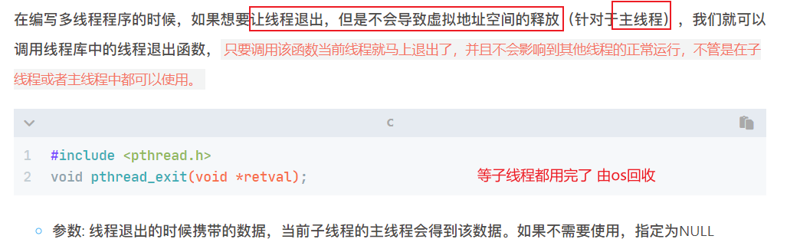
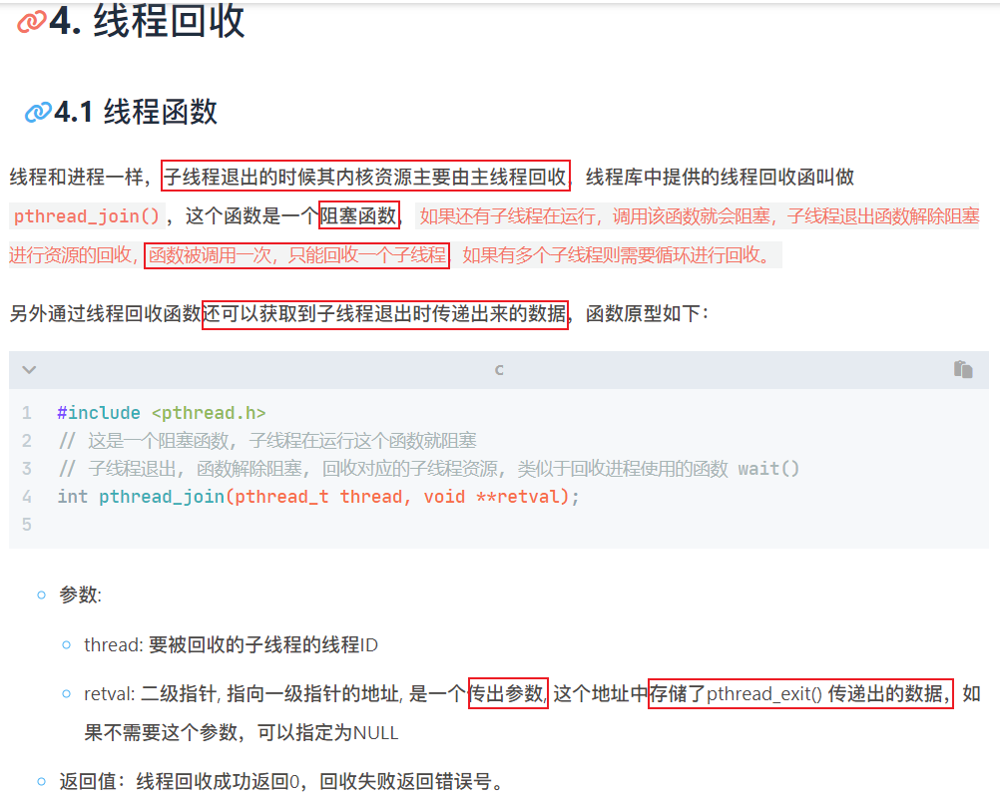
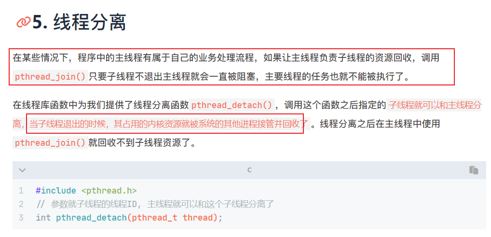
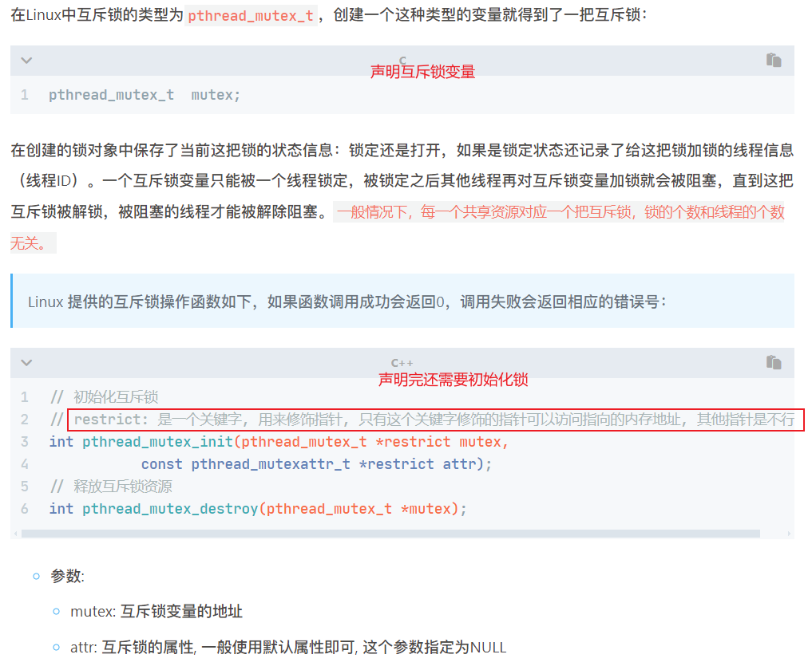
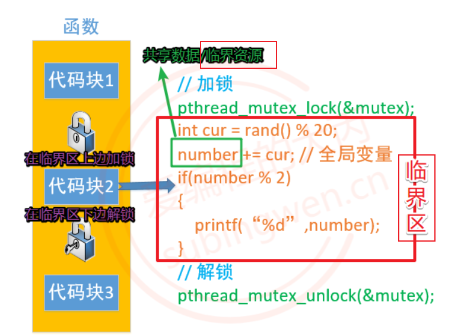
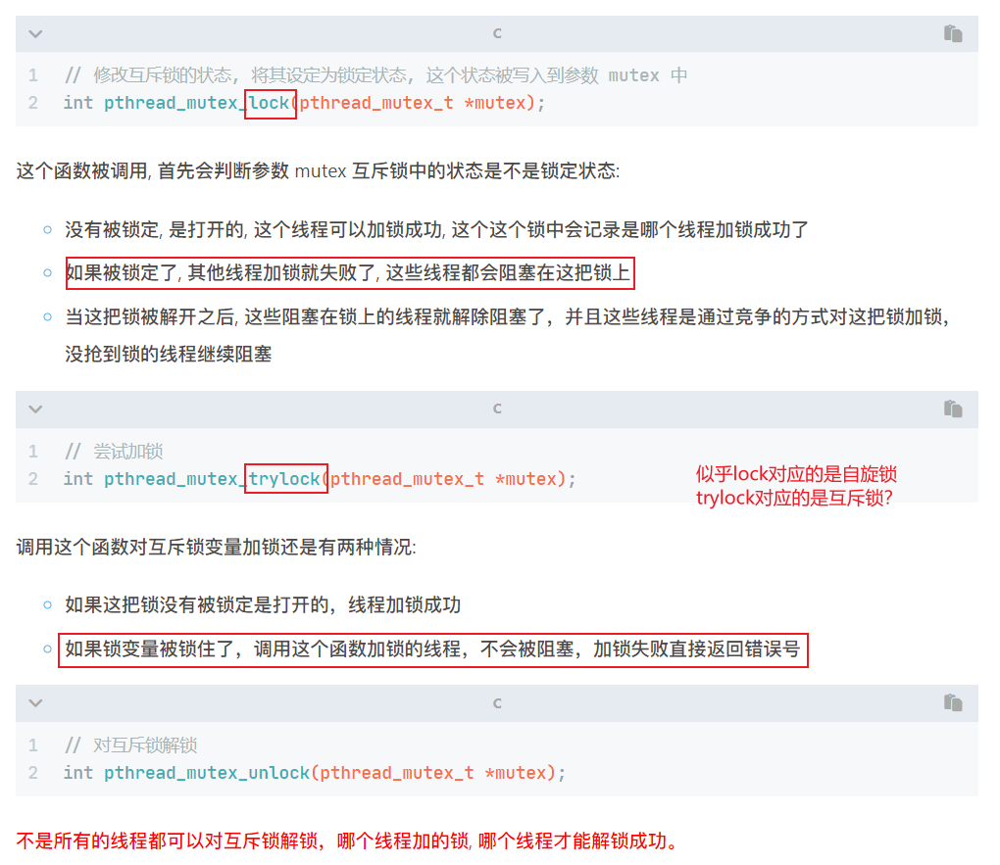
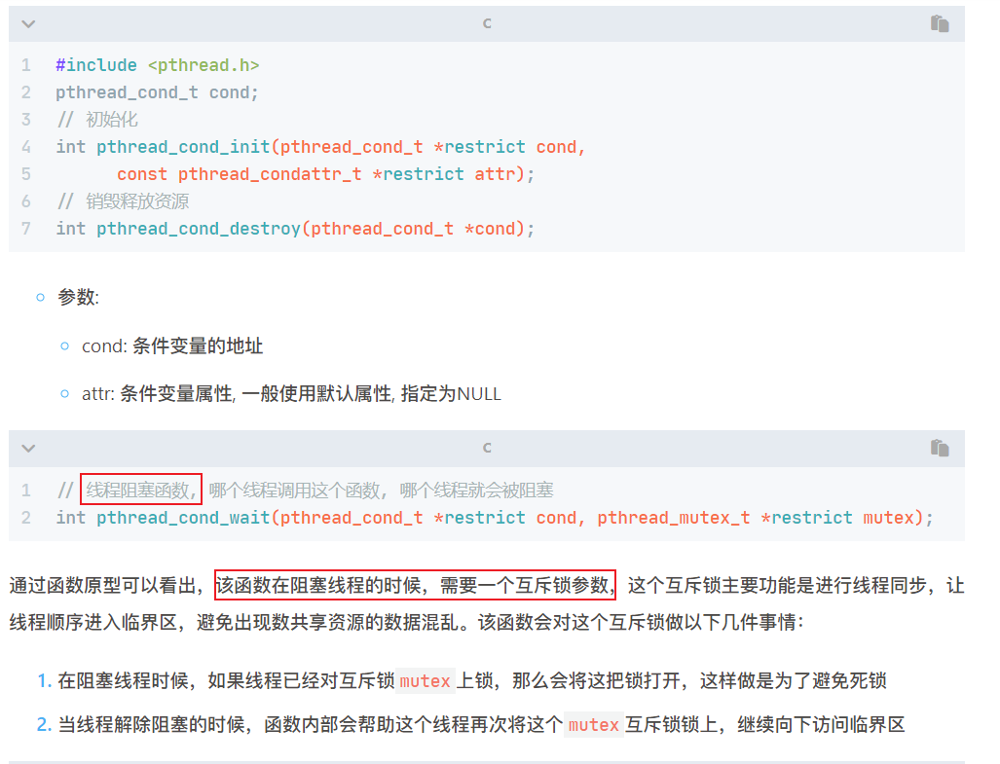

# 多线程/线程同步/线程池

- [多线程/线程同步/线程池](#多线程线程同步线程池)
  - [多线程](#多线程)
    - [线程函数](#线程函数)
      - [pthread\_exit \& pthread\_join \& pthread\_detach](#pthread_exit--pthread_join--pthread_detach)
  - [线程同步](#线程同步)
    - [互斥锁](#互斥锁)
    - [读写锁](#读写锁)
    - [条件变量](#条件变量)
      - [基于条件变量的生产者消费者问题](#基于条件变量的生产者消费者问题)
    - [信号量](#信号量)
      - [基于信号量的生产者消费者问题](#基于信号量的生产者消费者问题)
  - [线程池](#线程池)


## 多线程

每一个进程对应一块虚拟地址空间：
  

进程有自己独立的虚拟地址空间, 多个线程共用同一个地址空间。节省资源，开销少。
**==多个线程共享代码段(text)，全局数据区(data段 bss段)，堆区(stack)，打开的文件（文件描述符）==**
**==每个线程都有自己的栈区和寄存器（内核管理）==**

---

linux基于进程做了一个线程，linux中进程是轻量级进程light weight process LWP。
线程上下文切换比进程上下文切换快得多。

在处理多任务程序的时候使用多线程比使用多进程要更有优势，但是线程并不是越多越好，如何控制线程的个数呢？
**文件IO操作**：文件IO对CPU是使用率不高, 因此可以分时复用CPU时间片, 线程的个数 = 2 * CPU核心数 (效率最高)
处理**复杂的算法**(主要是CPU进行运算, 压力大)，线程的个数 = CPU的核心数 (效率最高)

### 线程函数

进程创建子进程时，原来的进程退化成为主线程。

  

```c
// pthread_create.c 
#include <stdio.h>
#include <stdlib.h>
#include <unistd.h>
#include <string.h>
#include <pthread.h>

void* callback(void* args) {
    for (int i=0; i<5; ++i) {
        printf("子线程：i=%d\n", i);
    }
    printf("子线程：%ld\n", pthread_self());
    return NULL;
}

int main() {
    pthread_t tid;
    pthread_create(&tid, NULL, callback, NULL);
    for (int i=0; i<5; ++i)
        printf("主线程: i=%d\n", i);
    printf("主线程：%ld\n", pthread_self());
    sleep(1);
    // pthread_exit(NULL)也可以解决该问题，先不释放虚拟地址空间
    return 0;
}
```

注意：
**1.主线程执行完了就会释放虚拟地址空间，所以常常都释放了子线程还没跑起来，主线程需要sleep一手。
2.编译指令时`gcc pthread_create -lpthread` 否则，链接不到线程库文件。**

  

---



==为什么要由主线程回收子线程资源？（保留疑问）==
这样可以**确保主线程不会在子线程完成之前结束**，从而确保子线程能够正确地执行完毕，避免资源泄漏或其他潜在问题。

```c
#include <stdio.h>
#include <stdlib.h>
#include <unistd.h>
#include <string.h>
#include <pthread.h>

struct Test
{
    int num;
    int age;
};

struct Test t; //得定义到父子进程共享区域 如果放到子进程内 当子进程结束时 局 部变量也没了
// 当然你也可以放到主线程的栈空间，即在主线程中定义 然后你穿给他就行了
void* callback(void* args) {
    for (int i=0; i<5; ++i) {
        printf("子线程：i=%d\n", i);
    }
    printf("子线程：%ld\n", pthread_self());
    t.num = 10;
    t.age = 18;
    pthread_exit(&t);
    return NULL;
}

int main() {
    pthread_t tid;
    pthread_create(&tid, NULL, callback, NULL);
    for (int i=0; i<5; ++i)
        printf("主线程: i=%d\n", i);
    printf("主线程：%ld\n", pthread_self());
    // pthread_exit(NULL); 由于pthread_join会阻塞等待子线程的退出 所以没必要
    void* ptr; // 这个ptr最终会指向pthread_exit传出来的t的地址；因为我们想要 修改ptr 所以传入&ptr
    pthread_join(tid, &ptr);
    struct Test* pt = (struct Test*)ptr;
    printf("子线程: num=%d, age=%d\n", pt->num, pt->age);
    return 0;
}
```

  

#### pthread_exit & pthread_join & pthread_detach

pthread_exit用于线程自行退出，pthread_join用于主线程等待并回收子线程资源，pthread_detach用于将线程置于分离状态以便自动释放资源。(常用于主线程最后的自动退出)

specifically,
线程退出函数 pthread_exit(void* retval): 用于线程自行退出，通常在线程函数的最后调用。调用exit后立即终止，如果线程是joinable状态，exit不会释放线程占用的资源，需要通过pthread_join回收；如果是detached状态，exit会自动释放线程占用的资源。
<!-- 让线程退出时，不释放其虚拟地址空间，即不影响其他线程的正常运行。（常常在主线程最后使用，防止主线程先退出销毁了虚拟地址空间，而子线程还没结束） -->

线程回收函数 pthread_join(pid, void** retval): 用于主线程**阻塞**等待子线程pid退出并回收子线程的资源。只有joinable状态的线程才可以被join。

线程分离函数 pthread_detach(pid): 用于将线程pid标记为detached状态，处于detached状态的线程在退出时会自动释放资源，不需要其他线程回收。**不必等待主线程使用join函数阻塞等待**回收资源。一个detached线程不能被其他线程join。

## 线程同步

线程同步是让线程依照顺序依次执行（跟并行没关系）

### 互斥锁

  



  
> **图片上的互斥锁自旋锁关系是不对的**。我还不清楚trylock有什么用，反正互斥锁用的都是`pthread_mutex_lock`;
> trylock可用于防止死锁，因为加锁失败后不会阻塞，还可以干其他的事儿，此时可以释放另一个临界资源，这就打破了**请求与保持**必要条件。

```c
#include <stdio.h>
#include <unistd.h>
#include <stdlib.h>
#include <sys/types.h>
#include <sys/stat.h>
#include <string.h>
#include <pthread.h>

#define MAX 50
// 全局变量
int number;
pthread_mutex_t mutex;

// 线程处理函数
void* funcA_num(void* arg)
{
    for(int i=0; i<MAX; ++i)
    {
        pthread_mutex_lock(&mutex);
        int cur = number;
        cur++;
        usleep(1000);
        number = cur;
        printf("Thread A, id = %lu, number = %d\n", pthread_self(), number);
        pthread_mutex_unlock(&mutex);
    }

    return NULL;
}

void* funcB_num(void* arg)
{
    for(int i=0; i<MAX; ++i)
    {
        pthread_mutex_lock(&mutex);
        int cur = number;
        cur++;
        number = cur;
        printf("Thread B, id = %lu, number = %d\n", pthread_self(), number);
        usleep(500);
        pthread_mutex_unlock(&mutex);
    }

    return NULL;
}

int main(int argc, const char* argv[])
{
    pthread_t p1, p2;
    pthread_mutex_init(&mutex, 0);

    // 创建两个子线程
    pthread_create(&p1, NULL, funcA_num, NULL);
    pthread_create(&p2, NULL, funcB_num, NULL);

    // 阻塞，资源回收
    pthread_join(p1, NULL);
    pthread_join(p2, NULL);
    pthread_mutex_destroy(&mutex);

    return 0;
}
```

自旋锁使用方法基本一致

```c
pthread_spinlock_t spinlock;
pthread_spin_init(&spinlock, 0);
pthread_spin_lock(&spinlock);
pthread_spin_unlock(&spinlock);
pthread_spin_destroy(&spinlock);
```

注意别产生死锁，情况如下：
1.加锁之后忘记解锁
2.重复加锁
3.在程序中有多个共享资源, 因此有很多把锁，随意加锁，导致相互被阻塞（也就是常见概念上的死锁，循环链）
  

解决方法：采用**资源按序分配法(大家保持同一顺序来申请资源)**来破坏循环等待条件

---

### 读写锁

读锁共享，写锁独占，写优先级高
读多写少使用读写锁。

```c
pthread_rwlock_t rwlock;
pthread_rwlock_init(&rwlock, NULL);
pthread_rwlock_destroy(&rwlock);
```

  

题目要求：8个线程操作同一个全局变量，3个线程不定时写同一全局资源，5个线程不定时读同一全局资源。

```c
#include <stdio.h>
#include <unistd.h>
#include <stdlib.h>
#include <sys/types.h>
#include <sys/stat.h>
#include <string.h>
#include <pthread.h>

#define MAX 50
// 全局变量
int number;
pthread_rwlock_t rwlock;

// 线程处理函数
void* read_num(void* arg)
{
    for(int i=0; i<MAX; ++i)
    {
        pthread_rwlock_rdlock(&rwlock);
        printf("Thread A, id = %lu, number = %d\n", pthread_self(), number);
        pthread_rwlock_unlock(&rwlock);
        usleep(rand()%5); // 休眠0,1,2,3,4微秒
    }
    return NULL;
}

void* write_num(void* arg)
{
    for(int i=0; i<MAX; ++i)
    {
        pthread_rwlock_wrlock(&rwlock);
        int cur = number;
        cur++;
        number = cur;
        printf("Thread B, id = %lu, number = %d\n", pthread_self(), number);
        pthread_rwlock_unlock(&rwlock);
        usleep(5);
    }

    return NULL;
}

int main(int argc, const char* argv[])
{
    pthread_t p1[5], p2[3]; // p1 read
    pthread_rwlock_init(&rwlock, 0);

    // 创建两种子线程
    for (int i=0; i<5; ++i) {
        pthread_create(&p1[i], NULL, read_num, NULL);
    }
    for (int i=0; i<3; ++i) {
        pthread_create(&p2[i], NULL, write_num, NULL);
    }

    // 阻塞，资源回收
    for (int i=0; i<5; ++i)
        pthread_join(p1[i], NULL);
    for (int i=0; i<3; ++i)
        pthread_join(p2[i], NULL);
    pthread_rwlock_destroy(&rwlock);
    return 0;
}
```

### 条件变量

**并发有两大需求：互斥和同步
互斥是因为线程间存在共享数据资源，通过互斥锁mutex解决。
同步则是因为线程间存在依赖。在生产者消费者问题中，消费者发现队列为空时，告诉os：“我要wait，一会儿会有其他线程来唤醒我”（事件模式）。生产者push队列之后，调用signal，告诉os：“你可以唤醒wait的线程了（如果有的话）”**

> 如果没有这种事件event模式，你只能使用轮询poll模式，不断去轮询队列，有值就消费，没值sleep一会儿再来（挺耗cpu的）

因为它常常和if, while一块用，所以叫条件变量。

条件变量是用来进行线程的阻塞，必须搭配互斥锁使用，互斥锁实现线程同步。
  

  

> pthread_cond_wait有三个功能：1.阻塞线程；2.在阻塞线程之前打开互斥锁；3.线程解除阻塞之后锁上互斥锁。
> 条件变量不是PV操作，信号量才是。
> 信号量是一种更高级的抽象，可以利用条件变量、互斥锁等基础原语来实现。

#### 基于条件变量的生产者消费者问题

```c
#include <stdio.h>
#include <stdlib.h>
#include <unistd.h>
#include <pthread.h>

pthread_cond_t cond;
pthread_mutex_t mutex;

// 任务队列用来存储任务/数据，可用数组、链表或者容器表示，简单起见我们就用使用链表，只能从表头插入取出
typedef struct Node {
    int val;    
    struct Node* next;
}Node;

Node* head = NULL; // 先整个空的头

void* producer(void* arg) {
    while (1) { // 不断生产
        // *多个线dd程不能同时往链表(共享资源)中添加节点*
        // *此外本来我们往容器中添加数据，生成者也会有阻塞条件（容器满），此处简单起见弄个链表没有上限*
        pthread_mutex_lock(&mutex);
        Node* node = (Node*)malloc(sizeof(Node));
        // 初始化node
        node->val = random() % 1000;
        node->next = head; // 头插法
        head = node;
        printf("Producer: %ld, value: %d\n", pthread_self(), node->val);
        pthread_mutex_unlock(&mutex);
        pthread_cond_signal(&cond); // 唤醒>=1个消费者 *cond中记录了阻塞的消费者线程*
        sleep(rand() % 3);
    }
    return NULL;
}

void* consumer(void* arg) {
    /*
    分析过程：
    假设上来没有资源(head=NULL)，第一个消费者抢到锁上锁成功，被wait函数阻塞（其他也抢到时间片的消费者会被阻塞在互斥锁上），
    wait很聪明，*会自动把锁打开*，避免死锁（如果不释放，生产者也抢不到锁），wait开锁之后，其他消费者(if have)也进来被wait阻塞了，锁依然打开
    假设阻塞之后来资源了，被阻塞的线程会*抢*互斥锁，抢到的那位解除阻塞，其他继续阻塞(等到该线程执行结束后解锁，此时又会有一个线程抢到，此时head==NULL，故而需要判断)
    ，wait同时会自动上锁，然后线程访问下面的临界资源

    > 如果说把while换作if(head==NULL)，会发生什么：消费者阻塞在wait->wait解锁->生产者上锁->生产一个商品然后signal唤醒>=1个消费者，
    > 此时，一个消费者抢到锁并解锁，其他消费者依然阻塞在wait，抢到锁的消费者消费结束后解锁，此时没加锁成功的某线程又抢到锁，
    > 此时head==NULL,如果是if，这个消费者就直接去消费head了，就出问题了。
    > 即*我们想让消费者被唤醒之后再做一次判断(因为被唤醒的时候未必有资源(wait生产一个资源会唤醒多位))*
    */
    while (1) {
        // 条件变量实现版本，互斥锁应该在wait之前（否则wait上锁，你下面又上锁就gg了）
        pthread_mutex_lock(&mutex); // 链表依然是共享资源
        // *消费时有阻塞条件奥（链表中有东西）*
        while (head == NULL) { // 当链表为空，告诉os，我要wait，一会儿会有其他线程来唤醒我（此处不同于信号量中的p操作）
            pthread_cond_wait(&cond, &mutex); // 阻塞消费者线程
        }
        Node* node = head;
        head = head->next;
        printf("Consumer: %ld, value: %d\n", pthread_self(), node->val);
        free(node);
        pthread_mutex_unlock(&mutex);
        sleep(rand() % 3);
    }
    return NULL;
}

int main() {
    pthread_cond_init(&cond, NULL);
    pthread_mutex_init(&mutex, NULL);
    pthread_t t1[5], t2[5];
    for (int i=0; i<5; ++i) 
        pthread_create(&t1[i], NULL, producer, NULL);
    for (int i=0; i<5; ++i)
        pthread_create(&t2[i], NULL, consumer, NULL);
    // 释放线程资源
    for (int i=0; i<5; ++i) { 
        pthread_join(t1[i], NULL);
        pthread_join(t2[i], NULL);
    }
    pthread_mutex_destroy(&mutex);
    pthread_cond_destroy(&cond);
    return 0;
}
```

### 信号量

信号量其实就是个变量，用来表示系统中某种资源的数量，需要设初值。
> 对应王道课本中的信号量机制

申请资源：wait原语(简称P操作)，p一次，value--，value<0时使用block原语自我阻塞。
释放资源：signal原语(简称V操作)，v一次，value++，若v后依然**value<=0，说明有进/线程被阻塞等待该资源**，使用wakeup原语唤醒等待队列第一个进程（阻塞->就绪）

  

  
  

#### 基于信号量的生产者消费者问题

1.当资源总数为1时，我们是不需要使用互斥锁对缓冲区进行互斥访问，信号量中包括这件事情。即此时只需要两个信号量变量。
2.当资源总数大于1时，需要额外的一个互斥锁实现缓冲区的互斥访问。且需要互斥夹紧。

```c
#include <stdio.h>
#include <stdlib.h>
#include <unistd.h>
#include <pthread.h>
#include <semaphore.h>

const int NUMBER = 10; // 缓冲区数量/允许并发的数量咯
sem_t sem_p;   // 生产者同步信号量 表示空闲缓冲区的数量
sem_t sem_c;    // 消费者同步信号量 表示产品的数量

pthread_mutex_t mutex;

typedef struct Node {
    int val;    
    struct Node* next;
}Node;

Node* head = NULL; // 先整个空的头

void* producer(void* arg) {
    while (1) {
        sem_wait(&sem_p); // p一个空间
        // 信号量实现版本，互斥锁应该在wait之后，互斥夹紧
        pthread_mutex_lock(&mutex);
        Node* node = (Node*)malloc(sizeof(Node));
        node->val = random() % 1000;
        node->next = head; // 头插法
        head = node;
        printf("+++Producer: %ld, value: %d\n", pthread_self(), node->val);
        pthread_mutex_unlock(&mutex);
        sem_post(&sem_c); // v一个产品
        sleep(rand() % 3);
    }
    return NULL;
}

void* consumer(void* arg) {
    while (1) {
        sem_wait(&sem_c); // p一个产品
        pthread_mutex_lock(&mutex); // 链表依然是共享资源
        Node* node = head;
        head = head->next;
        printf("---Consumer: %ld, value: %d\n", pthread_self(), node->val);
        free(node);
        pthread_mutex_unlock(&mutex);
        sem_post(&sem_p); // v一个空间
        sleep(rand() % 3);
    }
    return NULL;
}

int main() {
    sem_init(&sem_p, 0, NUMBER); // 空闲缓冲区数量初始化为n
    sem_init(&sem_c, 0, 0); // 产品数量初始化为0

    pthread_mutex_init(&mutex, NULL);
    pthread_t t1[5], t2[5];
    for (int i=0; i<5; ++i) 
        pthread_create(&t1[i], NULL, producer, NULL);
    for (int i=0; i<5; ++i)
        pthread_create(&t2[i], NULL, consumer, NULL);
    // 释放线程资源
    for (int i=0; i<5; ++i) 
        pthread_join(t1[i], NULL);
    for (int i=0; i<5; ++i) 
        pthread_join(t2[i], NULL);

    pthread_mutex_destroy(&mutex);
    sem_destroy(&sem_p);
    sem_destroy(&sem_c);

    return 0;
}
```

## 线程池

多线程中频繁创建销毁线程效率很低，线程上下文切换很耗时。所以需要一种线程复用的方法，即执行完一个任务，并不被销毁，而是可以继续执行其他的任务。
**线程池**上场。

线程池是一种多线程处理形式，处理过程中将任务添加到队列，然后在创建线程后自动启动这些任务。

线程池组成：
> 一句话总结：任务队列是任务容器，生产者将任务放到队列内(so who is producer?)，工作线程是消费者，管理者线程管理工作线程数量。

1. 任务队列：存储需要处理的任务（数组、链表或者container，生产者与消费者模型）
   1. 生产者把任务放到任务队列，消费者线程不断从任务队列取任取。（如果任务队列为空，阻塞消费者线程；如果任务队列满，阻塞生产者。）
   2. 任务是一些(回调)函数，即存储函数指针即可。
2. 工作线程（任务队列中任务的**消费者**）：N个
   1. 作用是不断从任务队列取出并处理任务。
3. 管理者线程（不干活）：负责管理**工作线程**（工头/hr）；1个
   1. 作用是周期性监测**任务队列中的任务个数**及**处理忙状态的工作线程的个数**。
   2. 当任务过多时，可适当创建一些新工作线程(招人)；当任务过少时，适当销毁一些工作线程(裁人)。
   3. 可以设定一个频率，管理者是爱sleep的。
