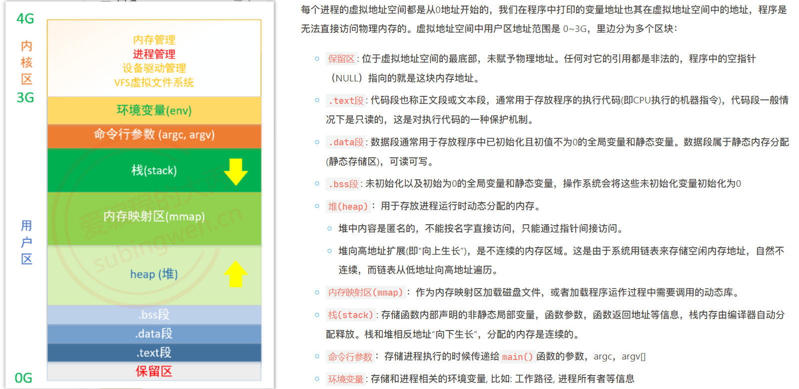

# 多线程和线程同步

## 多线程

每一个进程对应一块虚拟地址空间：
  

进程有自己独立的虚拟地址空间, 多个线程共用同一个地址空间。节省资源，开销少。
**==多个线程共享代码段(text)，全局数据区(data段 bss段)，堆区(stack)，打开的文件（文件描述符）==**
**==每个线程都有自己的栈区和寄存器（内核管理）==**

---

linux基于进程做了一个线程，linux中进程是轻量级进程light weight process LWP。
线程上下文切换比进程上下文切换快得多。

在处理多任务程序的时候使用多线程比使用多进程要更有优势，但是线程并不是越多越好，如何控制线程的个数呢？
**文件IO操作**：文件IO对CPU是使用率不高, 因此可以分时复用CPU时间片, 线程的个数 = 2 * CPU核心数 (效率最高)
处理**复杂的算法**(主要是CPU进行运算, 压力大)，线程的个数 = CPU的核心数 (效率最高)

### 线程函数

进程创建子进程时，原来的进程退化成为主线程。

  

```c
// pthread_create.c 
#include <stdio.h>
#include <stdlib.h>
#include <unistd.h>
#include <string.h>
#include <pthread.h>

void* callback(void* args) {
    for (int i=0; i<5; ++i) {
        printf("子线程：i=%d\n", i);
    }
    printf("子线程：%ld\n", pthread_self());
    return NULL;
}

int main() {
    pthread_t tid;
    pthread_create(&tid, NULL, callback, NULL);
    for (int i=0; i<5; ++i)
        printf("主线程: i=%d\n", i);
    printf("主线程：%ld\n", pthread_self());
    sleep(1);
    // pthread_exit(NULL)也可以解决该问题，先不释放虚拟地址空间
    return 0;
}
```

注意：
**1.主线程执行完了就会释放虚拟地址空间，所以常常都释放了子线程还没跑起来，主线程需要sleep一手。
2.编译指令时`gcc pthread_create -lpthread` 否则，链接不到线程库文件。**

  

---


==为什么要由主线程回收子线程资源？（保留疑问）==
这样可以**确保主线程不会在子线程完成之前结束**，从而确保子线程能够正确地执行完毕，避免资源泄漏或其他潜在问题。

```c
#include <stdio.h>
#include <stdlib.h>
#include <unistd.h>
#include <string.h>
#include <pthread.h>

struct Test
{
    int num;
    int age;
};

struct Test t; //得定义到父子进程共享区域 如果放到子进程内 当子进程结束时 局 部变量也没了
// 当然你也可以放到主线程的栈空间，即在主线程中定义 然后你穿给他就行了
void* callback(void* args) {
    for (int i=0; i<5; ++i) {
        printf("子线程：i=%d\n", i);
    }
    printf("子线程：%ld\n", pthread_self());
    t.num = 10;
    t.age = 18;
    pthread_exit(&t);
    return NULL;
}

int main() {
    pthread_t tid;
    pthread_create(&tid, NULL, callback, NULL);
    for (int i=0; i<5; ++i)
        printf("主线程: i=%d\n", i);
    printf("主线程：%ld\n", pthread_self());
    // pthread_exit(NULL); 由于pthread_join会阻塞等待子线程的退出 所以没必要
    void* ptr; // 这个ptr最终会指向pthread_exit传出来的t的地址；因为我们想要 修改ptr 所以传入&ptr
    pthread_join(tid, &ptr);
    struct Test* pt = (struct Test*)ptr;
    printf("子线程: num=%d, age=%d\n", pt->num, pt->age);
    return 0;
}
```

  

## 线程同步

线程同步是让线程依照顺序依次执行（跟并行没关系）

### 互斥锁

**互斥锁**
  


  
> **图片上的互斥锁自旋锁关系是不对的**。我还不清楚trylock有什么用，反正互斥锁用的都是`pthread_mutex_lock`;
> trylock可用于防止死锁，因为加锁失败后不会阻塞，还可以干其他的事儿，此时可以释放另一个临界资源，这就打破了**请求与保持**必要条件。

```c
#include <stdio.h>
#include <unistd.h>
#include <stdlib.h>
#include <sys/types.h>
#include <sys/stat.h>
#include <string.h>
#include <pthread.h>

#define MAX 50
// 全局变量
int number;
pthread_mutex_t mutex;

// 线程处理函数
void* funcA_num(void* arg)
{
    for(int i=0; i<MAX; ++i)
    {
        pthread_mutex_lock(&mutex);
        int cur = number;
        cur++;
        usleep(1000);
        number = cur;
        printf("Thread A, id = %lu, number = %d\n", pthread_self(), number);
        pthread_mutex_unlock(&mutex);
    }

    return NULL;
}

void* funcB_num(void* arg)
{
    for(int i=0; i<MAX; ++i)
    {
        pthread_mutex_lock(&mutex);
        int cur = number;
        cur++;
        number = cur;
        printf("Thread B, id = %lu, number = %d\n", pthread_self(), number);
        usleep(500);
        pthread_mutex_unlock(&mutex);
    }

    return NULL;
}

int main(int argc, const char* argv[])
{
    pthread_t p1, p2;
    pthread_mutex_init(&mutex, 0);

    // 创建两个子线程
    pthread_create(&p1, NULL, funcA_num, NULL);
    pthread_create(&p2, NULL, funcB_num, NULL);

    // 阻塞，资源回收
    pthread_join(p1, NULL);
    pthread_join(p2, NULL);
    pthread_mutex_destroy(&mutex);

    return 0;
}
```

自旋锁使用方法基本一致

```c
pthread_spinlock_t spinlock;
pthread_spin_init(&spinlock, 0);
pthread_spin_lock(&spinlock);
pthread_spin_unlock(&spinlock);
pthread_spin_destroy(&spinlock);
```

注意别产生死锁，情况如下：
1.加锁之后忘记解锁
2.重复加锁
3.在程序中有多个共享资源, 因此有很多把锁，随意加锁，导致相互被阻塞（也就是常见概念上的死锁，循环链）
  

解决方法：采用**资源按序分配法(大家保持同一顺序来申请资源)**来破坏循环等待条件

---

### 读写锁

**读写锁**
读锁共享，写锁独占，写优先级高
读多写少使用读写锁。

```c
pthread_rwlock_t rwlock;
pthread_rwlock_init(&rwlock, NULL);
pthread_rwlock_destroy(&rwlock);
```

  

题目要求：8个线程操作同一个全局变量，3个线程不定时写同一全局资源，5个线程不定时读同一全局资源。

```c
#include <stdio.h>
#include <unistd.h>
#include <stdlib.h>
#include <sys/types.h>
#include <sys/stat.h>
#include <string.h>
#include <pthread.h>

#define MAX 50
// 全局变量
int number;
pthread_rwlock_t rwlock;

// 线程处理函数
void* read_num(void* arg)
{
    for(int i=0; i<MAX; ++i)
    {
        pthread_rwlock_rdlock(&rwlock);
        printf("Thread A, id = %lu, number = %d\n", pthread_self(), number);
        pthread_rwlock_unlock(&rwlock);
        usleep(rand()%5); // 休眠0,1,2,3,4微秒
    }
    return NULL;
}

void* write_num(void* arg)
{
    for(int i=0; i<MAX; ++i)
    {
        pthread_rwlock_wrlock(&rwlock);
        int cur = number;
        cur++;
        number = cur;
        printf("Thread B, id = %lu, number = %d\n", pthread_self(), number);
        pthread_rwlock_unlock(&rwlock);
        usleep(5);
    }

    return NULL;
}

int main(int argc, const char* argv[])
{
    pthread_t p1[5], p2[3]; // p1 read
    pthread_rwlock_init(&rwlock, 0);

    // 创建两种子线程
    for (int i=0; i<5; ++i) {
        pthread_create(&p1[i], NULL, read_num, NULL);
    }
    for (int i=0; i<3; ++i) {
        pthread_create(&p2[i], NULL, write_num, NULL);
    }

    // 阻塞，资源回收
    for (int i=0; i<5; ++i)
        pthread_join(p1[i], NULL);
    for (int i=0; i<3; ++i)
        pthread_join(p2[i], NULL);
    pthread_rwlock_destroy(&rwlock);
    return 0;
}
```

### 条件变量

条件变量是用来进行线程的阻塞，必须搭配互斥锁使用，互斥锁实现线程同步。
  
> 跟PV操作感觉还是不太一样
> pthread_cond_wait有三个功能：1.阻塞线程；2.在阻塞线程之前打开互斥锁；3.线程解除阻塞之后锁上互斥锁。

#### 基于条件遍历的生产者消费者问题

```c
#include <stdio.h>
#include <stdlib.h>
#include <unistd.h>
#include <string.h>
#include <pthread.h>

pthread_cond_t cond; // full=0 表示产品的数量
pthread_mutex_t mutex;
//此处由于链表没有空间上限 就不整条件变量empty来限制缓冲区上限了

// 定义链表
struct Node {
    int number;
    struct Node* next;
};

struct Node *head = NULL;

void* producer(void* args) {
    while (1) {
        pthread_mutex_lock(&mutex);
        // 生产一个新节点
        struct Node* newNode = (struct Node*)malloc(sizeof(struct Node));
        newNode->number = rand() % 1000;
        newNode->next = head; // 头插法(不带头结点的链表)
        // 把产品放到缓冲区
        head = newNode;
        printf("生产者, id: %ld, number %d\n", pthread_self(), newNode->number);
        pthread_mutex_unlock(&mutex);
        pthread_cond_signal(&cond); // 增加一个产品；前V后P；
        sleep(rand() % 3);
    }
    return NULL;
}

void* consumer(void* args) {
    while(1) {
        pthread_mutex_lock(&mutex); // 为什么要把临界区划得这么大呢？王道书上直接互斥夹紧缓存区啊
        // 从头消费一个新节点 条件是链表中有元素才行
        while(head == NULL) //  为什么要判断？
            pthread_cond_wait(&cond, &mutex);
        struct Node* tmp = head;
        printf("消费者, id: %ld, number %d\n", pthread_self(), tmp->number);
        head = head->next;
        free(tmp);
        pthread_mutex_unlock(&mutex);

        sleep(rand() % 3);
    }
    return NULL;
}

int main() {
    pthread_mutex_init(&mutex, NULL);
    pthread_cond_init(&cond, NULL);
    pthread_t p1[5], p2[5]; // t1:producer
    for (int i=0; i<5; ++i)
        pthread_create(&p1[i], NULL, producer, NULL);
    for (int i=0; i<5; ++i)
        pthread_create(&p2[i], NULL, consumer, NULL);
    for (int i=0; i<5; ++i)
        pthread_join(p1[i], NULL);
    for (int i=0; i<5; ++i)
        pthread_join(p2[i], NULL);
    pthread_mutex_destroy(&mutex);
    pthread_cond_destroy(&cond);
    return 0;
}
```
