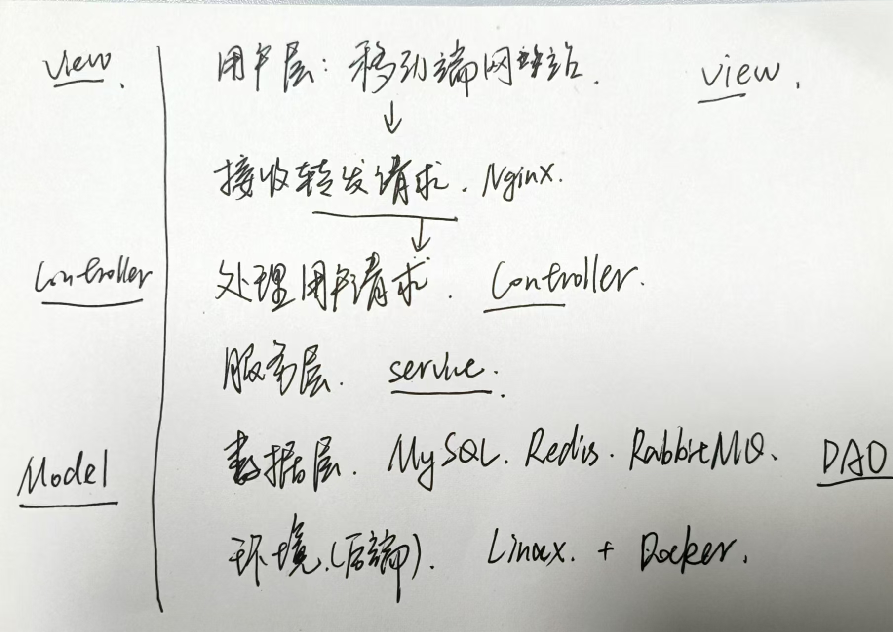

# 常见HR面问题整理

[toc]

## 对加班的理解

1. 我十分理解加班在有些情况下时不可避免的，比如项目紧急上线或者客户需求的时候，我觉得这是很正常的情况，其实跟我读研时候比较类似，到了会议投递ddl或者组会ddl的时候，我们一般也都会加加班让工作做得更好一些。
2. 所以只要工作目标明确，并且报酬合理，我愿意投入额外的时间和精力，为团队和公司的发展贡献更多力量。

## 期望薪资 base

<!-- > 宣传岗位上base包括：上海深圳南京杭州苏州成都 -->

最想去上海深圳，然后南京杭州苏州也都很喜欢
华为定级
13级 19-21 * 14-16  26.6w - 33.6w
14级 22-25 * 14-16 30.8w - 40w

1. 房补是3-8k? 不同地点不一样是什么意思，一般会去那些BASE地点呢？房补是直接到账吗，相当于工资吗？

## 职业规划

* 首先，不断学习和积累后端方向的知识，我计划深入掌握更高级的技术栈，比如微服务架构和性能优化等。同时学习更多开发工具，比如熟练学习kafka、K8S等技术，逐渐成长为一名T型后端开发工程师，也就是兼具技术的深度和广度。
* 第二，我也会继续学习更多的新技术，因为我本身读研期间也在一直学习，从chatgpt，Perplexity到stable diffusion, sora等AIGC方面的新工作，我觉得这有利于扩展自己的技术视野，也能够在工作中相出一些创新的解决方案。
* 再长期，我当然期望成为一名技术专家，但对于我来说，还有不短的距离，我希望以后可以实现这一愿望。

## (项目)困难/最大的挫折 & 解决方案

情景：科研项目中，老师给我了一个全新的、很小众的课题——拓片修复。因此我无法找到完全相关的前人工作作为参考。整个项目的pipeline设计成了一个巨大的挑战。比如，我们需要决定是否采用两阶段模型还是一阶段模型，是否应该使用现有的预训练VAE，还是自己重新进行微调。这些问题让我们在前期阶段耗费了大量时间和精力。

行动：
第一，我积极向团队导师请教，导师会帮我明确整体的研究方向，同时会给出初步的框架性建议。
第二，我大量调研了相关论文，我并没有局限于寻找直接相关的论文，而是广泛调研了多个领域的研究成果，因为科研往往就是可以从不同领域受到启发。
第三，为了验证各种假设，我进行了大量实验，包括尝试不同模块组合、不同参数配置的效果，同时我也在设法获取更多、质量更好的数据集。

结果：最终我们成功构建了一个完整的拓片修复pipeline，并且其效果达到了预期目标。这整个完整过程让我深刻认识到科研中的不确定性和探索性，尤其是面临一些前沿或者小众的、没有现成的解决方案的课题时，这让我的调研能力、解决问题的能力以及团队协作的能力得到了很大的提升。

## 个人优缺点

优点：
1. **学习能力强**：我能快速学习新知识和新技术，我有完整的学习方法，比如我短时间学会了ds+RAG，成功实现了智能客服
   1. **如何学习新知识？**
      1. 理解：官方文档、博客（腾讯技术工程）、书籍（深度学习鱼书）、B站课程、论文
      2. 实践：写项目
      3. 总结：写笔记(参见个人github)、博客；
         1. 总结也就是更深层次的理解，然后再去实践，这样就正向循环了
2. **沟通能力好**：能有效与团队、客户、开发人员沟通，推动问题解决。

缺点：
1. 相对比较缺乏企业实践/实习经历：在科研/项目中积累了较多技术经验，但在**企业级大规模系统的实践上还有待加强**

## 为什么从AI转行后端开发

不确定性/反复调参 -> 落地才是真价值 -> 海量和高并发 需要后端 -> 结合创新

1. ai研究中，我经历了一些不确定性和反复调参的挑战，虽然这种挑战也锻炼了我的耐性和细致思考，后端开发中的系统设计和代码实现让我能够在明确的框架下工作，看到即时的反馈和解决问题的成就感，这种可控性给我带来了更多满足感。
2. ai研究过程中，我积累到了很多ml, dl, nlp/llm, cv方面的知识，但我也意识到技术的真正价值是如何将他们应用到实际项目中，而后端开发可以让我接触到实际的需求，解决具体的问题，我会觉得更有成就感
3. 近年来，随着AI技术的快速发展，我也看到，许多AI应用背后需要强大的后端系统来处理海量数据和高并发请求。我希望通过深入学习后端开发，提升自己在系统设计和高性能编程方面的能力，同时将AI与后端开发结合，创造出更具创新性的解决方案。
<!-- 
## 华为云-媒体服务产品部

我对华为云的数字内容生产线MetaStudio有一定了解。MetaStudio是华为云媒体服务产品部的一款创新性产品，结合了华为云强大的人工智能技术，尤其是与盘古大模型的融合，能够在多种创作场景中提供高效的内容生产支持。

具体来说，MetaStudio涉及到的关键技术/应用包括：

* Text-to-Image: 我们可以用其生成各式各样的背景图像。
* Text-to-Video: 这里主要需要考虑到一些control，比如语言和口型对齐，甚至配和相应的动作。

然后今年在做一些新功能：包括音色复制和智能换装等，我觉得都是很好的方向，比如智能换装这个应用可以用到一些电商平台中进行试穿等等。

应用场景很广泛：虚拟偶像，智能客服，虚拟讲师，wemeeting的会议中虚拟人物等。我觉得这是很好的未来媒体的发展方向，所以如果能够参与到媒体服务产品部的软件开发工作中，我觉得是一件很值得高兴的事情。 -->

## 奖项

数学竞赛一二三比率大概：5% 10% 20%

## 反问

> 心理学：人们对一个体验的印象取决于这个体验结束时候的感受

1. 入职后是如何培养新员工的（从技术和服务两个角度吗），大概会培养周期是多久？
2. 会不会有固定的BASE地？外派的概率？外派的要求？是不是每隔三四年会换一个工作地点，为什么这样子？
3. 通过这场面试，您能给我一些建议吗？
4. 您觉得什么样的人可以出色地做好这份工作，哪些是最重要的能力或素质？

<!-- --- -->

<!--    -->

<!-- ## 华为销服类

### 集体面试

1. 自我介绍 1min
2. 阅读场景题 3min
   1. 读完就不让看题了，所以要把关键词记到纸上
3. 讨论 25min大概
   1. 说出你对场景题的思考和解决方案（可以先用笔梳理自己的思路）
      1. 逻辑清晰
   2. 发言顺序需要自己争取
   3. 不要打断别人，不要过度表现
   4. 准备一些新颖/偏的观点，防止话被说光了
4. 推选汇报人
5. 面试官提问（Q&A环节）

> 似乎一般来说，有leader角色，计时员，记录员(总结大家的观点)，总结员

如何作答呢？

1. 客户第一，方案必须体现用户的痛点
2. 不要二极管，非黑即白，说“兼顾”，“平衡”更好
3. 如果问谁表现最差？不要直接批评，要客观、公正；是否有逻辑？团队协作？贡献度？情绪？时间管理(低效讨论)？是否充分参与讨论？
   1. 整体来看大家都很积极，但在时间管理上，有一定的优化空间。

最后面试官cue到的问题：
1，以case为例，你和客户沟通的时候他态度很恶劣怎么办？
2，你是否认同第x位同学担任总结的角色，为什么？
3，你认为谁表现得最差，谁的问题对你最具有启发性？

[link](https://www.xiaohongshu.com/discovery/item/65f01b120000000012022af6?source=webshare&xhsshare=pc_web&xsec_token=ABW1hK2Pla3YXl0KUGBq9zyXqSGASnXIqwOOmfe-JPSPQ=&xsec_source=pc_share)

如何群面？

[link](https://www.bilibili.com/video/BV1ek4y1A7Yi/?spm_id_from=333.788.recommend_more_video.2&vd_source=31f382886b368673a25ce3ff23e82bfc)

群面是模拟沟通/谈业务的场景，那就需要有逻辑、有条不紊地推动这个项目/团队，懂得合作。

* 竞争心/好胜心不至于太强
* 自我介绍不要秀肌肉，介绍一下你叫啥，你的经验和专业知识能帮助到大家什么，介绍和题目相关的有用的经历
* 时间内一定要达成一致意见/讨论完，不然可能团灭，所以有人垃圾废话的时候可以直接打断...(“你说的有道理，不过我们来谈谈...”)
* 群面的题目多数都来源于面试官的工作，大家的讨论在面试官眼里就跟幼儿园文艺汇演一样，所以不用担心最终方案的水平
* 自由讨论：一开始的时候要站出来说要3分钟的时间来看题目，3分钟之后给后面的时间划分出一个框架出来
* 如何得到观点？
  * 横向拆解：需求 + 场景
  * 纵向拆解：前中后，比如设计一种购物app，分析购物前、购物中、购物后
* 总结陈词的前提是你做好了大家的记录，去总结大家讨论出的方案 -->
<!-- 
### 主管面

12 【自己整理的一些华为主管面问题 - kazino_ | 小红书 - 你的生活指南】 😆 scOC538POv1Diou 😆 https://www.xiaohongshu.com/discovery/item/673aef4f0000000007025769?source=webshare&xhsshare=pc_web&xsec_token=ABepW0zBCyRu3ai_itc4pf9-hPkFiR8m1LtCHZa4akIQI=&xsec_source=pc_share -->