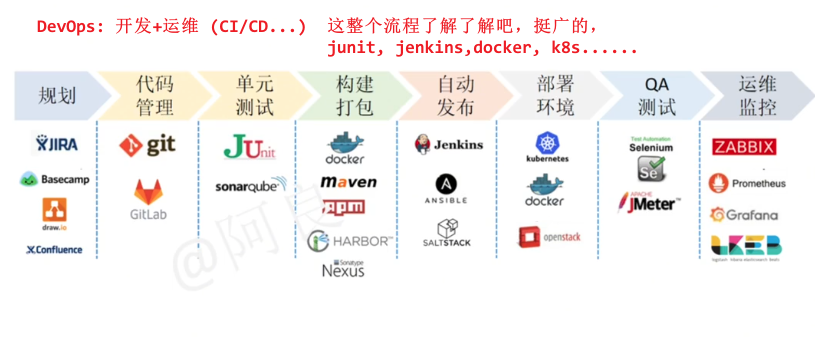
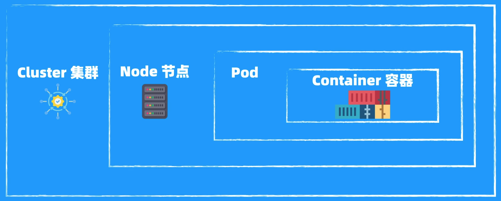

# 云计算服务工程师-相关知识

- [云计算服务工程师-相关知识](#云计算服务工程师-相关知识)
  - [你对面试岗位的了解？](#你对面试岗位的了解)
  - [什么是云(服务)？](#什么是云服务)
  - [解释一下IaaS、PaaS、SaaS](#解释一下iaaspaassaas)
  - [公有云 vs. 私有云](#公有云-vs-私有云)
  - [云服务器使用经验](#云服务器使用经验)
  - [你是怎么用Docker的？](#你是怎么用docker的)
  - [为什么后端开发转云计算服务工程师](#为什么后端开发转云计算服务工程师)
  - [可能需要全球派遣，能接受吗？](#可能需要全球派遣能接受吗)
  - [项目计划](#项目计划)
    - [java后端项目计划/具体流程](#java后端项目计划具体流程)
    - [科研项目项目计划/具体流程](#科研项目项目计划具体流程)
  - [你对华为企业文化的了解/理解？](#你对华为企业文化的了解理解)
  - [场景题](#场景题)
    - [你发现客户使用的产品有bug隐患，但是客户并没有发觉。此时你会如何做？](#你发现客户使用的产品有bug隐患但是客户并没有发觉此时你会如何做)
    - [作为服务工程师，如何高效协同开发人员修复用户使用产品过程中出现的bug](#作为服务工程师如何高效协同开发人员修复用户使用产品过程中出现的bug)
  - [个人优缺点](#个人优缺点)
  - [什么是“云原生”技术](#什么是云原生技术)
  - [k8s/docker/普罗米修斯](#k8sdocker普罗米修斯)
  - [Docker](#docker)
    - [什么是Docker](#什么是docker)
    - [Docker vs. Linux虚拟机](#docker-vs-linux虚拟机)
    - [基础](#基础)
  - [Kubernetes](#kubernetes)
  - [ds](#ds)
      - [ds历程](#ds历程)
      - [ds应用](#ds应用)

## 你对面试岗位的了解？

> 你可以首先解释一下什么是云（服务）

我了解到云计算服务工程师岗位，就是为客户打造一套基于云的完整系统。eg 客户需要用华为云来跑业务：
一句话：**解决方案设计与交付**
1. **设计**：我就需要先搞懂他们的业务需求，然后设计一套方案，可能会用到容器（docker，k8s）、存储、网络、数据库、AI模型、安全等技术，把系统搭起来。
2. **交付**：我得确保这套系统能顺利上线，数据不丢、业务不卡，还能处理各种突发问题，比如宕机了如何快速恢复。让客户觉得好用、靠谱。

## 什么是云(服务)？

* 云服务是由**云服务提供商**（eg 华为云，腾讯云，亚马逊AWS，谷歌云）提供的**计算资源和服务**，包括计算、存储、数据库、人工智能等。致力于为企业提供全栈、全场景的**云解决方案**。
* 用户可以直接按需使用这些资源，无需拥有物理硬件。
  * 优势：用户节约成本，降低初期投资和运维成本；还可以弹性扩展；高可用；快速部署；安全
  * 劣势：依赖网络；隐私问题（数据存储在云端）；长期成本；

---

* 计算：虚拟机、容器
* 存储：对象存储、文件存储
* 网络：虚拟网络、负载均衡器
* 数据库：关系型数据库(mysql, oracle), 非关系型数据库(redis, mongoDB)
* 人工智能服务：图像识别、deepseek、数字人
* 安全：身份验证、数据加密、安全监控
* 大数据分析：数据处理、分析、可视化

Maas(Model-as-a-Service): 昇腾适配版DeepSeek-R1/V3

## 解释一下IaaS、PaaS、SaaS

三者层层递进，满足不同需求

* IaaS: 基础设施即服务（Infrastructure as a Service）
  * 云服务提供商提供**基础设施**，如**虚拟机、网络、以及存储**等。用户可以自由管理配置，自己装系、部署应用、自由度很高
  * eg 华为云的**弹性**云服务器(ECS)（即用户可以按需选择cpu, 存储..）
* PaaS: 平台即服务（Platform as a Service）
  * 提供**应用开发平台**，比如**数据库、消息队列、开发工具**等，给**开发人员**提供一个完整的开发和部署环境，用户可以直接开发、部署、运行应用，无需关心底层细节
  * eg 华为云的**关系型数据库**RDS，提供mysql, PostgreSQL这类数据库
  * eg 华为云**AI开发平台ModelArts**，提供模型开发、训练、推理和部署。（也即MaaS）
* SaaS: 软件即服务（Software as a Service）
  * 提供**软件服务**，用户直接使用**云端的软件**，无需安装、维护，只需通过浏览器访问
  * eg 华为云的云会议WeLink、google docs

## 公有云 vs. 私有云

* 公有云：云服务提供商把服务器、网络等资源统一管理起来，大家一块用。用户无需买设备，按需付费，方便省钱。
  * 优势：**初期成本更低**；弹性扩展能力强；
  * 劣势：**数据隐私**问题（数据存储在云端）；**长期成本**比较高；
  * 适用于：**中小型企业**或初创公司、短期项目、对数据安全要求不高的企业
* 私有云：**资源专供**给一个组织使用，通常部署在企业内部。需要企业自身负责运维
  * 优势：数据在企业本地，安全性高；
  * 劣势：短期成本高；难扩展
  * 适用于：**政府、大企业**；对数据安全要求高的企业，长期项目

比如华为有多种部署deepseek的方法：

1. 基于华为云的**ModelArts服务平台**（MaaS平台）（**公有云**
   1. 提供631B，提供200万token免费体验
   2. **按照时间/token计费，接口调用**，灵活扩容缩容
2. **买华为云服务器**/也可以自己部署到本地 -> **基于ollama**部署ds（**私有云**
   1. 这个服务器资源都是自己的，自己也可以做进一步的**RAG**
   2. > 感觉卖的挺贵的（当然我不知道价格体系，只是我觉得，3k/month(32b)），而且还是32b版本

## 云服务器使用经验

1. 创建/购买云服务器(选择配置规格：内存，cpu，GPU...)
2. ssh连接：ssh username@ip
3. 创建开发环境（eg CUDA, PyTorch），开发/搭建网站

> 更上一层，直接使用google colab (free)

## 你是怎么用Docker的？

1. 点评项目中：基于Docker部署Mysql，redis，nginx(部署前端)，rabbitmq，RAGflow等服务，暴露接口给宿主机
2. 微服务项目中：微服务保护技术sentinel，分布式事务seata

* mysql服务器直接用docker安装，且把端口映射到本地，ip地址就是127.0.0.1/localhost:3306
  * docker容器内的mysql是与宿主机隔离的，有自己独立的ip port，宿主机外部无法直接访问。将该端口映射到宿主机的某个端口，这样宿主机和外部网络就可以通过**宿主机ip+port**访问容器内的服务了。
  * docker pull mysql拉取mysql容器，然后`docker run..`运行该容器

## 为什么后端开发转云计算服务工程师

> 开发门槛降低 -> 不像造轮子，想整合资源，想解决现实问题 -> 后端背景 & 工管

1. **AI趋势**：现在写代码很简单（gpt, copilot, cursor, manus），所以**一般的软件开发门槛**在降低
2. **岗位的广度有吸引力**：该岗位覆盖了云架构设计、交付、运维、以及客户沟通与服务。这样我可以基于华为云的各种云服务来**快速搭建**解决方案，而不是**从零开始造轮子**
3. **后端背景**让我熟悉系统设计、性能优化（数据库优化）和故障排查，这些技能可以用在云上解决方案设计和运维保障
4. 本科是**工管**，学过项目管理、资源协调等知识，可以帮助我在交付中做好进度管理，确保顺利落地

## 可能需要全球派遣，能接受吗？

1. 我的优势是适应能力强，喜欢和不同背景的人交流，能快速融入新环境
2. 我觉得是很好的机会，可以接触到不同的文化，学习到不同的技能

## 项目计划

### java后端项目计划/具体流程

1. 需求分析
   1. 明确项目的核心功能：eg 用户登录，运动场所查询与推荐，智能客服，优惠券秒杀
2. 设计架构(后端)
   1. 后端：springboot + mybatis-plus; 数据库: mysql, redis缓存层；消息队列：rabbitmq；智能系统：word2vec, ds, ragflow；
3. 关键技术选型
   1. 即核心功能的实现方式，eg 登录使用smtp协议，使用redis替代session；智能客服借助rag增强；高并发优化使用redis限流...
4. 开发实现
5. 测试与优化
   1. 单元测试junit，接口测试postman，压力测试jmeter
6. 部署上线
   1. docker + k8s容器化部署， prometheus监控...

### 科研项目项目计划/具体流程

1. 问题分析
   1. 碑文破损->现有方法的问题->核心挑战
2. 方法设计
   1. 两阶段修复：识别+修复
3. 准备数据
   1. 识别训练数据集 + 修复训练数据集
4. 训练模型
   1. 微调、训练与优化
5. 评估优化
   1. 使用大量评估指标 
6. 论文撰写 & 发表

## 你对华为企业文化的了解/理解？

1. 坚持创新与研发：华为一直坚持投入大量资金进行技术创新，研发投入占据总收入的23%，研发员工占据总员工55%，我非常认同这一点，我觉得正式这种对创新和研发的重视，是华为在行业中保持领先的主要原因，这也为员工提供了不断创新和成长的机会。
2. 华为对民族和社会具有高度的责任感：华为在推动技术创新的同时，也肩负着对国家和社会的责任，这种研发精神帮助中国突破了很多卡脖子的技术，包括自主研发的芯片处理器、操作系统以及华为云的GaussDB数据库等等。
3. 认可华为艰苦奋斗的文化：华为一直强调艰苦奋斗的精神，倡导员工面对困难不退缩、勇于拼搏。我觉得我个人成长以来也是以艰苦奋斗作为自己的准则，凡事要么就不做，要么就尽可能地做到最好。
5. 自我批判与持续改进：华为鼓励员工和组织保持自我批判的态度，持续进行自我反思和改进，我十分认同这种文化，我觉得这种文化是难得可贵的，一个人、一个组织都不是完美的，只有积极反思、主动改进，才能变得更好。

所以，我个人是非常认同华为的企业文化的，我也非常喜欢华为公司，我觉得如果我有幸加入华为，做出自己的一份贡献，那我会觉得非常荣幸。

华为成立于1987，有21万员工，遍及170多个国家，为全球30多亿人提供服务。
23年，研发经费占全年收入23%，研发员工越11万，占总员工的55%，专利14万件

<!-- 华为**云媒体服务产品部**：音视频流传输、运动跟踪、AIGC数字人、云会议、云桌面、实时渲染 -->

## 场景题

### 你发现客户使用的产品有bug隐患，但是客户并没有发觉。此时你会如何做？

1. **评估问题**：判断该bug是否影响客户的业务，问题有多严重
2. **与团队沟通**：和开发团队沟通，找出解决方案
3. **主动告知客户**：即使客户没发现，也要主动说明问题，告知我们正在修复，确保客户了解情况
4. **修复问题并持续跟进**：解决问题后，我会确保修复有效，持续跟踪，避免以后出现类似问题
5. 总结经验：总结问题出现的原因，避免类似问题再次发生

### 作为服务工程师，如何高效协同开发人员修复用户使用产品过程中出现的bug

> 收集信息 -> 沟通协商 -> 验证 -> 总结经验

1. 收集问题信息：从用户那里获取问题的细节
2. 与开发人员沟通/协助：清楚描述问题，告诉开发人员bug复现步骤
3. **验证修复**：修复后，我先验证是否有效，再与用户确认问题是否解决
4. 总结经验：分析问题根本原因，提出改进建议，避免再发生

## 个人优缺点

优点：
1. **学习能力强**：我能快速学习新知识和新技术，我有完整的学习方法，比如我短时间学会了ds+RAG，成功实现了智能客服
   1. **如何学习新知识？**
      1. 理解：官方文档、博客（腾讯技术工程）、书籍（深度学习鱼书）、B站课程、论文
      2. 实践：写项目
      3. 总结：写笔记(参见个人github)、博客；
         1. 总结也就是更深层次的理解，然后再去实践，这样就正向循环了
2. **沟通能力好**：能有效与团队、客户、开发人员沟通，推动问题解决。

缺点：
1. 相对比较缺乏企业实践/实习经历：在科研/项目中积累了较多技术经验，但在**企业级大规模系统的实践上还有待加强**

## 什么是“云原生”技术

云原生（cloud-native），是一种**方法论**。**充分利用云计算、容器化和微服务架构等现代化技术来构建和运行应用程序**。强调应用的**灵活性、可扩展性、高可用性**。

> native can be translate to '原生', so bad.

核心特点：

* **微服务架构**：将应用拆分成小的独立的服务，每个服务执行特定功能，便于独立开发、部署和扩展。
* **容器化**：将**应用和依赖环境打包**成容器，然后可以**确保在任何云环境中都能一致运行**。
* **动态管理**：通过自动化工具（如Kubernetes）进行容器和服务的部署、管理和扩展。

## k8s/docker/普罗米修斯

* Docker：用于**构建、运行、传送**应用程序的轻量级平台。
* Kubernetes (K8s)：**自动化管理和编排容器**应用的开源平台。它帮助管理大规模的容器集群，确保高可用性和负载均衡。
* Prometheus：用于**监控和报警**的开源时间序列数据收集系统。

## Docker

### 什么是Docker

* Docker是一个应用 ==**打包、分发、部署**== 的工具
  * **打包**：软件运行需要的依赖、第三方库、软件打包为一个安装包
  * **分发**：把打包好的安装包上传到一个镜像仓库，他人可以方便获取安装
  * **部署**：拿到安装包就可以一个命令运行起来应用，自动模拟出一模一样的运行环境
* 可以理解为一个轻量的虚拟机，它只虚拟你软件需要的运行环境，多余的不要。而普通虚拟机(eg linux虚拟机 VM)则是一个庞大的系统，包含各种你不管你要不要的软件 

### Docker vs. Linux虚拟机

Docker轻快但隔离性弱，适合高效部署应用。VM稳重但资源重，适合需要完整系统隔离的场景。

1. 资源使用
   1. Docker基于容器技术，容器共享宿主os的内核，只打包应用和依赖，资源占用小，启动速度快（秒级）（**Docker是在OS上层的软件**
   2. Linux VM通过虚拟化技术运行完整的os，每个VM有独立的os内核，资源占用大(内存)，启动慢（分钟级）
2. 隔离性
   1. docker容器之间共享内核，若内核有安全漏洞，可能影响所有容器
   2. Linux VM隔离型强，每个VM，互不干扰
3. 可移植性
   1. docker容器可以轻松打包并跨环境迁移（只要宿主系统兼容即可）
   2. Linux VM整个os难以迁移

### 基础

**镜像**(Image)：软件安装包，包含环境依赖
**容器**(Container)：软件安装后的状态，**容器是镜像的运行实例**。当你从一个镜像启动容器时，docker会在镜像的基础上创建一个容器，并将容器的文件系统、网络、环境变量等与宿主机隔离开来。一个image可以创建多个container；不同容器之间隔离。
**Dockerfile**：一个自动化脚本，用来创建Docker镜像

---

Docker安装镜像

* 安装最新版redis`docker run -d -p 6379:6379 --name redis redis:latest`
  * -d 后台
  * `-p 宿主机端口 : 容器内端口`: 将容器的6379**端口暴露**到宿主机的6379端口(容器是隔离环境，有自己的ip+port，不映射的话就访问不到应该)
  * --name 容器命名
  * `-v 数据卷名:容器内目录`：挂载目录，把宿主机目录(绝对路径)挂载到容器内目录
    * eg `-v D:/code/testcode_dir:/app`

---

制作自己的镜像

* `docker build -t name:version`
  * -t 设置镜像名称和版本号
  * 需要提前写好dockerfile

做好之后，别人就可以docker run了

---

Docker挂载目录

为何要挂载目录？

1. **数据持久化**：容器本身是临时的，停止或删除后内部数据都丢失了，而我们想持久化一些数据，eg 数据库数据文件、日志文件等，这时候我们就会挂载到宿主机的目录中
2. **共享文件/配置**：多个容器可以共享配置文件or资源

* `bind mount`: 直接把宿主机目录映射到容器内
* `volumn`: 由容器创建和管理，创建在宿主机，所以删除容器不会丢失，官方推荐

---

Docker多容器通信

---

  

> 丢个图放这儿，DevOps全流程，了解了解，涉及到CICD，云计算，部署等

DevOps = Development + Operations 开发 + 运维
**DevOps强调CI/CD，通过自动化构建、测试和部署，确保快速和安全将代码推向生产环境。**
<!-- 
DevOps核心流程：

1. 规划plan：制定需求和计划
2. 编码code：开发人员写代码，使用git版本控制系统管理代码（含单元测试）
3. 构建build：将代码编译或打包为可执行文件，基于jenkins
4. 测试 -->

## Kubernetes

/ˌkjuːbərˈnɛtiːz/

k8s由google开源的**容器编排引擎**

Docker: 把1个应用/容器放在1个隔离环境中
k8s: 多个应用/容器 多个隔离环境

* **集群Cluster**：多个机器组成的集群
  * 每个机器称为**Node节点**
  * **Master**：集群的控制中心，负责调度和管理集群
* **Pod**：k8s最小部署单元，可以包含一个或多个**容器Container**
  * 一个pod就像一个房子，里面的容器共享网络和存储，共同完成某个人物
  * 容器是真正运行应用的地方，里面打包了应用和依赖环境

想象一个快递公司（Cluster），有几个分拣中心（Node），每个分拣中心有几组工人（Pod），每组工人用自己的工具箱（Container）处理包裹。

  

## ds

#### ds历程

* 24/1发布ds-v1
* 24/12发布ds-v3 (671B)，仅55天训练，是gpt的1/10成本
* 25/1发布ds-R1 直接大火

ds的核心优势

* **低成本**：dsv3和gpt4性能差不多，但训练成本只占据1/10-1/20,
  * fp8混合精度训练，自研moe架构，以及很多技术创新(你看他开源周就知道了，很硬核)
* **性能好**：数学、代码等领域还是SOTA
* **开源**：所以各个云服务提供商也都搞上了

#### ds应用

1. ds+RAG: 构建专业级RAG应用解决方案，可以直接把用户领域（政务/医疗）的数据塞进来，搜索增强
2. ds+Dify: 添加知识库 和 联网搜索，然后可以对接到metaStudio数字人（这数字人还挺好玩的，口型不错，形象形态端庄