# 点评

- [点评](#点评)
  - [QA Summary](#qa-summary)
  - [0. 背景](#0-背景)
    - [项目架构 \& 部署](#项目架构--部署)
    - [数据库表设计](#数据库表设计)
  - [1. 邮件登陆与验证](#1-邮件登陆与验证)
    - [关于session](#关于session)
    - [Q \& A](#q--a)
      - [具体实现](#具体实现)
    - [STAR总结](#star总结)
      - [SMTP POP3 IMAP](#smtp-pop3-imap)
  - [2.缓存数据](#2缓存数据)
    - [标准操作](#标准操作)
    - [缓存更新 / 缓存与数据库的一致性](#缓存更新--缓存与数据库的一致性)
      - [项目实现](#项目实现)
    - [解决缓存穿透问题](#解决缓存穿透问题)
    - [解决缓存雪崩问题](#解决缓存雪崩问题)
    - [如何解决缓存击穿问题](#如何解决缓存击穿问题)
      - [互斥锁解法](#互斥锁解法)
      - [逻辑过期解法](#逻辑过期解法)
  - [推荐系统](#推荐系统)
    - [电商项目常见推荐系统](#电商项目常见推荐系统)
    - [我们的流程](#我们的流程)
    - [改进](#改进)
      - [1. 基于向量数据库进行改进](#1-基于向量数据库进行改进)
      - [2. 模型层面的提升](#2-模型层面的提升)
      - [简单学下ES](#简单学下es)
      - [jmeter](#jmeter)
  - [3. 秒杀](#3-秒杀)
    - [优惠券秒杀下单](#优惠券秒杀下单)
      - [基本的优惠券下单](#基本的优惠券下单)
      - [乐观锁解决超卖问题](#乐观锁解决超卖问题)
      - [悲观锁实现单体一人一单功能](#悲观锁实现单体一人一单功能)
      - [集群环境下并发问题](#集群环境下并发问题)
        - [分布式锁](#分布式锁)
        - [Redission](#redission)
        - [redission是如何实现可重入的](#redission是如何实现可重入的)
        - [redission是如何实现可重试的](#redission是如何实现可重试的)
        - [redission是如何解决锁超时的问题的](#redission是如何解决锁超时的问题的)
    - [异步秒杀优化](#异步秒杀优化)
      - [利用延时消息机制取消超时未支付订单](#利用延时消息机制取消超时未支付订单)
      - [限流器算法](#限流器算法)
      - [基于ZSet实现滑动窗口限流器](#基于zset实现滑动窗口限流器)

## QA Summary

Q1: 基于 SMTP 协议 (QQ 邮箱) 实现邮件登录，使用 Redis 替代传统 Session 机制，实现集群环境下的Session 共享；

**大概总结**：
1. 项目中实现了基于QQ邮箱的邮箱验证码登录。通过JavaMail API配置SMTP邮件服务，向用户发送带有2分钟有效期的验证码，并将其存入Redis。
2. 用户提交验证码后，后端从Redis中验证一致性，通过后生成一个随机Token（用户相关的, eg 基于UUID），作为用户身份标识存储在Redis中(ttl 7days)。
3. Token通过HTTP请求的Authorization头(请求头属性)携带，后续服务可通过该Token获取用户信息，实现了类似Session的身份认证机制，并支持集群环境下的会话共享。

> redis key使用string即可，一个`email_code`，一个`UUID_token`

---

Q2: 利用双重拦截器，完成用户登录状态校验及Token自动续期

1. 首先很多地方需要校验用户登录，所以不能每个业务都写校验逻辑。且我们知道springMVC中在执行controller之前会走interceptor的preHandle()逻辑，我们可以配置拦截路径。
2. 第一个Interceptor拦截一切路径，刷新token的有效期，然后全部放行；第二个Interceptor拦截需要登录的路径。(注意浏览店铺、登录入口是不需要校验登录的，无需拦截)

---

Q3: 利用 Redis 缓存高频数据提升查询速度；

1. 缓存内容：**商铺信息：名称、(店铺描述)、图像URL、地址**、平均价格、营业时间等信息
2. 缓存形式：
   1. 一个`Shop`类型的java对象，利用`Hutool`工具包下的`JSONUtil`将Shop对象转换为**Json字符串**
   2. 利用Redis客户端(jedis)将json字符串存储到redis的String类型的key中(**每个店铺存到一个String中，id作为名称**)
   3. 取出时同样借助redis客户端，然后借助hutool进行反序列化


Q4: 项目QPS测过吗？

<!-- 简单测过。没使用缓存的时候接口大概在5000qps（打到mysql数据库的速度），使用缓存后大概在6/7万qps，大概提升了10倍。我们做了缓存预热、延迟双删机制等保障缓存的有效性。 -->

算了，确实没测明白。大概redis能带来10倍的qps提升。（因为我并没有上线，使用jmeter本地测试是有5k(缓存前)，但这并没有考虑网络因素，所以我很难估算）

---

Q5: 采用延迟双删策略确保数据一致性(Delayed Double Deletion)。

1. 传统的做法是先更新数据库再删除缓存。（反过来的话，发生数据不一致的概率高得多，删除缓存到更新mysql之间，另一个线程又更新了缓存）
2. 先更新数据库再删除缓存的问题：更新数据库到删除缓存之间，另一个线程读到的是redis中的脏数据。
3. 延迟双删
   1. **先删除redis**：避免读到脏数据(只能去mysql)（解决了先更新数据库，再删除缓存中"读到redis失效的数据"的问题）
   2. **再更新数据库**：（在删除redis到更新好数据库之间可能有其他线程查到了数据库旧数据，并写入redis -> 故而最后再删除一次redis）
   3. **延迟一段时间**：给数据库足够的操作时间，确保数据已经持久化到数据库
      1. 延迟时间的选择是50ms-500ms
   4. **再删除一次redis**

---

Q6: 基于BitMap实现布隆过滤器+缓存空对象解决缓存穿透问题

1. 我们基于BitMap和一些hash函数实现了布隆过滤器，首先存储了所有店铺id到布隆过滤器中。
2. 前端提交店铺id，需要先经过BF判断再查询缓存和数据库。如果bloom说没有则一定没有，直接拒绝，避免访问缓存和数据库，如果bloom说有则大概率存在，则继续查询缓存和数据库
3. 如果缓存和数据库都没找到的话，此时我们再去**缓存空对象**来防止短时间内的重复穿透（TTL 2min）

---

Q7: 如何解决缓存击穿问题

缓存击穿：热点key过期的瞬间，大量请求打到数据库，干废数据库。

高并发访问 && 缓存重建业务比较复杂；大家都想去重建缓存，导致数据库压力过大。


1. **互斥锁解法**：缓存未命中时，只让一个线程拿互斥锁，去查询数据库**重建缓存**，其他线程的请求等待锁释放后读取缓存
  * 选择了**一致性Consistency**，但很慢，**可用性Availability**很低(CAP理论)
  * 实现简单；但性能低，有死锁风险
* **逻辑过期**：不给热点数据设置TTL，也就不会失效；但要额外设置一个过期时间字段，当真的过期了，得创建线程去重建缓存，重建过程中其他请求直接拿这个过期了的旧数据
  * 逻辑过期选择了**可用性**，但不保证**一致性**


> 缓存预热：系统对外提供服务前，将高频数据加载到redis，避免刚启动时候缓存为空，导致大量请求达到数据库，造成**缓存击穿**。

---

Q8: 推荐系统中数据库存储问题

1. 将店铺的特征向量N x 200，先通过hutool工具包将java数组序列化为json字符串，然后存入mysql数据库表中，每行记录有一个INT的店铺id，和一个varchar的特征向量。
   1. text2vec是Nx768维了
2. redis是存到**一个**hash中，每个shop_id作为field，对应的value是特征向量的json字符串（全存到一个string会出现大key问题(>10KB)

---

Q9: 如何评估推荐系统的效果


第一：在模型开发阶段（无需用户参与，依赖历史行为数据）

1. 构造一个**验证集**（eg **用户历史交互的最后一条作为目标，前面的交互作为输入（很妙了）**）
   1. 用户曾经购买/浏览/评论过的店铺作为输入，用户最近一次浏览/购买的店铺作为ground truth（验证标签）
2. **常见指标**有：（我们会推荐top-10给用户）
   1. **命中率**Hit：命中为1，未命中为0
   2. 考虑**推荐列表中命中的位置**，越靠前越好。
      1. 归一化折损累计增益NDCG
   3. 如果gt有多个店铺的话，比如你选择最后3个作为GT，可以采用下述指标
      1. **准确率**precision: 衡量推荐的前K个店铺中，有多少命中了用户真实访问的目标店铺。但其实我们的gt就只有1，所以命中(gt在推荐列表)的话就是$1/K$，未命中就是0
      2. **召回率**recall: 衡量在用户真实喜欢的内容中，推荐系统覆盖了多少。若命中，则为1，否则0

第二：**在线评估阶段**：通过点击率CTR、平均停留时间等指标分析上线推荐对真实用户行为的影响

1. **点击率**：点击推荐/看到推荐；越高说明推荐的内容吸引了用户
2. **平均停留时间**：用户在推荐内容上停留的时间越长，说明推荐的内容越吸引用户

第三：**用户问卷调研**（user study），问核心用户主观感受，内容是否相关，是否喜欢

---

Q10: 基于Redis ZSet实现滑动窗口限流算法，防止系统崩溃；

1. 对于每个请求，记录请求时间戳到zset中，其member和score都是时间戳; `ZAdd key curTime curTime`
2. 每次请求时，先删除过期的时间戳（eg 1s / 1000ms之前的），然后判断zset的大小是否超过限制；即`ZRemRangeByScore key 0 (curTime - 1000)`删除窗口之前的kv数据，然后`ZCard key`统计数量，如果超过阈值则拒绝请求(阈值200)

---

Q11: 基于Lua脚本校验用户购买资格，防止超卖并确保一人一单

<!-- 1. 同步(优惠券)下单操作需要：判断库存是否充足 -> 扣减库存 -> 创建订单 -->
1. 异步下单流程：**资格校验**（判断库存充足 -> 校验一人一单） -> 保存优惠券id, 用户id, 订单id到**MQ**(**下单结束**) -> 异步处理（消费者从que取消息，扣减库存，保存订单）
   1. 库存是否充足：redis: get(string_key) > 0；在redis中存储库存数量
   2. 一人一单：redis: sismember(userId)；维持一个set集合，存储已经购买的用户id
   3. 校验完毕后decrby(库存)，sadd(userId)

---

Q12:  使用RabbitMQ实现异步下单处理，结合延迟消息机制来取消超时未支付订单。

1. 同步下单需要同步地在一个服务器上做：判断缓存->判断一人一单->扣库存->创建订单；繁琐的mysql数据库操作很耗时
2. 异步下单：可以把“扣库存和创建订单”交给消费者，生产者做完资格校验(lua脚本)后把消息交给MQ就行了
3. 延迟消息取消超时未支付订单：
   1. 用户下单后要发送**两个消息**：一个消息交给**正常队列去扣减库存创建订单**，另一个消息交给**延迟队列**用户检测超时未支付
   2. 将消息放入一个ttl为30min的延时queue，该queue不绑定消费者。故而30min后一定超时，成为死信，我们额外需要创建一个**死信队列**，该queue绑定消费者，专门处理超时的订单，**首先判断用户是否支付成功，成功就没事儿，如果没成功则恢复库存**（所以正常que的消费者一定执行，延时queue的消费者也一定执行，只不过未必会回复库存
      1. 是否支付成功：看数据库的pay_status字段即可 / 或者调用支付平台API查询 （细节不记得了）

> 所以**分别独立发送两条消息搭配两个队列**；队列有三个：正常队列（处理库存），延时队列（ttl 不绑定消费者），死信队列（绑定消费者，处理超时订单）

over. 25/4/22

---

## 0. 背景

介绍：该项目是一款类似大众点评的智能运动休闲服务平台，为运动爱好者提供便捷的功能，包括短信登录、运动场所查询和推荐、智能推荐、优惠券秒杀等功能

> 代码行数：**6000 line+**；count by `vscode counter plugin`


### 项目架构 & 部署

1. 项目是前后端分离的，前端工程的静态资源(html, css, js)直接部署在nginx服务器上，后端工程会打包成一个jar包，运行在tomcat服务器中。
   1. nginx首先可以反向代理，将请求转发到后端的tomcat服务器上（即从一个url转发到另一个url）
   2. nginx还可以做负载均衡，将请求转发到多个tomcat服务器上，实现负载均衡
2. 分层
   1. view层：用户点击页面，前端发送请求到nginx，nginx会把请求转发到后端的tomcat服务器
   2. controller层：接收请求，调用service层的方法，返回数据
   3. model层：负责数据的存储和操作，mysql，redis

> 前端浏览器访问: `localhost:8080/api/voucher/list/1`; nginx会将8080/api代理到8081/backend，然后backend被负载均衡到8081和8082（都是我们设置好的

Q: nginx反向代理的好处?

* **进行负载均衡**:
* **保证后端服务安全**: 一般后台服务地址不会暴露
* **提高访问速度**: nginx本身可以缓存之前访问的接口的数据


### 数据库表设计

**Q: 数据库表是如何设计的?**

0. 项目主要包括用户表、用户详情表、商铺/运动场所信息表、优惠券表、优惠券订单表、商铺特征向量表
1. 符合数据库设计的**三大范式**：第一：各个字段都是原子性的，比如shop表中的地址，我们是按照`省-市-区-具体地址`进行设计的，每个部分占用一个字段，确保每个字段都是最小的不可分割单元。第二：表的非主键字段完全依赖于主键（比如user表中，都依赖user_id）；第三：每个字段都只依赖于主键，没有冗余依赖。
2. 我们将用户信息拆分为`user`基本信息和`user_info`扩展信息两个表分开存储，算是**垂直拆分**，避免一个表过于庞大，影响性能。
3. **建立索引**提升查询速度：user表中的`phone/email`字段，运动场所名称`name`，每个表的主键有索引
4. 商铺特征向量表中: `shop_id int, feature_vector varchar`，每个店铺存储[200,1]的float数组
<!-- 5. 比如user中：采用**varchar**(设置不同的最大长度)存储`email`, `password`, `nick_name`, `icon`，以节省空间。头像`icon`存储**url链接**，url来自阿里云OSS图床。 -->

---

> * tb_user: 用户基本表: id主键, phone, name
> * tb_user_info: 用户详情表: user_id主键, city, fans, followee, gender, level...
> * tb_shop: 店铺信息表: id主键, name, type_id(逻辑外键), images, address, score, avg_price
> * tb_shop_type: 店铺类型表: id主键, 类型name, sort
>   * 店铺类型：健身中心、游泳馆、球类运动(乒乓、羽毛球、篮球、足球、高尔夫)、武术搏击、溜冰、马术、攀岩
> * tb_blog：用户探店日记: id主键, shop_id(逻辑外键), user_id(逻辑外键), titile标题, content内容, images
> * tb_voucher：优惠券表: id, shop_id, 代金券名title, type(0普通券 1特价券) 
> * tb_seckill_voucher: 特价秒杀券表（秒杀券要多填的消息，即秒杀券扩展字段）：库存stock，抢购起止时间
> * tb_voucher_order：优惠券的订单表: id主键, user_id(逻辑外键), voucher_id(逻辑外键)

## 1. 邮件登陆与验证

1. 发送验证码（收到用户登录请求 -> 校验邮箱合法性 -> 生成验证码通过SMTP发送）
2. 登录与注册（收到用户提交的账号和验证码请求 -> 校验验证码正确性 -> 查数据库中有无账号，无则注册 -> 将用户user存到session/redis中）
  <!-- 1. 将整个User类对象user都存入session/ThreadLocal -->
3. 其他请求校验登录状态（收到用户请求 -> 从http请求中取出session -> 从session取出user，如不存在则拦截 -> 将user存到ThreadLocal）

---

**1.1 使用SMTP协议(qq邮箱)发送验证码邮件** [link](https://github.com/haopengmai/dianping/blob/master/src/main/java/com/hmdp/utils/MailUtils.java) [code](https://github.com/cs001020/hmdp/blob/master/src/main/java/com/hmdp/service/impl/UserServiceImpl.java#L52-L67)

1. 用户输入邮箱，点击发送验证码，前端会将邮箱post给服务端 (`@PostMapping("/code")`)
2. 后端生成验证码，并通过SMTP协议发送邮件给用户
   1. 生成随机验证码
   2. 将验证码存入session，并设置过期时间（eg 2min）`session.setAttribute("email_code", code), session.setAttribute("code_expire", 2min);`
      1. ==redis==: `stringRedisTemplate.opsForValue().set("email_code" + email, code, 2, TimeUnit.MINUTES);`
   3. 使用JavaMailAPI发送邮件
3. 用户输入验证码登录
4. 后端读取session中存的验证码，验证是否匹配&在有效期内，如果匹配则登录成功，**记录用户登录状态**`session["user_logged_in"] = True`
   1. 后续用户访问其它接口时，服务器可以检查session中用户登录状态
5. 之后的其他请求中，前端会自动带上 Session ID
   1. sessionID是服务端通过set-cookie发给前端的，前端会在cookie中保存，每次请求都会带上该字段

> * 不同用户客户端对应不同session会话；而Redis同样是不同用户对应着不同的key

得了：回头从头看看视频吧

---

后端发送邮件的具体：

1. 服务端设置属性和smtp身份验证：首先设置邮件属性，如SMTP**邮箱服务器**`smtp.qq.com`、端口`587`、邮箱账号`992045294@qq.com`和密码`16位秘钥`
2. 创建`mailSession`和`MimeMessage`邮件发送对象，设置发件人、**收件人**、主题和内容，最后调用`Transport.send`发送邮件
   1. 都是**JavaMailAPI**的功劳（`javax.mail`）。它提供了一个**平台无关**和**协议无关**的框架，允许开发者轻松地**构建邮件和消息应用程序**。
   2. 这里的验证码是随机生成的，重要的是我们会把验证码以`String`的形式存到redis中(key与邮箱相关，ttl是2min到期)，方便后续校验
      1. `stringRedisTemplate.opsForValue().set("login:code" + email, code, 2, TimeUnit.MINUTES);`


---

**短信验证码登录、注册**：[code](https://github.com/cs001020/hmdp/blob/master/src/main/java/com/hmdp/service/impl/UserServiceImpl.java#L71-L110)
1. 用户输入验证码，将邮箱和验证码一块post给服务端 (`@PostMapping("/login")`)
2. 服务端**从session拿到当前验证码**(`session.getAttribute("code")`)，然后和用户输入的验证码进行校验；如果不一致，校验失败
   1. redis: `stringRedisTemplate.opsForValue().get("login:code" + email)`，然后和用户输入的验证码进行校验
3. 根据邮箱`tb_user`表查询用户，如果用户不存在，则为用户**创建用户信息**（随机一个用户名）
4. **将用户信息保存到session中**(`session.setAttribute("user", user)`)，方便后续获得当前登录信息
   1. redis: 将用户信息存到redis中（通过UUID生成一个随机token作为key）

---

**校验登录状态**(use interceptor): [code](https://github.com/cs001020/hmdp/blob/master/src/main/java/com/hmdp/interceptor/RefreshTokenInterceptor.java#L30-L50)

1. 用户在发送一些请求(not exclude)到controller时，请求的cookie中会带着sessionID(user的那个)
   1. 后续改为：**用户会带着token访问(在http的`authorization`字段)**
2. 服务端从`HttpServeletRequest`中获得该客户端对应的session`getSession()`，从session中取出"user"的数据(`session.getAttribute("user)`)，如果不存在就拦截返回401
   1. 后续：**服务端从redis中取出token对应的value，判断是否存在**
3. 如果存在，将用户信息存入ThreadLocal

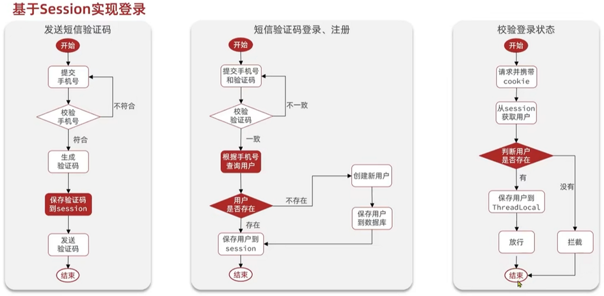


### 关于session

* Session用来**存放会话内的数据**，本项目中存了验证码、用户信息
* **一个客户端对应一个会话**，该**客户端后续的请求都属于该会话** (有效期内)，因为会带上sessionID，所以服务端将其视为一个会话内
* **不同客户端对应不同会话**（不同的浏览器、设备、用户），这样大家就可以各登录各的，互不干扰
* 一个客户端发送请求给服务端，如果没带sessionid，就意味着是一个**新客户端**，服务端为其创建一个会话，并返回一个sessionid
* 默认情况下session有效期是30min，超时了就要重新登陆
* HttpSession参数会有SpringMVC自动注入，当你发送请求的时候

### Q & A

<!-- **Q: 为什么要把验证码存到session？为何不存到mysql嘞？**
A: 临时性存储：验证码通常是临时的，存储在session中可以确保在用户会话期间有效，且在会话结束后自动失效。存到mysql会增加复杂性，没必要

**Q: 最终为什么要存到redis，而非session?**
A: 出现session共享问题

**Q: 为何可以用这个session校验登录状态？**
A: 因为只有你登录之后会被赋予一个sessionid，然后查询你这个id就可以找到对应的session，那固然就找到了这个会话； 在会话期间我们想要快速访问用户数据，避免频繁查询数据库，主要是后续的权限校验需要对比；因为这个session -->

**Q: 为什么要把用户信息存到ThreadLocal？为什么不直接去session中或者mysql取？**

> bg: **==每个用户请求都会交给Tomcat线程池中的一个线程来处理==**，请求处理完成后，回收到线程池，准备好处理下一个请求。

A: 首先用户信息会经常使用(比如用户下单时，我们需要获取用户id，然后写到订单表中)，所以我们要特别存起来
1. **线程安全**：ThreadLocal可以在多线程环境中保证每个线程都能访问到自己独立的用户信息，避免了多线程冲突。
2. **访问速度**：直接从session中取 或从mysql数据库中取 速度要比从ThreadLocal中取慢得多
3. **避免显式传参**，简化代码：使用ThreadLocal可以避免在多个方法之间显式传递用户信息，使得代码更加简洁和易于维护。
   1. 一个请求通常由多个过滤器、拦截器、服务层方法等共同处理，我们当然应该可以在收到的时候拿个变量接收，然后通过参数传递下去，但比较麻烦

> 至于ThreadLocal的底层细节，请见`JUC.md`

**Q: 为什么登录校验要写在拦截器中？**
A: 项目中很多Controller/业务需要校验用户的登录，我们不可能在每个业务中都写校验逻辑;
SpringMVC中，请求会先走interceptor组件的`preHandle()`，成功后再到达相应的controller, 你可以配置所有请求都走拦截器，也可以通过`execludePathPatterns()`排除路径，比如我们排除了`/shop/**`看看商铺肯定是不用校验登录的；


Q: 何所谓session共享问题?

**多台tomcat并不共享session空间，当切换到不同tomcat时，数据会丢失。**
详：每个tomcat中都有一份自己的session, 假设用户第一次请求被负载均衡到了第一台tomcat，并且把user信息存放到第一台服务器的session中，但第二次请求被负载均衡到第二台tomcat，那么在第二台服务器上，肯定没有第一台服务器存放的session，所以校验登录状态就无法从session中取出user信息了


解决方案：

**使用Redis实现共享session登录，主要是为了解决在分布式系统中，用户session无法共享的问题**。

因为传统的session是存储在服务器端的内存中，当请求分发到不同的服务器时，就无法获取到用户的session信息。而Redis作为一个内存数据库，具有**高性能、高并发、持久化**等特点，非常适合用来存储和共享session。

Q: redis替代session实现登录注册功能的好处

* **分布式**支持：Redis更适合分布式系统，很容易扩展
* **持久化**：可将数据持久化到磁盘(RDB, AOF)；而session数据会因为系统故障或者重启而丢失
* **灵活**：可以用各种数据结构存储会话数据，eg 字符串、哈希表、列表等

#### 具体实现

可以用String来存储，也可以用Hash结构存储，占用更少内存

**==Q: 我们用什么key？==**
A: 验证码的key: `login:code:{phone}`
用户信息的key: `login:token:{Radom_UUID}`；通过UUID随机生成; 可以用手机号，但有点敏感

**Q: 过期时间怎么设置的？**
A: 验证码2min, 用户信息30min(改为7天吧)并且**每次请求来了刷新从新即使**

**Q: 如何状态权限 / Token续期的？**
A: 第一个Interceptor拦截一切路径，刷新token的有效期，然后全部放行；第二个Interceptor拦截需要登录的路径

---

### STAR总结

**双重拦截器完成登录状态的刷新**

**S**: 用户请求进入之后，对于一些业务比如帖子发布，优惠券购买，我们需要判断这个用户是否登录了，登录了放行，没登录则拦截。但是对于其他一些业务比如说浏览店铺，对于未登录的用户我们也不需要拦截。
**T**: 但是这里还存在一个token过期的问题，我们一般会给这个token设置一个过期时间。我设置的是7天，如果过期了，用户就会从登录状态变为未登录的状态，但是如果这七天内用户再次登录了，进行了一次查询，我们应该给这个token进行一次续期。
**A**: 我设置成了两层拦截器，**第一层拦截器拦截所有请求**，如果token存在，则给这个**token刷新**，进行一个续期操作。如果**token不存在则直接放行交给下一层判断**。接下来这些请求会到达第二个拦截器，这个拦截器只拦截一些必须登录操作，只有token存在才可以执行（token不存在说明校验不通过）。
**R**: 所以，我设置两层拦截器，第一层拦截器拦截所有接口的请求，token存在则对token进行一个刷新，不存在直接放行。第二层拦截器拦截那些必须要登录才能完成的操作。


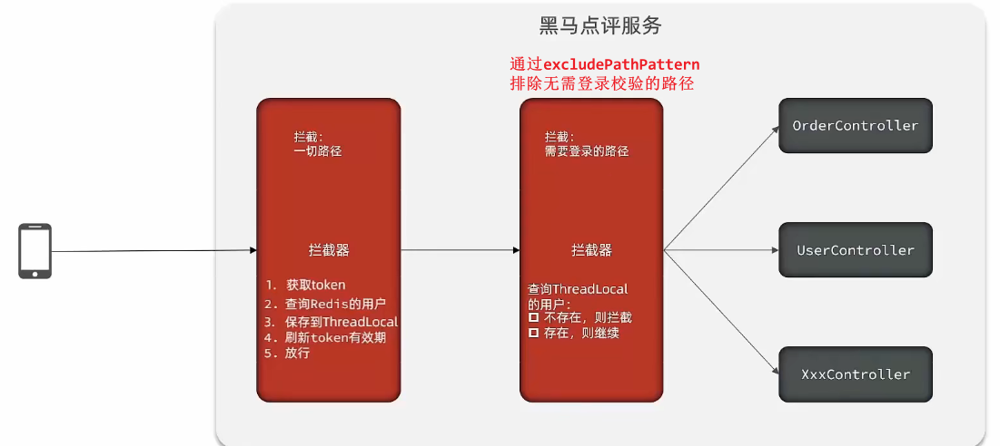
> 第二个Interceptor会排除一些无需登录校验的路径 `eg /login, /shop/**`  [code](https://github.com/cs001020/hmdp/blob/b9026b6da2274f4fc7f419aceb6d84c8e24222b7/src/main/java/com/hmdp/config/MvcConfig.java#L21-L44)

**Q: 为何要设置两个Interceptor，不能在第一个Interceptor中遇到不存在token时直接拦截掉吗？**
A: 不能，因为有一些功能不需要校验，比如浏览店铺，登录入口，所以你如果在第一个Interceptor拦截过滤掉，那这些功能就没啦。所以由于我们想过滤一部分请求不进行校验，然后我们又想对所有请求进行token刷新，故而需要两个Interceptor做不同的拦截

#### SMTP POP3 IMAP

* **SMTP用于发送邮件，而POP3和IMAP则用于接收邮件**
* POP3更适合单一设备使用，而IMAP提供了更灵活的多设备访问和管理功能，使其在现代电子邮件使用中更为普遍
* SMTP(Simple Mail Transfer Protocol)
  * 功能: SMTP是用于发送电子邮件的协议，主要负责将邮件从**发件客户端**发送到接收者的**邮件服务器**
  * 工作原理: 当用户通过电子邮件客户端（如qq或Gmail）发送邮件时，SMTP将邮件传输到指定的邮件服务器`smtp.qq.com`。SMTP通过**TCP/IP**协议工作，通常使用端口25或**587**。
  * SMTP 仅用于发送邮件，不处理接收或存储邮件。
* POP3(Post Office Protocol version 3)
  * 是用于**从邮件服务器接收电子邮件**的协议，主要用于将邮件下载到本地设备。
  * 工作原理: 用户通过**POP3客户端**连接到邮件服务器，下载所有新邮件并将其存储在本地。默认情况下，下载后这些邮件会**从服务器上删除**。
* IMAP(Internet Message Access Protocol)
  * 多设备同步 & 邮件始终保留在服务器上（升级版pop3


## 2.缓存数据

使用redis作为mysql的缓存的好处(高性能、提高qps、保护mysql后端)

summary: 

1. **缓存数据一致性**：使用redis缓存mysql数据库的数据，那肯定要做一致性操作，不然你更新了数据库，缓存却没更新 -> Cache-Aside(先更新数据库，后删除缓存) -> 延迟双写
2. **缓存穿透**：请求的数据缓存和数据中都没有，每次请求都打到数据库，吃不消 -> 布隆过滤器 + 缓存空对象
3. **缓存雪崩**：同一时段大量的redis缓存key的ttl同时到期，或者redis服务器宕机，大量请求同时打到数据库 -> 给不同key的ttl添加随机值；构建redis高可用主从集群，主节点废了，靠从节点顶上
4. **缓存击穿**/热点Key问题：某热点key过期到重建的“瞬间”，大量请求打到数据库想去重建缓存，把数据库干废了 -> 使用setnx互斥锁让一个线程去重建缓存（有C无A） / 逻辑过期：不给热点key设置ttl（有A无C）

---

本来我们查店铺信息都是去数据库中查询，很慢，所以考虑**使用redis缓存店铺信息**
```java
@GetMapping("/{id}")
public Result queryShopById(@PathVariable("id") Long id) {
    //这里是直接查询数据库
    return shopService.queryById(id);
}
```

**Q: 怎么个缓存流程？存到一个String中？**

1. 一个`Shop`类型的java对象，利用`Hutool`工具包下的`JSONUtil`将Shop对象转换为**Json字符串**
2. 利用Redis客户端(jedis)将json字符串存储到redis的String类型的key中(**每个店铺存到一个String中，id作为名称**)
3. 取出时同样借助redis客户端，然后借助hutool进行反序列化

**Q: 使用redis缓存了哪些数据？**
A: **商铺信息：名称、(店铺描述)、图像URL、地址**、平均价格、营业时间等信息

```json
{
    "area": "深圳",
    "openHours": "10:00-22:00",
    "sold": 4215,
    "images": "https://qcloud.dpfile.com/pc/jiclIsCKmOI2arxKN1UF0Hx3PucIJH8qQ0Sz-Z811zcN56-_QiKuOvyi0100xsRtFoXqG3iT2T27qat3WhLVEuLvk00mSS1IdNpm8K8sG4JN9RIm2mTkCbltc2o2vFCF2ubeXzk490sGrXt_KYDCngOyCwZK-s3fqawNlswzk.jpg,https://qcloud.dpfile.com/pc/IOF6VX3qaBgFXFVgp75w-KKmwZjF8cGXDU8g9bQC6YGCpAmG00QbfT4vCCBj7njuzFvxlbkwx5uwqY2qcJixFEOaSS1IdNpm8K8sG4JN9RIm2mTkCbltc2o2vmIU_8ZGOT1OJpJmLxG6urQ.jpg",
    "address": "金华路德赢里文华苑29号",
    "comments": 3035,
    "avgPrice": 80,
    "score": 37,
    "name": "牛牛健身房",
    "typeId": 1,
    "id": 1
}
```

Q: 缓存之后QPS从多少增加到多少？
A: Sorry, i dont know...

### 标准操作

查询数据库前先查redis缓存，如缓存命中，则直接返回，否则，再查询mysql数据库，顺便**将数据存入redis**。

**业务中**：
* 用户post一个**店铺id**来查询，先去redis查缓存，然后判断是否命中
  * 命中直接返回，结束；
  * 未命中，根据id查数据库，然后判断查询结果是否命中
    * 若命中，将数据写入redis再返回
    * 若不存在，直接返回404报错

**问题**：未考虑 **==缓存更新==**；如果已缓存了数据到redis，此时若数据库更新，reids就是旧数据了

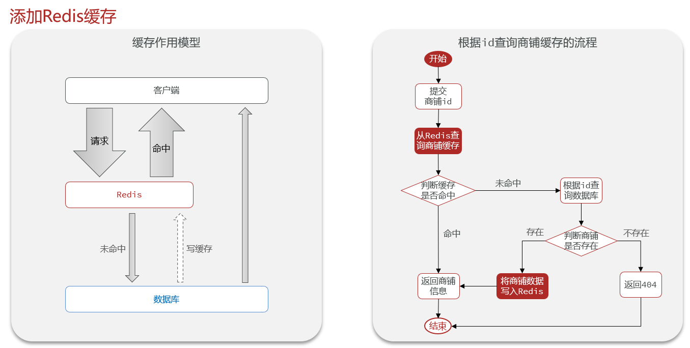{width=90%}

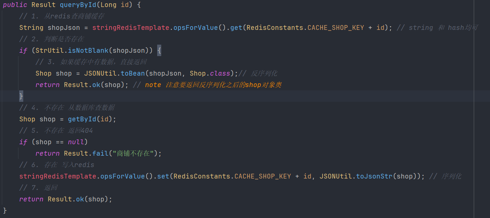

### 缓存更新 / 缓存与数据库的一致性

> 理论详见 [redis.md](https://github.com/haooxia/CSJourney/blob/main/database/redis.md)

缓存更新策略分为：==内存淘汰、超时剔除和主动更新==（一致性逐渐增高，维护成本也逐渐增高）

<!-- 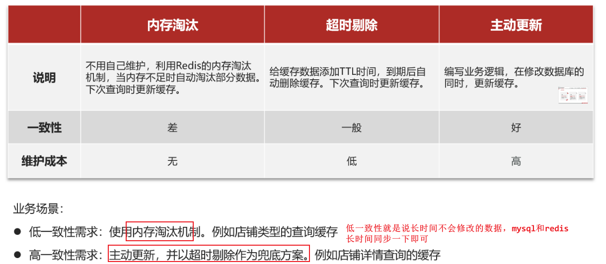{width=80%} -->
<!-- > **本项目中高一致性需求：店铺详情信息，以及优惠券信息** -->


<!-- 主动更新又分为：==Cache-Aside模式，Read/Write Through模式, Write Behind Caching模式== -->

<!-- --- -->

**Q: 为什么是删除缓存而非更新缓存？**
A: 如果每次修改数据库都更新缓存，这样会有很多次无效写入redis操作，就，你每次都更新，可也没人来访问，何必呢？不如直接删掉，下次别人访问了再加载一次即可（懒惰、延迟加载

**Q: 如何保证缓存和数据库的操作的同时成功或失败？原子性**
A: 本项目是单体的，把缓存与数据库操作放到一个事务里即可；分布式系统中可采用分布式事务, eg seata

**Q: 为什么要先操作/更新mysql数据库再删除redis缓存？能否反过来？**
A: 不能，反过来发生数据不一致的概率高得多，原因左图（你删除了缓存，还没更新数据库之间，另一个线程查数据库然后更新了缓存，然后你才更新数据库，此时二者不一致了）：

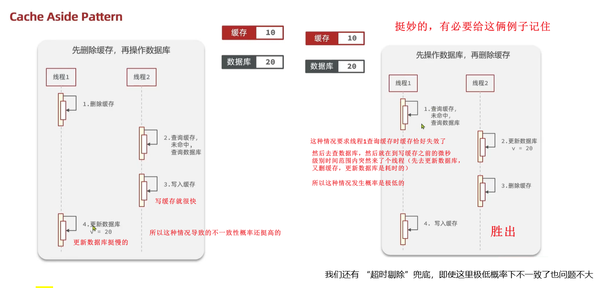
> * 右侧正常情况是：线程2: 更新数据库->删缓存；-> 线程1: 查缓存未命中 -> 写入缓存
> * 右侧的发生概率是极低的，但也可能发生，所以我们设置超时时间使用**超时剔除作为兜底**（即使我写缓存写错了，超时了自动会删掉

<!-- Q: 为什么要采用Cache Aside？write/read through 及 write back区别？

Q: Cache Aside名称的由来? -->

---

Q: 什么是**延迟双删**(Lazy Double Deletion)？
A: 分布式系统中数据库和缓存数据保持**最终一致性**的常用策略，并非强一致性；

[reference-1](http://t.csdnimg.cn/euldM)
[reference-2](http://t.csdnimg.cn/nF6c9)

Q: **为何需要延迟双删?**

* 方案一：先更新数据库，再删除redis缓存：当请求1执行完更新数据库操作后，**还未来得及删除redis**，此时 **==请求2查询到并使用了redis中的旧数据==**。
* 方案二：先删除redis，再更新数据库：当请求1执行完删除redis后，还未进行更新数据库操作，此时请求2**查询到了数据库的旧数据并写入了redis**。然后你跑去更新数据库，导致二者不一致。

Q: **如何实现延迟双删**?
A: 第三种方案：

* **先删除redis**：确保接下来的读操作会从数据库中读到最新数据，避免读到旧数据（解决了先更新数据库，再删除缓存中"读到redis失效的数据"的问题）
* **再更新数据库**：（在删除redis到更新好数据库之间可能有其他线程查到了数据库旧数据，并写入redis -> 故而最后再删除一次redis）
* **延迟N秒**：给数据库足够的操作时间，确保数据已经持久化到数据库
* **再删除一次redis**

<!-- 注意: N > 请求2将数据库旧数据写入redis的时间 -->

> "延迟双删" 相比于 "先更新数据库再删除缓存": **数据一致性要求更高，性能低一些**

Q: 如何确定延迟的时间？
A: 如果数据库的更新操作通常很快，可以选择较短的延时时间，比如几百毫秒或一秒钟

**Q: 延迟双删一定保证一致性了吗？**
A: 没有，线程1删除缓存，更新数据库之前，线程2读取数据库并写入缓存，然后线程1更新好数据库，在删除redis缓存之前，线程3过来会读到redis中的旧数据。


#### 项目实现


==**主动更新（Cache Aside旁路缓存策略） + 超时剔除**==

* **读操作**：根据id查询商铺时，先查缓存，命中直接返回，未命中再去查数据库，将数据库结果写入缓存，**并设置超时时间ttl**；（30min）
  * 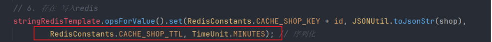  
* **写操作**：根据id修改店铺时，**先**修改/更新数据库，再**删除**缓存（同时开启事务保证两个操作的原子性
  * 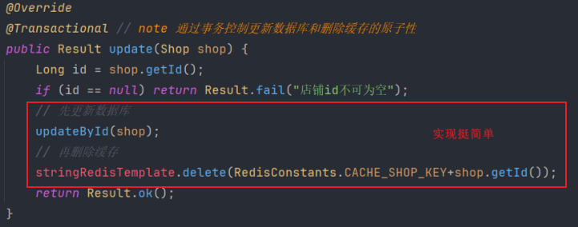  

代码分析：当我们修改了数据之后，把缓存中的数据进行删除，查询时发现缓存中没有数据，则会从mysql中加载最新的数据，从而避免数据库和缓存不一致的问题。
由于此项目是单体架构的项目，更新数据库操作和删除缓存操作都在一个方法里，需要通过**事务**去控制，来保证原子性。**但如果是分布式系统：在更新完数据库之后，删除缓存的操作不是自己来完成，而是通过mq去异步通知对方，对方去完成缓存的处理!!**

<!-- #### STAR总结

利用Cache-Aside解决数据库与缓存的数据一致性问题

> from ChatGPT:

Situation (S): 用户频繁查询店铺信息，导致直接访问数据库的查询速度较慢。为了解决这个性能瓶颈，决定采用Redis缓存来加速查询。然而，随着数据库的不断更新，Redis中的缓存数据可能与数据库中的数据不一致，导致数据过时的问题。这种情况下，必须找到一种有效的缓存更新策略来保证数据一致性。

Task (T): 需要设计并实现一种缓存策略，在提高查询性能的同时，保证数据库与缓存数据的一致性，尤其是在更新店铺信息时，确保缓存与数据库保持同步。

Action (A):

读取操作：在用户查询店铺信息时，首先查询Redis缓存。如果缓存命中，则直接返回数据；如果未命中，则查询MySQL数据库，并将查询结果写入缓存，同时设置缓存的超时时间（如30分钟），以减少缓存过期造成的一致性问题。

写入操作：在用户更新店铺信息时，首先更新MySQL数据库，然后删除Redis中的对应缓存。为了确保操作的原子性，将数据库更新和缓存删除操作放在同一个事务中。如果项目是分布式系统，则通过消息队列（MQ）异步通知其他服务进行缓存删除。

Result (R): 通过采用Cache-Aside模式并结合超时剔除机制，成功解决了数据库与缓存之间的数据一致性问题。该方案在确保高性能查询的同时，有效避免了缓存和数据库数据不同步的情况，提高了系统的可靠性和用户体验。 -->

### 解决缓存穿透问题

> 缓存穿透及Bloom filter理论详见 [redis.md](https://github.com/haooxia/CSJourney/blob/main/database/redis.md)

**缓存穿透**问题：客户端请求的数据在缓存和数据库中都不存在，导致每次查询都会绕过缓存直接打到数据库，对数据库造成巨大压力（攻击数据库的好办法）；即**大量无效请求直接打到数据库**
> Cache Penetration 其实翻译为'渗透'挺好（不怀好意者通过这个漏洞避开redis渗透到mysql

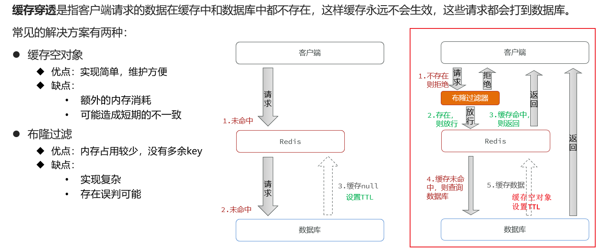  


解决方案：**布隆过滤器 + 缓存空对象**

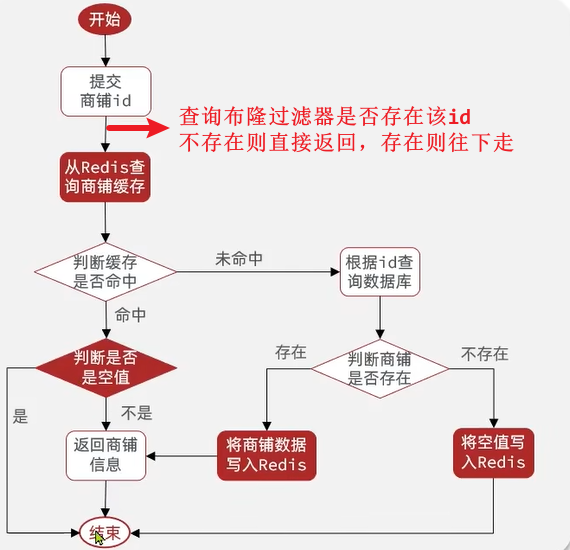{width=60%}

* 前端提交店铺id，首先会经过Bloom Filter计算查询是否存在该id（布隆过滤器内提前计算存储了数据库中所有的商铺id），如果bloom说没有则一定没有，直接拒绝，避免访问缓存和数据库，如果bloom说有则大概率存在，则继续查询缓存和数据库
  * 如果缓存和数据库都没找到的话，此时我们再去**缓存空对象**来防止短时间内的重复穿透（TTL 2min）


Q: bloom filter是如何实现的?
A: please read `redis.md` **基于Redis的BitMap实现**
Q: 还有哪些解决缓存穿透的方法（主动和被动方案）?
A: please read `redis.md`

---

ChatGPT总结：

* Situation: 客户端发起请求，查询的数据在缓存和数据库中都不存在，导致每次查询都直接打到数据库。
* Task: 解决缓存穿透问题，以减少对数据库的压力。
* Action: 首先通过布隆过滤器判断请求的数据是否存在，如果不存在则直接拒绝请求，避免访问缓存和数据库；同时使用缓存空对象来防止短时间内的重复穿透。
* Result: 成功减少了无效请求对数据库的直接攻击，保护了数据库性能。

### 解决缓存雪崩问题

> 理论详见 [redis.md](https://github.com/haooxia/CSJourney/blob/main/database/redis.md)

本项目给不同的key添加随机值（比如在增量0-10min中浮动）

Q: 还有哪些缓存雪崩的解决方案?
A: `redis.md`

### 如何解决缓存击穿问题

> 其实**项目亮点**可以说：利用互斥锁和逻辑过期这两种方案解决缓存击穿问题；确实还挺不错的

指缓存中**某个热点key过期的瞬间**，大量并发请求直接打到数据库，干废数据库

两种解法：互斥锁法

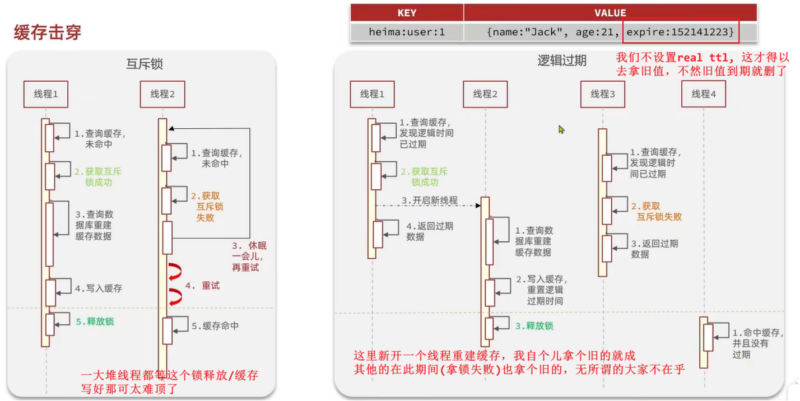  

#### 互斥锁解法

原方案：从缓存中查询不到数据后直接查询数据库
**现方案**：查询缓存之后，如未查到，尝试获取互斥锁，然后**判断是否获得互斥锁**，没拿到就休眠50毫秒并重新查缓存(看看这时候拿锁的哥们重建好了没，好了就直接拿缓存，没好再歇息50ms)，拿到锁的哥们就根据id查询数据库，并重建/更新缓存，最后释放锁。

实现 [code](https://github.com/cs001020/hmdp/blob/b9026b6da2274f4fc7f419aceb6d84c8e24222b7/src/main/java/com/hmdp/service/impl/ShopServiceImpl.java#L81-L108)

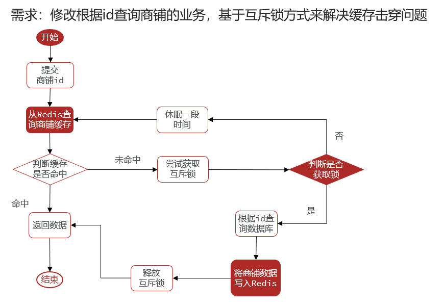{width=80%}

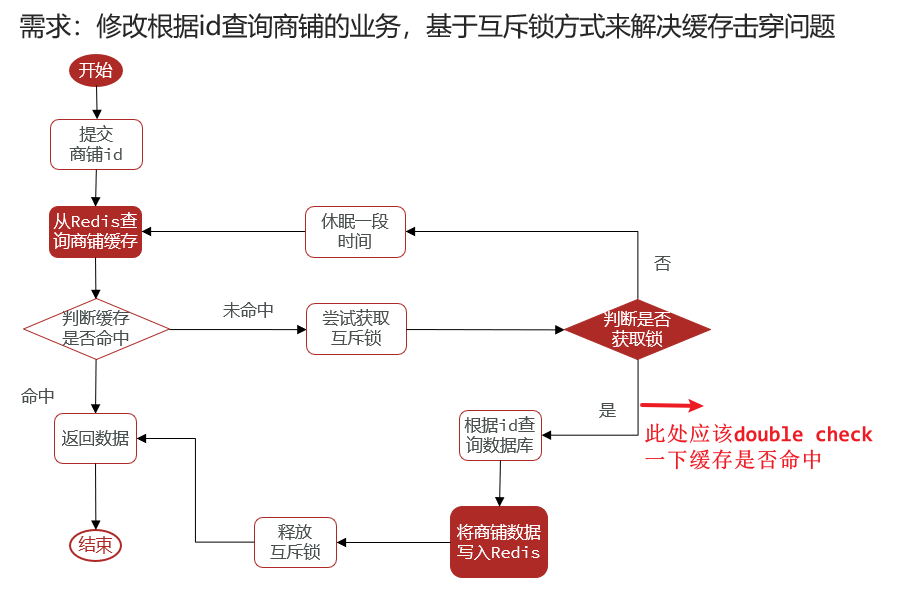  


> **获取锁成功之后还需要再次查询redis缓存是否命中做Double Check**，因为此时你获取的锁可能是别人重建结束后释放的锁（也就是你判断缓存没命中之后别人释放了），其实此时如果缓存重建成功的话，你不应该再去拿锁重建

利用redis的String的指令`setnx lock 1 获取锁, del lock释放锁`

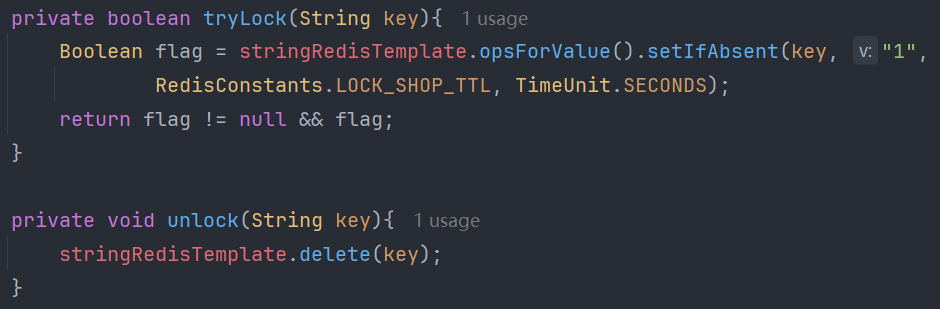  
> 锁就是redis中的一个key；`setIfAbsent`即为`setnx`，ttl=10s (比业务长个几倍啥的就行)
> **key使用店铺id**，即每个店铺有一把锁

---

**Q: 你这其他线程每隔50ms就查询一下，多耗费cpu资源啊？**
A: 优化，利用指数退避算法：`50*2, 50*4, 50*8, 50*16...` 

**Q: 这个互斥锁用什么实现？**
A: Redis的**分布式锁**`setnx`, set if not exists, 当key不存在时设置并返回true(获得锁), 当key存在时返回false(表示锁被占用)，同时我们设定一个过期时间ttl，防止服务崩溃等异常原因导致锁无法释放。
还可以用zookeeper的分布式锁

**Q: 为什么不用synchronized?**
A: synchronized没拿到锁会一直阻塞等待直到获取锁，而我们没拿到锁之后并不是要去一直拿锁，让一个线程拿锁重建缓存就完事儿了；synchronized的话别人拿到重建完释放锁后，你又把锁拿来，没必要啊。即**synchronized不满足我们这种没拿到锁之后的自定义行为**
> 我们这里拿到锁和没拿到锁之后的行为是需要我们**自定义**；我们定义获取失败时休眠并重试，这应该比你一直阻塞好的多吧。

**Q: 为什么不用ReentrantLock？**
ReentrantLock可以通过非阻塞方式`tryLock()`获取锁，如果锁不可用，不会阻塞，可以执行其他逻辑，所以**理论上我认为ReentrantLock.trylock()在单体项目中是可以用的**。。。但分布式场景下用不了


Q: 还有什么分布式锁？区别是什么？

Q: 我记得有个redission？TODO


<!-- 你的并发效果怎么样呢？
我采用JMeter进行并发压力测试：日志中就查了一次数据库，证明在如此高并发的场景下我们并没有打到数据库上（1000个线程并发运行，Ramp-up时间5秒（打到指定线程数所需时间，用于控制启动速度，即5s内平均每秒启动200个线程）
> 这jmeter测试的跟缓存击穿没啥关联啊，只能说证明了我们的互斥锁没问题：即一个线程拿锁去查数据库，即就查了一次数据库，其他都是查缓存 -->

#### 逻辑过期解法

> 代码见黑马笔记，我这里暂时选择写使用互斥锁解决缓存击穿问题了，要用逻辑过期解法的话再回去看看
> 逻辑过期涉及到的东西也蛮多的：setnx锁，线程池

**需求：修改根据id查询商铺的业务，基于逻辑过期方式来解决缓存击穿问题**

原方案：从缓存中查询不到数据后直接查询数据库
**现方案**：用户查缓存（**理论上都命中**，因为我们没删除，没命中的(穿透问题)我们提前用布隆过滤器过滤了），命中后将value取出，**判断value中的过期时间是否满足**，如果没有过期，则直接返回redis中的数据，**如果过期，尝试获取锁，拿到锁的那一个线程会开启独立线程去执行缓存重建**，不管拿没拿到锁，自己不负责重建，自己都会直接返回旧数据用着，重构完成后释放互斥锁。
> 因为只需要一个线程去开启一个独立线程，故而需要竞争锁

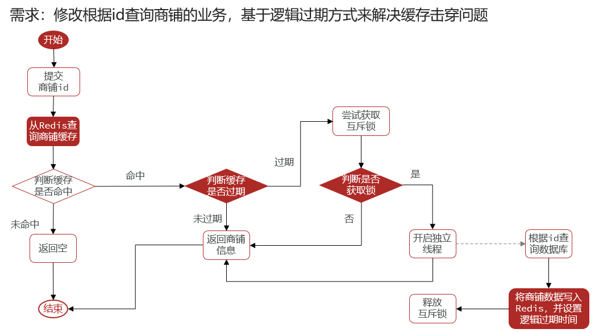  
> 我的bloom filter稍微和这里未命中不太一样 没了未命中 直接前面过滤了；不重要，这里关注击穿问题

我们通过jmeter并发测试：发现就执行了一次缓存重建，在重建完成之间，直接返回旧的数据，重建成功之后返回新的数据（确实妙

Q: 为什么要开启独立线程做缓存更新而非自己更新？
A: 自己更新那不就跟互斥锁解法类似了，自己需要等更新好才能用，异步更新的话，自己直接拿个旧的就行了


<!-- 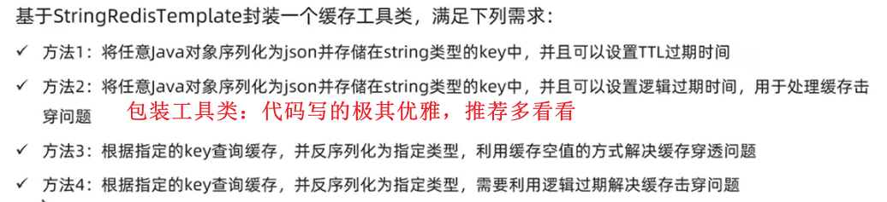   -->


## 推荐系统

### 电商项目常见推荐系统

> 电商项目中的推荐系统是提升**用户体验**和**销售转化率**的重要工具，主要通过**分析用户行为数据**来推荐相关商品。

* **基于内容的推荐算法** (**==我们主要是这个==**)
  * 核心思想：**推荐与用户过去喜欢的物品相似的新物品**
  * 步骤
    * 为每个物品提取特征
      * 文本特征提取方法：TF-IDF, Word2Vec
    * 用户画像构建
      * 基于用户购买过的店铺，用户点赞的评论，同样计算出特征向量
    * 计算相似度，生成推荐列表 (eg top-10)
* **协同过滤推荐算法**
  * 依据**用户与其他用户**的行为相似性。系统不直接分析物品的属性，而是基于用户的行为相似性（如评分、购买记录等）进行推荐。它可以分为两类：
    * 基于用户的协同过滤：**找到和你兴趣相似的“人”，推荐他们喜欢的内容。**
    * 基于物品的协同过滤：找出与用户喜欢的物品相似的其他物品，然后进行推荐。（**其实也很像...**）
      * 但协同过滤算法应该不涉及到文本特征提取，而是直接利用**数值**，比如某用户对某物品的评分数、点赞等，进行相似度计算

* 对比
  * 基于内容：
    * 不依赖其他用户的行为数据，即不依赖大规模数据
    * 解决**冷启动**问题，你新来了个店铺，无需等待其他用户跟它交互
      * 所谓冷启动就是新来个用户/店铺，数据不够用，不好推荐
    * 但推荐结果往往局限于用户已经有过兴趣的领域，容易产生**信息茧房**，难以为用户发现完全新领域的内容
    * 适用于**文本丰富**的场景：新闻、电影、音乐推荐（尤其是可以提取物品的很多文本、图像等内容的场景
  * 协同过滤：
    * 可以发现用户潜在的兴趣，避免信息茧房
    * 冷启动问题严重
    * 适用于**用户行为数据丰富**的场景，如**电商**(但我的用户不多，就基于内容了...)

> 我们主要是基于内容的，然后我们也看了别的用户评论，也可以说考虑了其他用户的行为相似性，沾点协同过滤的边，anyway, 没必要这么清晰....未来可以增加更多的协同过滤

### 我们的流程

我有100个店铺，每个店铺都有店铺名称，图像，地址，价格，评分，商品内容，此外每个店铺还有多个用户评价。

1. **数据准备阶段**
   1. 收集100个店铺的**名称、描述、前10条点赞最多的用户评价**，代表这个店铺的特征
      1. > 这三者我叫做“店铺内容文本”好了
2. **特征提取阶段**
   1. 文本预处理：
      1. 使用`jieba`库进行**分词**
      2. **去除停用词**(eg 标点符号、“的”、“了”、“和”等)；使用**百度停用词库**即可：[link](https://github.com/goto456/stopwords/blob/master/baidu_stopwords.txt)
   2. 使用word2vec模型对店铺内容文本提取特征向量
      1. > 你可以直接把店铺内容中三者直接concat，然后一下子计算出一个特征向量（我用这个了，简单点），你也可以分别算三个向量，然后使用三个weight加权
      2. 你可以直接用一个预训练好的中文word2vec模型(tencent AILab提供的)([link](https://github.com/shibing624/text2vec/releases/download/1.1.4/light_Tencent_AILab_ChineseEmbedding.bin))。你也可以拿你的店铺内容文本去finetune一下，但没啥必要
   3. 将每个店铺的特征向量存到mysql数据库中，而后缓存至redis
      1. 特征向量是float数组(`shape=[200,1] (ndarray)`)
3. **实时推荐阶段**
   1. 当用户点击“猜你喜欢”按钮时，根据用户历史的“购买过的商品名+商品描述+用户点赞过的评论”进行推荐，即同样适用word2vec计算特征向量（比如说可以找用户最近/高频的10个进行推荐）
   2. 计算用户特征向量和所有店铺特征向量之间的余弦相似度：$cos(A,B) = \dfrac{A\times B}{||A|| \times ||B||}$
   3. 取出相似度最高的10个推荐给用户即可

> java的word2vec模型：Deeplearning4j, 可以直接加载python预训练的bin模型文件
> word2vec or other model: [link](https://github.com/shibing624/text2vec)
> 基于腾讯AI Lab开源的800万中文词向量数据预训练得到的word2vec预训练模型，拿来直接用

**Q: 为什么不用Bert pretrained model?**
A: word2vec是浅层神经网络模型(2层)，bert是深层(bert-base是12层)，语义信息更丰富，更牛逼；但前者大概比后者**快10-100倍**，故而

A: 还可以考虑使用text2vec替代word2vec

**Q: 100个[200,1]的float数组怎么存到mysql中的?**
```sql
CREATE TABLE shop_features (
    shop_id INT PRIMARY KEY,
    feature_vector varchar # 存为varchar即可
);
```
A: 每个店铺对应200个浮点数，**序列化为Json字符串存储**（依然是hutool!）
`String jsonString = JSONUtil.toJsonStr(floatArray);
`

**Q: 又是如何存到redis中的?**
A: 存到一个`hash`中，每一个shop_id作为field，对应的value是特征向量转成的json字符串
(如果全存到一个string中，大概会出现大key问题(>10KB))

Q: 除了余弦相似度，还有什么相似度计算方法?
A: 欧氏距离，点积

Q: ==**如何评估你的智能推荐系统的效果**==?

第一：在模型开发阶段（无需用户参与，依赖历史行为数据）

1. 构造一个**验证集**（eg **用户历史交互的最后一条作为目标，前面的交互作为输入（很妙了）**）
   1. 用户曾经购买/浏览/评论过的店铺作为输入，用户最近一次浏览/购买的店铺作为ground truth（验证标签）
2. **常见指标**有：（我们会推荐top-10给用户）
   1. **命中率**Hit：命中为1，未命中为0
   2. 考虑**推荐列表中命中的位置**，越靠前越好。
      1. 归一化折损累计增益NDCG
   3. 如果gt有多个店铺的话，比如你选择最后3个作为GT，可以采用下述指标
      1. **准确率**precision: 衡量推荐的前K个店铺中，有多少命中了用户真实访问的目标店铺。但其实我们的gt就只有1，所以命中(gt在推荐列表)的话就是$1/K$，未命中就是0
      2. **召回率**recall: 衡量在用户真实喜欢的内容中，推荐系统覆盖了多少。若命中，则为1，否则0

第二：**在线评估阶段**：通过点击率CTR、平均停留时间等指标分析上线推荐对真实用户行为的影响

1. **点击率**：点击推荐/看到推荐；越高说明推荐的内容吸引了用户
2. **平均停留时间**：用户在推荐内容上停留的时间越长，说明推荐的内容越吸引用户

第三：**用户问卷调研**（user study），问核心用户主观感受，内容是否相关，是否喜欢


**改进空间：**

* 计算用户特征向量时，可以增加对用户行为的分析：如浏览时间
* 批处理：如果多个用户同时请求推荐，可以考虑批处理，提高效率
* 异步处理：可以考虑使用异步处理（如RabbitMQ）进行推荐计算，减轻请求处理的负担（当用户登陆之后直接异步算好
* 可以借助elasticsearch
  * 将特征向量存储到es中(dense vector形式)，然后采用es自带的cosine similarity检索相似的向量（es对向量存储和运算做了一些底层优化，更高效的存储啥的，至于细节还得看看，但感觉就那样，我先整个灵活自定义版本enough了）

---

https://chatgpt.com/c/66fe7896-bdec-8007-9f0b-3c41c7f1514e

1. `deeplearning4j`有`word2vec`工具类，可以直接加载`bin`模型文件
2. java同样有`jieba`分词库
3. Java工具类：使用ByteBuffer来转换float[]和 byte[]（然后使用blob存到mysql），并通过 deeplearning4j 的 INDArray 进行向量操作。

核心代码参考:
`java\project\recommend\recommend.ipynb`
`java\project\recommend\recommend.java`

### 改进

#### 1. 基于向量数据库进行改进

使用高效的向量数据库代替MySQL+Redis存储向量。

原本需要从Redis取出向量数据，然后使用java做余弦相似度计算。

Milvus：高性能本地部署

1. 内置了高效的近似最近邻(ANN)搜索算法（eg HNSW, IVF, Flat）
2. 会自动将向量索引数据缓存到内存

#### 2. 模型层面的提升

1. 使用句向量模型`text2vec-base-chinese`替代`word2vec`，效果好很多；[link](https://huggingface.co/shibing624/text2vec-base-chinese)
2. 可以考虑进一步fine-tune模型

#### 简单学下ES

* ElasticSearch: 一款开源的分布式搜索与数据分析引擎
* es采用**倒排索引**，mysql中每行记录在es中叫一个**文档**document，文档按照**语义**分成**词条**term (分词)，然后底层给词条建立索引（比如hash，那根据词条搜索起来不就快了吗
* 用的IK分词器，不是jieba哦

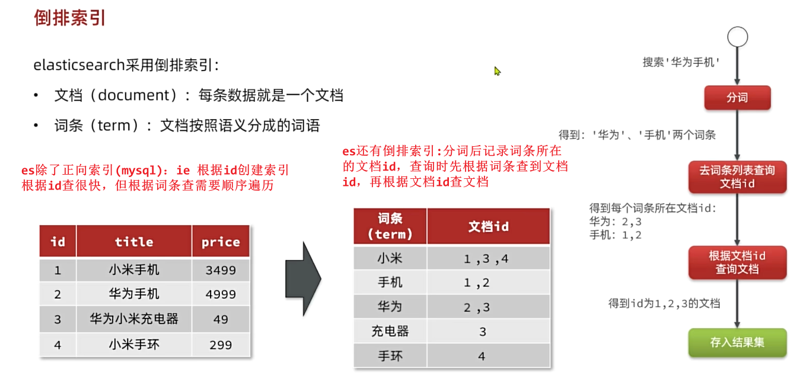  

#### jmeter

**接口测试**（模拟postman嘛）：

* 线程数：设置为 1，表示只有一个并发执行的测试任务
* 循环次数：设置为 1，表示测试任务只执行一次
* 接口测试的时候，这俩都设置为1
  * 接口测试只需要创建一个http请求，塞入ip(`127.0.0.1`) port(`8081`) 路径(`/shop-type/list`) 参数即可，这就充当了postman的功能

---

**QPS测试**：queries per second, 服务器每秒可以处理的请求数。
基于jmeter模拟多用户并发请求，并根据响应数据计算结果

1. 创建线程组
   1. 线程数：设置并发用户数，例如 50（表示 50 个用户同时发送请求）
   2. **Ramp-Up 时间**：设置线程启动时间，例如 5 秒（**表示50个线程在5秒内逐步启动**，每秒启动10个）
   3. 循环次数：永远，用“持续时间”控制测试时长。
      1. 建议：勾选“调度器”（Scheduler），设置持续时间（如 60 秒），这样测试会持续运行 60 秒。


## 3. 秒杀

### 优惠券秒杀下单

秒杀业务：

当用户发起请求，此时会请求nginx，nginx会访问到tomcat，而tomcat中的程序，会进行串行操作

**其中核心业务是：`seckillVoucher(voucherId)`: 扣减库存 + 创建订单**

1. 库存不能超卖（查数据库-判断库存是否充足(>1)）
2. 一个用户对一个优惠券只能下一单（看一下数据库有没有该订单(即当前用户有没有这个券id相关的订单)，利用分布式锁解决其中的并发安全问题）
3. 如果还有库存，且该用户也没买过该优惠券，才继续：扣减库存 + 创建订单（业务结束释放redission锁）

> 可见12都是判断是否具有购买资格，3才是真正下单，所以

很多操作是要去操作数据库的，而且还是一个线程串行执行， 这样就会导致我们的程序执行的很慢，所以我们需要**异步程序执行**，那么如何加速呢？

#### 基本的优惠券下单

前端提交优惠券下单请求(post id), 查询优惠券的信息，看看秒杀是否开始结束，看看库存是否充足，然后才扣减库存(`tb_seckill_voucher的stock`)，创建订单，插入数据库`tb_voucher_order`；
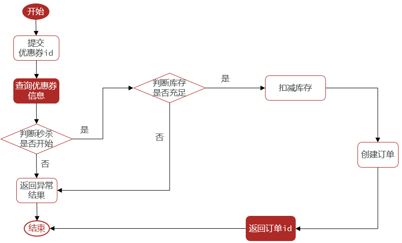{width=80%}

```java
// 核心代码
// 校验省略...
if (voucher.getStock() < 1) // 库存不足
    return Result.fail("库存不足！");
// 扣减库存
boolean success = seckillVoucherService.update()
        .setSql("stock= stock -1")
        .eq("voucher_id", voucherId).update();
if (!success) {
    //扣减库存
    return Result.fail("库存不足！");
}
// 创建订单省略...
```

标准实现的问题：当我们使用jmeter用200个用户线程并发请求一起抢购（然而我们的优惠券stock=100），理论上只会下单100次，**然而**，我们发现执行完毕stock变成了-9!而且订单数量是109单，此乃**超卖现象**，不可接受，我商家亏麻了。

原因：库存只有1时，多个线程一块查询认为还有库存，然后就都去扣减了
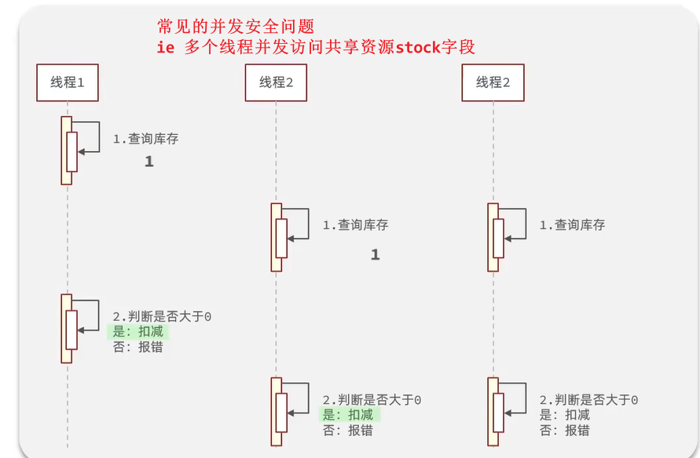  

#### 乐观锁解决超卖问题

* 定义：**超卖**问题是在**高并发环境**下，eg 电子商务和股票交易等秒杀场景中出现的一种数据不一致性问题；指销售的商品数量超过了实际库存数量
* 原因：多个线程操作共享资源，且代码有好几行，然后**多个线程难以避免出现穿插**；**并发引起的资源竞争没有加锁,导致运行时序不可控**；但请注意超卖是个概率问题，有概率发生而已

首先悲观锁synchronized, ReentrantLock肯定可以解决超卖问题，但悲观锁性能不好，不适合高并发场景

所以我们采用乐观锁，可以采用**版本号法**，可以给stock加个version字段，每次修改version++，提交时看看version对不对即可，但没必要；我们用**CAS法**，利用stock字段本身即可，
> 这里不存在ABA问题，因为该场景下stock只会--，不会++（stock数量是我们开始就设定好了的

```java
// 扣减库存
boolean success = seckillVoucherService.update()
        .setSql("stock= stock -1")
        .eq("voucher_id", voucherId)
        .eq("stock", voucher.getStock()) // 等号 -> 改进为gt("stock", 0);
        .update();

// 等价于
UPDATE seckill_voucher
SET stock = stock - 1
WHERE voucher_id = 'voucherId的值'
  AND stock = 'voucher.getStock()的值';
```

理论上应该是等号，就是你先查strock库存，然后你修改时不一样的话，那就是别人改了，我就得请求失败，但这样**太严格了, ==成功率太低==**，jemeter大多数请求的线程都挂掉了，别人确实改了，但依然是stock>0时我应该是请求成功的。所以我们**改进一下CAS：** `where stock > 0;`即可，现在超卖问题解决，200个请求线程刚好挂掉100！

<!-- #### 乐观锁解决 单体下一人多单超卖问题 -->

#### 悲观锁实现单体一人一单功能

问题：我们是卖优惠券的，但此时一个用户可以无限量抢单（利好黄牛），所以需要加一些限制逻辑。

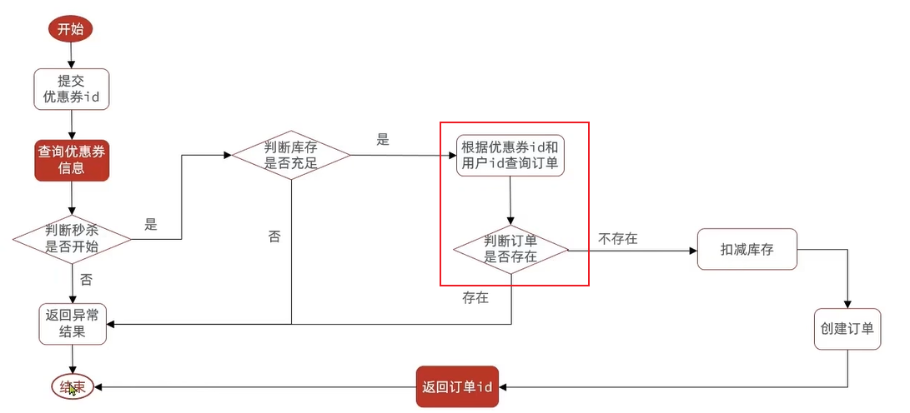  
秒杀扣减库存逻辑：判断是否在秒杀时间范围内，判断库存是否充足，**判断这个用户是否下过这个订单（根据用户id和优惠券id）**，若没有则扣减库存

```java
// 5.一人一单逻辑
Long userId = UserHolder.getUser().getId();
int count = query().eq("user_id", userId).eq("voucher_id", voucherId).count();
// 5.2.判断是否存在
if (count > 0) // 用户已经购买过了
  return Result.fail("用户已经购买过一次！");

//6，扣减库存
boolean success = seckillVoucherService.update()
        .setSql("stock= stock -1")
        .eq("voucher_id", voucherId).update();
if (!success) {
    //扣减库存
    return Result.fail("库存不足！");
}

//7.创建订单
//...
```

jmeter 200个请求测试结果发现一个人不止下了1单，我测的下了10单！
原因同上：多个请求同时判断count<=0, 所以同时来扣库存，故而请求乐观锁or悲观锁；
由于**乐观锁仅适用于插入数据的场景**，该场景不适合，所以悲观锁**锁住{查询count -> 扣减库存 -> 创建订单}**整个过程

<!-- > 前面那个超卖问题加的乐观锁也被这里的悲观锁包裹了啊？那要那个乐观锁还有啥用 -->

我们是**对用户userId加锁**，**而非锁住this(即不要锁这个方法，这样不同用户也会串行执行，而我们指向让同一用户串行执行，减小锁粒度**)，保证同一用户只能串行执行块内内容`synchronized(userId.toString().intern())`

到这儿，我们在用jemter测试，发现200个请求就成功了一次！奈斯

#### 集群环境下并发问题

> **虽然我们是单体项目，不过我们可能面临的并发度很高，所以有必要的话我们会把一个项目部署到多个机器，从而形成一个==负载均衡的集群==，而集群模式下synchronized会出现一些问题。**
> 我们在idea搞两个启动项，idea会给我们搞两台tomcat服务器，端口不同，形成了集群；然后我们使用nginx做了下负载均衡到两个ip+port

**Q: synchronized在集群下为什么会出现问题?**

A: 在集群环境中，多个Tomcat实例各自运行在独立的JVM中。虽然服务器A和服务器B的线程可能使用相同的代码和锁对象名称，但由于它们的**锁对象是不同**的，因此无法实现跨 JVM 的互斥。
具体来说：
服务器A的线程1和线程2使用同一个锁对象，可以互斥。
服务器B的线程3和线程4也可以互斥，但无法与服务器A的线程1和2互斥。
> 这里的**锁对象就是一个字符串对象**`userId.toString().intern()`，集群下这玩意儿是不同的，我们的字符串常量池都不是一个，怎么可能相同嘞

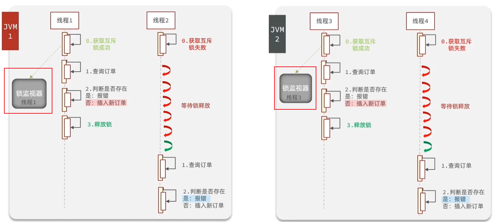{width=80%}

所以我们要想办法让多个jvm用同一把锁

所以我们不用synchronized了，我们采用Redis分布式锁：

第一：我们可以自己设计redis锁，通过set命令
第二：我直接就用了redission锁，何必造轮子呢，知道底层就行了

---

##### 分布式锁

**分布式锁**：满足分布式系统或集群模式下**多进程可见**并且**互斥**的锁。

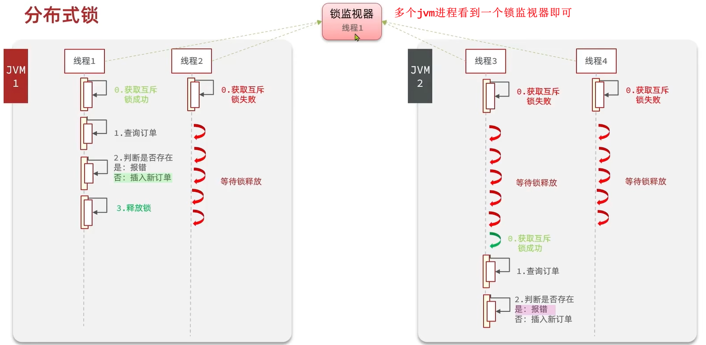  


分布式锁特点：
* 可见性：多个jvm进程都能看到相同的结果；
* 互斥：互斥是分布式锁的最基本的条件，使得程序串行执行
* 高可用：程序不易崩溃，时时刻刻都保证较高的可用性

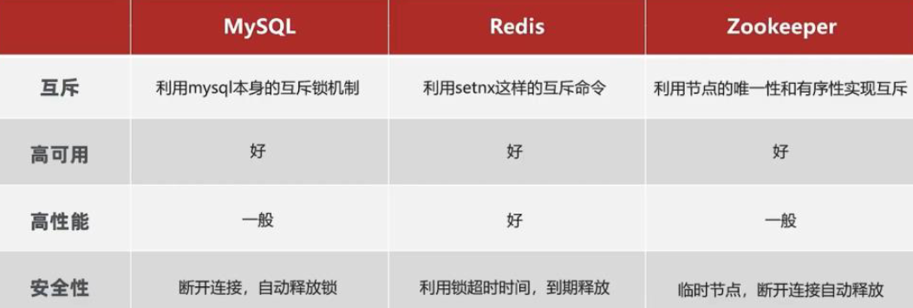  

**Q: 如何基于MySQL实现分布式锁？**
1. 创建一个锁表`lock`，字段：`lock_name`（锁的名称，作为主键primary key，唯一约束；锁的名称用来表示**某一资源的名称**），字段`lock_by`记录服务器节点ID
2. 如果两个节点都想要锁定同一资源`resource_1`，会分别尝试在表中插入一行记录，第一个节点`insert into lock (lock_name, lock_by) values ('resource_1', 'node_1')`成功；
3. 第二个示例插入同样的记录，会出现**主键冲突**(`resourec_1`这个主键只能出现一次)，故而上锁失败

**Q: 如何基于redis实现分布式锁？**
* `set lock thread1 NX EX 10`: NX保证互斥，EX设置过期时间，这一条指令完成两个功能，**原子操作**
  * 即一个`set` = `setnx` + `expire`

##### Redission

基于setnx实现的分布式锁存在下面的问题：

* **不可重入**：可重入是指同一线程可以多次获取同一把锁，避免死锁；synchronized和Lock锁都是可重入的。
  * redission利用hash结构记录线程id和重入次数实现可重入

* **不可重试**：目前的分布式只能尝试一次就返回false，而有的场景需要重试获取锁/**阻塞的**
  * 利用发布/订阅机制PubSub(redis)实现智能的等待、唤醒、重试

* **超时释放**: 我们在加锁时增加了过期时间，这样的我们可以防止死锁，但是如果卡顿的时间超长，虽然我们采用了lua表达式**防止删锁的时候，误删别人的锁**，但是毕竟没有锁住，有安全隐患
  * 利用watchDog，每隔一段时间`releaseTime/3=10s`，重置超时时间

* **主从一致性**: 如果Redis提供了主从集群，当我们向集群写数据时(把锁给他)，主机需要异步的将数据同步给从机，而万一在同步过去之前，主机宕机了(没拿到锁)，就会出现死锁问题。
  * 解决方法先不看了 [link](https://www.bilibili.com/video/BV1cr4y1671t?t=60.1&p=68)

---

我们利用最基本的redission分布式锁即可解决一人一单问题：

tryLock(waitTime, leaseTime, TimeUnit)
* waitTime: 尝试获取锁时等待的最长时间，期间会不断重试；default=-1，即失败立马返回，不等待
* leaseTime: 获取锁的有效时间，到点了就自动释放，为了防止死锁；即ttl，defalut=30

```java
@Resource
private RedissonClient redissonClient;

RLock lock = redissonClient.getLock("lock:order:" + userId);
//获取锁对象
boolean isLock = lock.tryLock(); 
// 可以传入三个参数： 最大等待时长（期间会重试），自动释放时间，时间单位
lock.unlock();
```

##### redission是如何实现可重入的

  

我们本来通过String的指令`set keyName valueName nx ex`自定义锁，来确保一次只能有一个线程获取锁。
> 应该是：keyName是userId，valueName是线程标识`Thread.currentThread().getId();`，这样也就保证了一个用户只能有一个线程拿到锁

但它是不可重入的，因为nx保证了互斥性，而可重入是**允许你一个线程多次获取同一把锁**，而nx是不允许的。

ReentrantLock是如何实现可重入的？基本原理：如果请求获取的锁已经有人的情况下，检查一下是不是自己这个线程，是的话，也让获取锁成功，并将**计数器state累加记录重入的次数**；销毁时减1，等到计数器为0时才删锁。
> 这个state是volatile的
> 很像cpp的一种智能指针


所以可以模仿，采用Hash类型，Key记录**锁名称**，field记录**线程标识**，value记录**计数器**

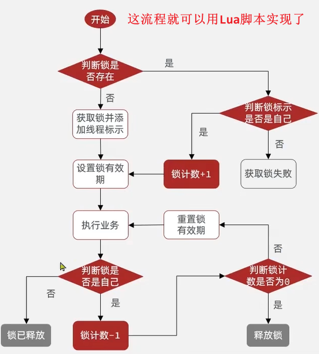  
> Lua是一门编程语言，Redis提供了Lua脚本的功能，你可以在一个Lua脚本中编写多条redis命令，可以确保多条命令执行的**原子性**
> 利用Hash结构实现的redis可重入锁的Lua脚本参考：[link](https://www.bilibili.com/video/BV1cr4y1671t?t=780.5&p=66)

* **实际上redission自带的默认的tryLock()和unlock()底层走的就是这一段Lua脚本！就是可重入的**

##### redission是如何实现可重试的

如果我们设定了waitTime=1，则1s内会重试，但并不是一直轮询重试！精髓在于：利用了消息订阅机制，等你释放了再去尝试获取锁，cpu友好很多。

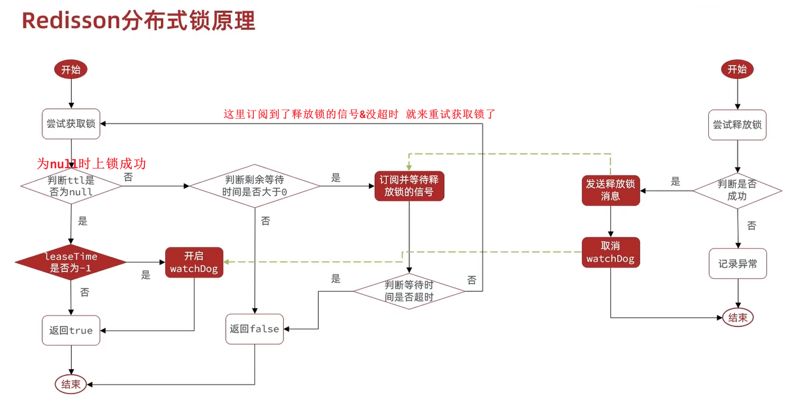  


##### redission是如何解决锁超时的问题的

Q: 什么是锁超时？
A: 我获取锁成功，锁有个ttl，但我业务阻塞了，还没执行完业务，锁ttl就到期了；这时候其他线程来获取了锁，就出问题了；即我们必须保证锁是因为我业务执行完毕而释放

leaseTime=-1默认时，默认值是30s，即30s会后自动释放；默认-1才有看门狗机制，如果自己设定了leaseTime则没有看门狗机制

watchDog看门狗机制：获取锁成功之后，开启一个定时任务，这个任务每隔一段时间(`releaseTime/3=10s`)就会去重置锁的超时时间，ttl满血复活

### 异步秒杀优化

首先，众所周知，串行很慢（同步式）
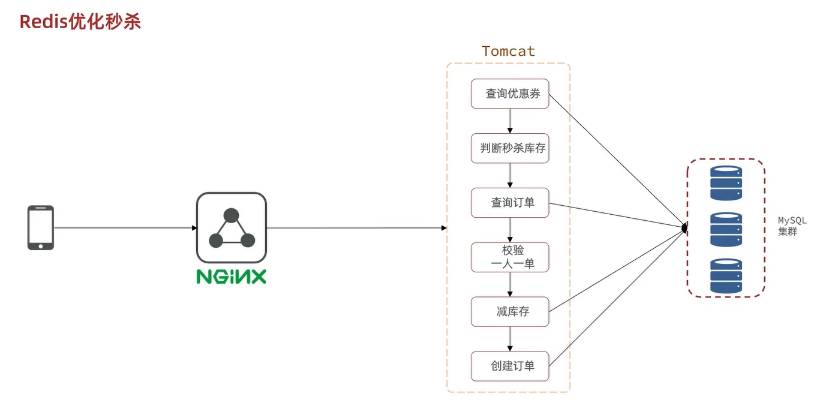  

故而异步完成，资格校验逻辑交给redis实现(lua保证原子性)，然后把**消息(用户ID，优惠券id，订单id)** 发给mq即可，此时下单就结束了，mq异步处理即可。
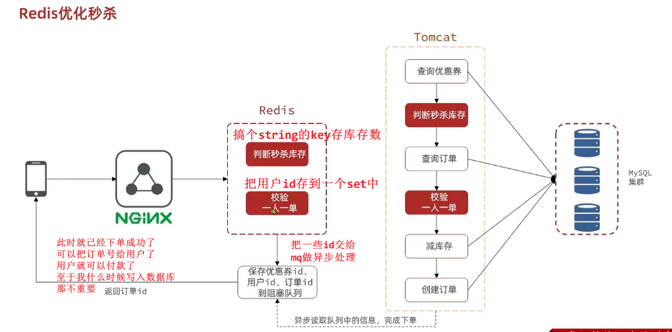  
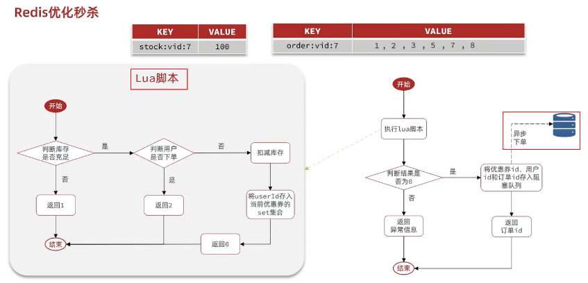  
> 我们将同步的写数据库操作，改为异步操作，一方面缩短秒杀业务的流程，从而大大**提高业务的并发**，另一方面**减轻了数据库压力**

1. 将优惠券库存存到redis中(string)
2. （生产者）基于lua脚本，判断库存是否充足、一人一单，进行秒杀资格校验（用不上俺的redission了，~~白雪~~
3. （生产者）如果抢购成功，则将优惠券id，用户id封装后存入rabbitmq消息队列/`BlockingQueue` [link](https://github.com/haopengmai/dianping/blob/e79be6b67ac5e0e6e3f0818cb6f9a9292cbedd11/src/main/java/com/hmdp/service/impl/VoucherOrderServiceImpl.java#L66-L97)
   1. `mqSender.sendSeckillMessage(JSON.toJSONString(voucherOrder))`
   2. [MQSender](https://github.com/haopengmai/dianping/blob/e79be6b67ac5e0e6e3f0818cb6f9a9292cbedd11/src/main/java/com/hmdp/rebbitmq/MQSender.java#L14-L26)
4. （消费者）mq消费者不断从queue中获取消息，实现异步下单（扣减stock库存(乐观锁)，保存订单）
   1. [MQReceiver](https://github.com/haopengmai/dianping/blob/e79be6b67ac5e0e6e3f0818cb6f9a9292cbedd11/src/main/java/com/hmdp/rebbitmq/MQReceiver.java#L20-L61)(line41-47是没必要的，前面已经校验过了)

```lua
-- 1.参数列表
-- 1.1优惠卷id
local voucherId = ARGV[1]
-- 1.2用户id
local userId = ARGV[2]

-- 2.数据key
-- 2.1库存key
local stockKey = 'seckill:stock:' .. voucherId
-- 2.2订单key
local orderKey = 'seckill:order:' .. voucherId

-- 3.脚本业务
-- 3.1判断库存是否充足
if(tonumber(redis.call('get',stockKey)) <= 0)then
    -- 3.2 库存不足 返回1
    return 1
end
--3.2判断用户是否下单 (我们是把userid存到一个set中的)
if(redis.call('sismember',orderKey,userId) == 1) then
    -- 3.3存在,说明是重复下单
    return 2
end
-- 3.4扣库存（后续下单过程会去扣减mysql的库存）
-- 请注意这里已经在redis中扣库存了，即已经把商品的库存分配给了这个用户
-- 其他人是买的时候库存少了一个，如果用户超时未支付的话，那总体就少抢一个
redis.call('incrby',stockKey,-1)
-- 3.5下单并保存用户（存到set中）
redis.call('sadd',orderKey,userId)
return 0
```


**Q: 基于阻塞队列BlockingQueue异步秒杀有啥问题？**
A: **内存限制问题**：这玩意儿使用jvm内容，高并发时候可能有巨多消息塞进来，直接**塞爆内存**，所以我们设置了个长度，但如果存满了呢？就塞不进去消息了，**消息丢失**；mq是jvm以外的东西，跟你jvm内存没鸟关系
第二，**数据安全问题**：如果服务突然宕机，内存的信息无了，消息丢了；jvm没有持久化机制；mq可以确保数据安全、可以持久化、消息确认，确保消息至少被消费一次


**Q: Redis有哪些mq的实现方式？**

1. 基于List模拟mq: `lpush+rpop/brpop` or `rpush+lpop/blpop` 
   1. brpop会blocking，rpop没消息时直接返回null
   2. 优点：内存没啥限制 + 数据可以持久化
   3. 缺点：无法避免消息丢失；只支持单消费者
2. 基于发布订阅模型PubSub（不完善：消费者可以订阅1或多个channel，生产者向对应channel发消息，所有订阅者都能收到
   1. 优点：支持多生产多消费
   2. 缺点：不支持持久化...(这玩意儿**不是个数据类型**，他就不能持久化...)；发送后如果没人收直接丢失
3. 比较完善的消息队列Stream（redis5.0
   1. Stream是一种数据类型，所以可以持久化
   2. 消息可以被多个消费者读取；消息可回溯，读完不会删掉

#### 利用延时消息机制取消超时未支付订单

之所以要取消超时订单：我这边给你发消息时已经在redis中扣了库存，别人买的时候库存就少一个。

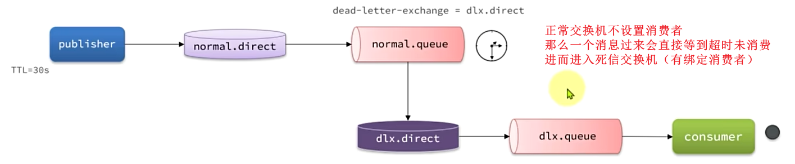

用户**下单**完成后，发送一个异步消息给消息队列，让消息队列去处理库存，同时还要发一个延时消息(15min)，到期后判断用户**支付**状态，如果是已完成，那啥事儿没有，如果是未支付，则应该恢复库存

#### 限流器算法

> sentinel默认限流模式是滑动时间窗口，sentinel限流后可以快速失败和排队等待，其中排队等待基于漏桶算法，而热点参数限流基于令牌桶算法

1. 固定窗口算法
   1. 原理：在一个固定的时间窗口内（如1秒），维护一个计数器记录请求次数。当请求次数达到设定的阈值时，后续请求将被拒绝，直到时间窗口重置
   2. 优点：实现简单，适用于基本的限流需求
   3. 缺点：在时间窗口边界可能问题，即1秒的后半秒+2秒的前半秒之和超过了阈值，本应该限流，但固定窗口无法限流
2. 滑动窗口算法
   1. 原理：将时间窗口(eg 1s)划分为多个小时间段，**每个子窗口独立计数**。随着时间的推移，窗口会滑动，移除过期的请求记录。
   2. 优点：相较于固定窗口算法，能更平滑地处理请求，减少突刺现象
   3. 缺点：实现复杂度增加，仍然可能在边界条件下出现问题
   4. **注意**：滑动窗口又分为**固定大小的滑动窗口**（即上述将一个窗口分为n个小窗口，然后在每个小窗口内搞一个单独的计数器计数），又分为**动态滑动窗口**（无需小窗口，根据时间戳动态管理）
3. 漏桶算法
   1. 原理: 维护**一个请求队列/桶**，请求以不确定速率流入，但以固定速率流出。若队列已满，新请求将被丢弃。
   2. 优点：能够**平滑处理请求**流量，确保系统稳定性。
   <!-- 3. 缺点：无法处理突发流量，所有请求都需排队 -->
4. 令牌桶算法
   1. 原理：维护**一个存放令牌的桶(一个计数器而已)**，**以固定速率向桶中添加令牌**。每次请求需要消耗一个令牌，如果桶中没有足够的令牌，请求将被拒绝或阻塞。

#### 基于ZSet实现滑动窗口限流器

> 每秒请求数：一般情况下，对于大多数电商平台，建议每秒限制在100到1000个请求之间。这一范围可以根据实际情况进行调整。例如：
> * 对于高性能系统，可以设置为每秒1000个请求。
> * 对于普通系统，则可以设置为每秒300到500个请求。

假设每个用户的请求都要记录时间戳，并基于时间戳统计请求次数。
> **但记录每个请求的时间戳有缺陷**...第一比较慢，第二耗内存；不如`expire + incr`这种**固定窗口算法**来的爽快可能，虽然也可以利用redis实现固定大小的滑动窗口（但我暂时就这样了，zset秀一点...

Redis实现滑动窗口限流步骤：

1. 每次请求时记录请求的时间戳，插入到Redis中一个全局的ZSET中，**所有用户的请求时间戳都记录在同一个集合中**, (score和member都是时间戳)
   1. `ZADD voucher:{voucherId}:requests currentTime currentTime`
2. 删除超过时间窗口外的请求，即删除比当前时间戳早的记录（如1秒以前的请求） (`根据score的range删除: ZRemRangeByScore`)
   1. `ZREMRANGEBYSCORE voucher:{voucherId}:requests 0 (currentTime - 1000)`
3. 统计1秒内的总请求数 (`前面删完了，此处即统计zset中元素个数: zcard`)
   1. `ZCARD voucher:{voucherId}:requests`
4. 如果超过阈值，则限流，没有的话，走下面的秒杀逻辑

```java
public Result seckillVoucher(Long voucherId) {
        String key = "voucher:" + voucherId + ":requests";
        long currentTime = Instant.now().toEpochMilli(); // 获取当前时间戳（毫秒）
        // 1. 记录当前请求的时间戳到Redis（所有用户共享同一个集合）
        jedis.zadd(key, currentTime, String.valueOf(currentTime));
        // 2. 删除时间窗口之外的请求（即1秒前的请求）
        jedis.zremrangeByScore(key, 0, currentTime - TIME_WINDOW);
        // 3. 获取1秒内的总请求数量
        long requestCount = jedis.zcard(key);
        // 4. 判断是否超过限流数量
        if (requestCount > REQUEST_LIMIT) {
            // 超过限流，返回限流提示
            return Result.fail("请求过于频繁，请稍后再试！");
        }
        // 5. 请求未超限，执行秒杀逻辑
        // TODO: 秒杀逻辑
        return Result.success("秒杀成功！");
    }
```
