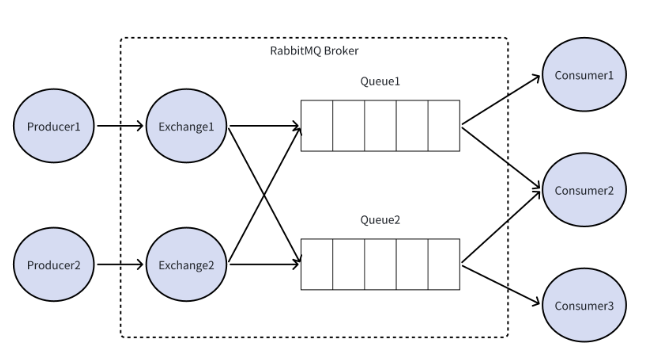

# 消息队列

- [消息队列](#消息队列)
  - [RabbitMQ特点 ☆☆](#rabbitmq特点-)
  - [为何要用mq/作用 ☆☆](#为何要用mq作用-)
  - [RabbitMQ整体模型 / AMQP协议 ☆☆](#rabbitmq整体模型--amqp协议-)
  - [Exchange类型 ☆☆☆](#exchange类型-)
    - [RabbitMQ工作模式/通讯模式](#rabbitmq工作模式通讯模式)
  - [RabbitMQ如何保证消息不丢失 ☆☆☆](#rabbitmq如何保证消息不丢失-)
    - [生产者-\>RabbitMQ](#生产者-rabbitmq)
    - [消息在RabbitMQ中的保障](#消息在rabbitmq中的保障)
    - [RabbitMQ-\>消费者](#rabbitmq-消费者)
  - [RabbitMQ如何保证消息有序 ☆☆](#rabbitmq如何保证消息有序-)
  - [如何保证消息的幂等性/解决消息重复消费](#如何保证消息的幂等性解决消息重复消费)
  - [mq中消息积压导致消息过期怎么办](#mq中消息积压导致消息过期怎么办)
  - [可靠性](#可靠性)
  - [死信队列是什么](#死信队列是什么)
  - [延时队列是什么](#延时队列是什么)
  - [mq vs. 多线程异步](#mq-vs-多线程异步)

> 本文基于RabbitMQ书写，其他MQ可能具备相似但不同的特性

## RabbitMQ特点 ☆☆

RabbitMQ是一种基于AMQP(高级消息队列协议)的**开源**消息中间件。核心基于生产者-消费者模型。

1. 高**可靠**性：支持**消息持久化**、**消息确认机制**和事务机制，确保消息不会丢失
2. **路由机制灵活**：通过交换机和绑定规则，支持多种消息分发模式（eg 直连、广播、主题）
3. **高可用**：支持集群部署和镜像队列（即使一个节点挂了，也不会丢失数据）
4. 支持多语言：提供java，python，.Net等客户端库
5. 支持多种协议：兼容AMQP、STOMP、MQTT等多种协议

## 为何要用mq/作用 ☆☆

> 解耦，异步，削峰

* **解耦**：生产者和消费者不再直接交互，而是通过消息队列进行通信。某一系统的故障不会直接影响到其他系统。eg 电商平台可以在订单处理时将信息发送到消息队列，即使下游系统暂时不可用，也不会影响用户下单
* **异步处理**：许多操作不需要同步地立即完成，例如订单创建和库存更新。通过使用消息队列，这些操作可以异步进行，从而减少整体处理时间，提高性能
* **流量控制与削峰**：在高并发场景下，如秒杀活动，订单系统使用消息队列做**缓冲**，把一秒内下的订单分散成一段时间来处理，系统可以**在低峰期逐步处理这些请求**，保持稳定性，防止崩溃

## RabbitMQ整体模型 / AMQP协议 ☆☆

AMQP协议基于TCP/IP，rabbitmq/AMQP示意图如下：

<!--    -->

  

- producer/publisher：生产者是发布消息的程序。**指定消息内容和路由信息，无需关心消息的具体去向，仅仅是将消息发送到交换机**
- consumer：消费者**订阅消息队列queue**，然后从队列中获取消息并消费。
- queue：队列，是**存储消息的==容器==**。生产者投递的消息会**暂存**在消息队列中，等待消费者处理，充当缓冲区的角色
- exchange：交换机，核心组件：负责接收生产者发布的消息，并 **==根据一定的规则将消息路由到一个或多个队列queue中==**
  - **交换机不保存消息，只是负责转发到queue**
  - 交换机的类型决定了它如何处理收到的消息
- binding（exchange的绑定）：交换机的消息路由过程由队列的绑定方式决定。**exchange通过binding将queue与自己关联**（即一个路由键指定绑定规则
- 
<!-- - virtual host：虚拟主机，起到**数据隔离**的作用。每个虚拟主机相互独立，有各自的exchange、queue -->

## Exchange类型 ☆☆☆

> 注意**生产者生产的每个消息**都可以有rountingKey，你可以发到不同的exchange，但有的会忽略rountingKey，比如fanout, headers exchange；**对于direct和topic，必须要指定rountingKey**

* **Direct Exchange**（直连交换机）：根据消息的RoutingKey（路由键）精确匹配，将消息发送给绑定了相同rounting key的queue
  * 如果没有匹配的，则丢弃消息
  * 适合点对点的消息传递场景
* **Fanout Exchange**（扇形交换机）：忽略rountingKey，将消息**广播**到所有绑定的queue
  * 适合发布订阅模式，eg 广播通知
* **Topic Exchange**（主题交换机/**通配符订阅**）：根据rountingKey的模式匹配（eg 使用通配符*和#），将消息路由到符合条件的队列
  * `*`匹配单个**单词**，`#`匹配0-n个**单词**
  * 类似于Direct基于rountingKey，但是可以使用通配符，适合**复杂的路由场景**
  * 例如，队列1绑定到topic交换机，并指定routingKey为`animal.*`（即匹配以`animal.`开头的任意routingKey）。当生产者发送消息时，会带上routingKey，然后topic交换机会根据路由键的匹配规则，将路由键以`animal.` 开头的消息路由到队列1。
* **Headers Exchange**（头交换机/**头匹配**）：不依赖rountingKey，而是根据消息的`headers`属性与队列绑定的`headers`参数匹配。
  * 适用于需要**根据消息的多个属性**进行过滤和路由的场景

### RabbitMQ工作模式/通讯模式

* **简单模式**: 一个生产者对应一个消费者，mq相当于是个代理，负责将生产者的消息传给消费者
  * eg 发送接受电子邮件(发件人-单一收件人)
* **工作队列模式(work queues)**: 一个生产者对应多个消费者，但消息只被某个消费者消费，适用于单个消费者处理不过来的场景
  * eg 一个订单需要10s处理，你不能逮着一个消费者串行地使劲薅吧
* **发布订阅模式(publish/subscribe)/fanout exchange**：一次向多个消费者发送消息，将消息将广播到所有的消费者（单生产者、多消费者、多队列(基于**fanout交换机**实现)
  * eg 更新商品库存后需要通知多个缓存和多个数据库。
* **路由模式(routing)/direct exchange**：根据Routing Key有选择地接收消息。不同的消息交给不同的队列消费（单生产者、多消费者、多队列(基于**Direct交换机**实现，队列与交换机绑定时制定一个rounting key)
* **主题模式**(Topic)/topic exchange: 也是基于routing key，只不过是可以在rountingKey中使用通配符了（#和*等），而direct中rountingkey必须是多个单词，以`.`分割

  

## RabbitMQ如何保证消息不丢失 ☆☆☆

RabbitMQ提供了很多保障机制，分为三个阶段：**生产者->RabbitMQ，RabbitMQ自身，RabbitMQ->消费者**：`事务Confirm，持久镜像，Ack死信队列`

### 生产者->RabbitMQ

**两种机制互斥**，不可同时使用，否则mq报错。这两者都是**生产者开启的**

1. **事务机制**：生产者通过开启事务（`channel.txSelect()`），可以确保消息被成功写入RabbitMQ，如果消息写入失败，事务会回滚，生产者可以重新发送消息。
   1. 特点：**可靠，但性能低**，因为**每次发送消息都需要等待mq的确认**。
2. **Confirm机制**：生产者设置confirm模式后，每条消息都会分配一个唯一ID。当消息成功写入mq后，mq返回一个ACK。入围成功写入mq，mq返回一个NACK，生产者重发。
   1. 特点：**性能高，适合高吞吐量场景**

### 消息在RabbitMQ中的保障

1. **持久化**：生产者可以将消息标记为持久化模式(`deliveryMode=2`)，mq会将**消息持久化**到磁盘，而非内存。（确保mq重启后消息不丢
   1. 同时，**队列也需要持久化**（`durable=true`），确保队列本身在mq重启后不丢
2. **集群/镜像模式**：镜像模式下消息会在多个节点之间同步，即使某节点宕机，其他节点可以顶上，避免消息丢失。
   1. 特点：更可靠；但增加网络开销和存储成本

### RabbitMQ->消费者

1. **BasicAck机制**：消费者处理完消息后，需要向mq发送确认(`basicAck`)，如果消费者处理消息时发生异常（eg网络中断），**mq会重新将消息发送给其他消费者，或者等这个消费者活了再发**（~~真聪明~~
2. **死信队列**(Dead Letter Queue, DLQ)：对于**多次重试仍无法成功消费的消息**，mq会将其转移到死信队列。私信队列用户后续人工排查，**避免消息直接被丢弃**
   1. 基于DLQ我们可以做一个订单超时未支付取消功能（多次重试还没消费嘛
3. 消息补偿机制：通过定时任务定期检查未处理的消息，并重新触发消费

## RabbitMQ如何保证消息有序 ☆☆

## 如何保证消息的幂等性/解决消息重复消费

> 所谓幂等就是无论这个消息被消费多少次，最终结果应该是一样的，eg 支付场景下一个扣款消息，如果重复扣款，最终也只能扣一次...从消费者角度不让重复消费时一个解决方案，还有其他方案 TODO

消息重复的原因有两个：1.生产时消息重复，2.消费时消息重复。

* 生产者发送消息给MQ，在MQ确认的时候出现了网络波动，生产者没有收到确认，这时候生产者就会重新发送这条消息，导致MQ会接收到重复消息
* 消费者消费成功后，给MQ确认的时候出现了网络波动，MQ没有接收到确认，为了保证消息不丢失，MQ就会继续给消费者投递之前的消息。这时候消费者就接收到了两条一样的消息
* 由于重复消息是由于**网络原因**造成的，无法避免

解决方法（也就是说允许你生产者重复生产咯，我消费时不重复消费就行了，确实...

* 发送消息时让每个消息携带一个**全局唯一ID**，在消费消息时先判断消息是否已经被消费过，**保证消息消费逻辑的幂等性**
* 例如引入数据库或者redis：
  * 数据库唯一主键去重：主键是不能冲突的，重复的数据无法插入
  * 引入Redis**解决重复消费**问题
    * 利用Redis，首先系统生成全局唯一的id，用set操作放入Redis中
    * 如订单信息id，消费后存储在Redis中，如果下次再来，先查看Redis中是否存在，如果存在，即此消息已经被消费过（后续不做消费处理）；如果不存在，即未消费，此时再将此id存入Redis中，进行后续的逻辑操作

综上，消费过程为：

* 消费者获取到消息后先根据id去查询redis/db是否存在该消息
* 如果不存在，则正常消费，消费完毕后写入redis/db
* 如果存在，则证明消息被消费过，直接丢弃

## mq中消息积压导致消息过期怎么办

* 如果消息在queue中积压超过一定的时间就会被rabbitmq给清理掉，这个数据就没了
* 解决方案：**批量重导**。就是大量积压的时候，我们当时就直接丢弃数据了，然后等过了高峰期以后，这个时候我们就开始写程序，**将丢失的那批数据，写个临时程序，一点一点的查出来，然后重新灌入mq**里面去，把白天丢的数据给他补回来。
  * 假设1万个订单积压在mq里面，没有处理，其中1000个订单都丢了，你只能手动写程序把那1000个订单给查出来，手动发到mq里去再补一次

## 可靠性

https://blog.csdn.net/sluck_0430/article/details/136266002

## 死信队列是什么

私信队列Dead Letter Queue (DLQ): **消费失败**的消息存放的队列

消息消费失败的原因：

* 消息被拒绝 & 不重新入队
* 消息超时ttl未消费
* 队列达到最大队列长度，最早的消息成为死信

如果队列通过`dead-letter-exchange`属性指定了一个交换机，那该队列中的死信就会投递到该**死信交换机**中，然后被路由到死信队列。可以监听死信队列中的消息做相应的处理。

可以**隔离**异常消息，避免影响正常消息，提高了**健壮**性，开发者也方便排查问题

## 延时队列是什么

延迟队列：消息进入队列后**不会立即被消费**，只有到达指定时间后，才会被消费

需求：

* 下单后，**30分钟未支付，取消订单，回滚库存**
* 新用户注册成功7天后，发送短信问候（原来如此

  
> 可以看到：有正常交换机+正常队列 和 死信交换机+死信队列+死信消费者

在RabbitMQ中并未提供延迟队列功能。但是可以使用：**TTL + 死信队列**组合实现延迟队列的效果
Specifically：
在创建队列是设置消息在队列中的存活时间ttl，由于正常队列没有消费者，消息一定会超时进入死信队列，监听死信队列的消费者就可以获取然后执行任务
> RabbitMQ中还可以通过社区中大佬写的插件直接将普通队列改造为延时队列

## mq vs. 多线程异步

* CPU消耗: 多线程异步可能存在CPU竞争，而**MQ不会消耗本机的CPU**
* 削峰或者消息堆积能力: 当业务系统处于高并发，MQ可以将消息堆积在Broker实例中，而**多线程会创建大量线程，甚至触发拒绝策略**
* 使用MQ引入了中间件，增加了项目复杂度和运维难度。
* 故而，规模比较小的项目可以使用多线程实现异步，大项目建议使用MQ实现异步
