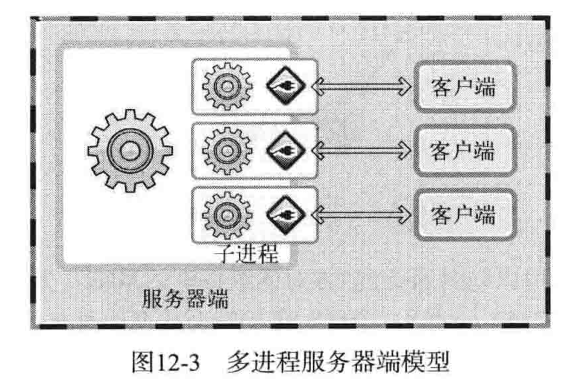
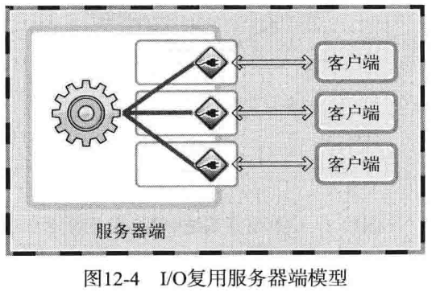

# notes of 30dayMakeCppServer

服务器种类：
无并发服务器：
1.单一服务器和单一客户端
2.单一服务器和多个客户端 但是客户端需要串行执行 后面的等待前面的客户端执行结束（即迭代服务器） 本质上没改变

并发服务器
1.多进程服务器

2.多线程服务器
3.IO多路复用服务器
  
4.IO多路复用+多线程

## day03 高并发epoll

所有的服务器都是高并发的，可以同时为成千上万个客户端提供服务，这一技术又被称为**IO复用**。
> IO复用和多线程有相似之处，但绝不是一个概念。IO复用是针对IO接口，而多线程是针对CPU。
在Linux系统中，IO复用使用select, poll和epoll来实现。epoll改进了前两者，更加高效、性能更好，是目前几乎所有高并发服务器的基石。