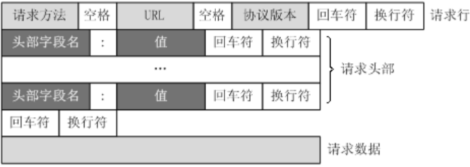
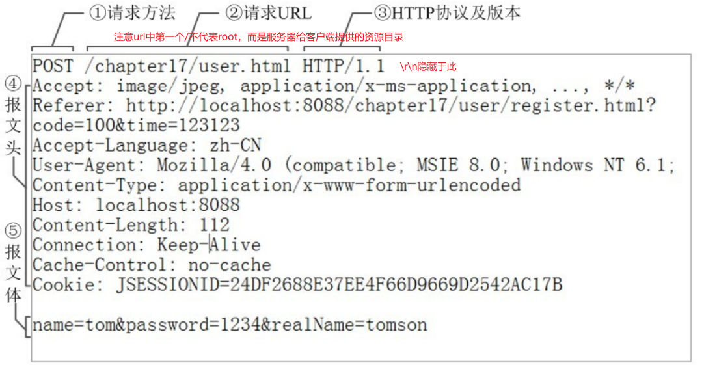
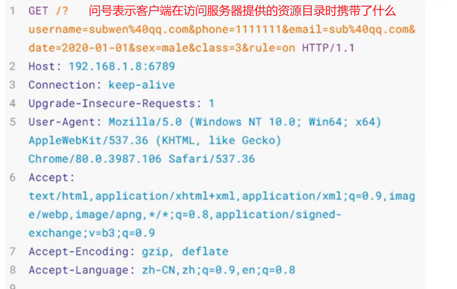
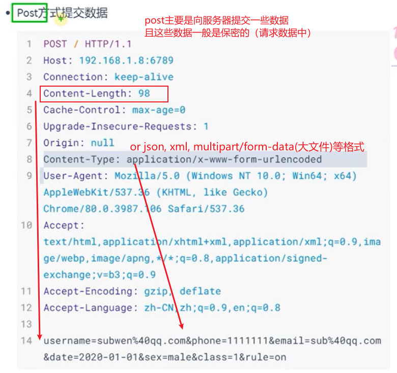
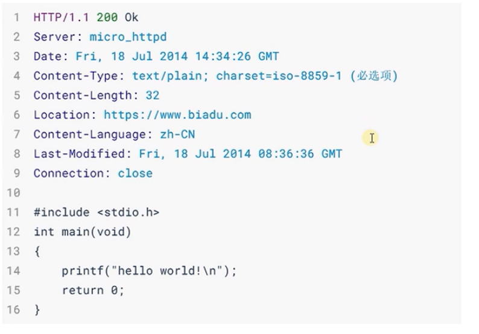
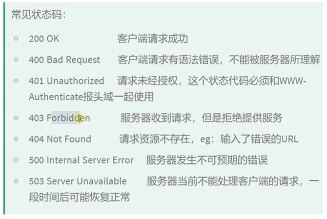
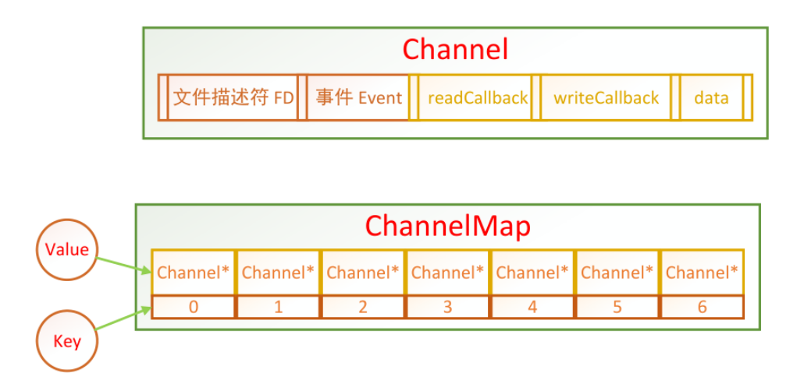

# note

## 基于epoll的多线程服务器

### http

**http请求**
  
  

http封装好数据之后形成一个数据块，得到若干行数据，每一行的结尾是\r\n换行符

get请求也可以携带数据（请求行中）：
  
浏览器地址栏缓存大概是8k，所以携带数据有限

get请求的请求数据一定是空的，它的数据会在请求行中，所以不是保密的；

post向服务器提交数据：
  

**http响应**
  
  

## 多反应堆线程池

channel模块：封装一个文件描述符fd，可能用于连接或者通信
  

dispatcher模块（核心）

