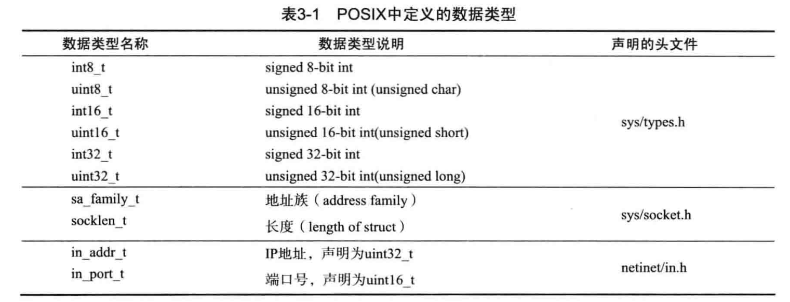

# 网络编程基础API

1.判断机器字节序

```c
#include <stdio.h>
void byteorder() {
    union {
        short value;
        char union_bytes[sizeof(short)]; // char array, 长度为2, 所以能存16bit
    } test; // union可以在同一块内存中存储不同类型的数据
    test.value = 0x0102;
    if ((test.union_bytes[0] == 1) && (test.union_bytes[1] == 2)) {
        printf("big endian\n");
    } else if ((test.union_bytes[0] == 2) && (test.union_bytes[1] == 1)) {
        printf("little endian\n");
    } else {
        printf("unknown...\n");
    }
}
```

---

通用socket地址结构体sockaddr

```c
#include <bits/socket.h>
struct sockaddr {
    sa_family_t sa_family; // 地址族类型(sa_family_t)
    char sa_data[14];
}
```

由于PF_INET地址需要6字节(16bit端口号 + 32bit ipv4地址) PF_INET6需要26字节(16bit端口，128bit ipv6, 32bit流信息, 32bit 范围ID)，所以上面的sa_data不够，so:

```c
#include <bits/socket.h>
struct sockaddr_storage {
    sa_family_t sa_family;
    unsigned long int __ss_align;
    char __ss_padding[128 - sizeof(__ss_aligh)]; // 最大128个char，即128byte；用来填充剩余空间
}
```

由于上面这个不方便使用，so搞了几个专门的socket地址结构体，IPv4，IPv6：
这些专用的结构体使用的时候，需要将其转换为sockaddr（将专用结构体指针转为sockaddr*）

```c
#include <sys/un.h>
// IPv4
struct sockaddr_in {
    sa_family_t sin_family;     // 地址族AF_INET
    uint16_t sin_port;         // 端口号 2byte 
    struct in_addr sin_addr;    // 地址结构体；设计成两个便于使in_addr被其他结构体共享复用
    char sin_zero[8];           // not use, 保证和sock_addr大小一致
}
struct in_addr {
    in_addr_t s_addr;           // ipv4地址 4byte 网络字节序
}

// IPv6
struct sockaddr_in6 {
    sa_family_t sin6_family;     // 地址族 AF_INET6
    uint16_t sin6_port;         // 端口号
    uint32_t sin6_flowinfo;     // 流信息         
    struct in6_addr sin6_addr;  
    uint32_t sin6_scope_id;     // scope id
}
struct in6_addr {
    unsigned char sa_addr[16];   // 字符数组(因为ipv6有字母!) 网络字节序
}
```

> POSIX中定义的数据类型 (Portable Operating System Interface) for UNIX
>  

ip转换

```c
#include <arpa/inet.h>
in_addr_t inet_addr(const char* string);            // ipv4点分十进制 -> 32bit整型 网络字节序（大端）
// 还可用于检测ipv4有效性，无效返回INADDR_NONE
int inet_aton(const char* cp, struct in_addr* addr); // 同上，使用更高频；自动将结果存于addr中； ascii to net
char* inet_ntoa(struct in_addr in);                 // 网络字节序 -> 点分十进制
```

<!-- 补充：

```cpp
// 适用于4和6的函数
int inet_pton(int af, const char* src, void* dst);
const char* inet_ntop(int af, const void* src, char* dst, socklen_t cnt);
``` -->
---

主机字节序(host byte order)是小端字节序(little endian)
网络字节序(network byte order)是大端字节序(big endian)
二者之间的转换

```c
#include <netinet/in.h>
unsigned long htonl(unsigned long hostlong);
unsigned short htons(unsigned short hostshort);
unsigned long ntohl(unsigned long netlong);
unsigned short ntohs(unsigned short netshort);
```

> 除了向socket_in结构体变量填充数据之外，其他情况无需考虑字节序问题，eg 传输数据的时候是自动转换的。


---
API of socket

```c
#include <sys/types.h> 
#include <sys/socket.h>
int socket(int domain, int type, int protocol);
int bind(int sockfd, const struct sockaddr* my_addr, socklen_t addrlen);
int listen(int sockfd, int backlog);
int accept(int sockfd, struct sockaddr *addr, socklen_t *addrlen);
int connect(int sockfd, const struct sockaddr *serv_addr, socklen_t addrlen);
```

> 服务器端需要bind socket，客户端不需要，connect会自动分配采用匿名socket。