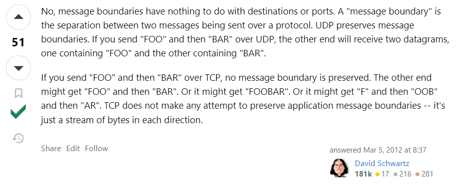

# notes

## chapter 01

0.解释一下socket。

Socket是**应用程序和操作系统内部的协议栈**(TCP,UDP)之间的桥梁；
Socket是**应用层和传输层**之间的接口，即在传输层之上。
网络编程的大部分内容就是设计并实现**应用层**协议，根据程序特点决定服务器端和客户端之间的**数据传输规则**；而链路层、网络层和传输层已经由**套接字**自动处理了，使得程序员从这些细节中解放出来；

1.底层 I/O 函数与 ANSI 标准定义的文件 I/O 函数有何区别？

文件I/O/低级磁盘I/O，遵循POSIX相关标准。任何兼容POSIX标准的os上都支持文件I/O。
这些函数提供了对文件的基本操作，如打开、关闭、读取、写入和移动文件指针等。它们通常是操作系统提供的，**与特定的操作系统和文件系统相关**。例如，在 Unix/Linux 系统中，底层 I/O 函数可能包括 open()、close()、read()、write() 等函数。在 Windows 中，同样可以使用底层 I/O 函数（如 CreateFile()、ReadFile()、WriteFile()
> windows严格区分文件io函数和socket io函数

标准I/O/高级磁盘 I/O，遵循ANSI C相关标准。只要开发环境中有标准I/O库(eg stdio.h)，标准I/O就可以使用。
用于**实现跨平台的文件操作**。这些函数包括 fopen()、fclose()、fread()、fwrite() 等。这些函数提供了对文件的高级操作，同时也提供了对底层 I/O 函数的**封装**，使得在不同的操作系统上都能够使用相同的接口来操作文件。**抽象，可移植**。windows和linux都是这些函数

2.数据传输类型
面向连接的套接字(SOCK_STREAM)：可靠的、按序传递的、无数据边界的、基于字节的面向连接的套接字；
面向消息的套接字(SOCK_DGRAM)：不可靠的、不按序传递的、有数据边界的、以数据高速传输为目的的的套接字；
> IP层是面向消息的、不可靠的，只关注一个数据包的传输过程，不保证传输顺序；
> 底层使用简单的功能，不然你让UDP怎么办？

3.**端口号就是在同一个操作系统内为区分不同应用程序（应用程序套接字）而设置的**，每个套接字对应一个port。port range: [0, 65535] (16bit), [0, 1023] are well-known port，同一种套接字不可以使用相同的端口号，但tcp和udp之间可以。

4.将服务器端ip设置为INADDR_ANY的作用：自动获取服务器端的ip地址；若由多个ip，只要端口一致，可以从不同ip接收数据；

5.Loopback address环回地址：用于向自身发送通信的一个特殊地址，为同一台设备上运行的应用程序之间的通信提供了一条捷径。同一台主机上的两项服务若使用环回地址而非分配的主机地址，就可以绕开TCP/IP协议栈的下层。通过ping环回地址，还可以测试本地主机上的TCP/IP配置。
> 只有当你希望将数据发送到同一台计算机上的另一个网络应用程序时，才会使用loopback地址。在这种情况下，数据从一个应用程序发送到网络堆栈，然后通过回环接口返回给同一台计算机上的另一个应用程序。

6.为什么客户端不需要bind？

网络数据交换双方必须都要分配ip和port，服务器端会使用bind主动分配ip和port，客户端在调用connect函数时，由操作系统内核自动分配（ip使用主机的ip，端口随机）

7.听说服务端accept函数还会自动产生socket？

是的。服务端调用accept时，os会自动创建新的用于数据io的套接字，返回sockfd，自动与发起连接的客户端建立连接。使用这个套接字与客户端进行io；
最开始创建的socket呢？一直在，在listen的时候成为服务器端监听套接字，得继续守门，因此accept会新建一个socket。

问题：accept返回的套接字如果叫做客户端套接字的话，客户端自己创建的sockfd叫什么？

8.解释一下message boundaries 数据边界。

TCP v.s. UDP

- TCP do not preserve message boundaries (数据边界)
  - TCP收到数据后先存入buffer，只要不超过容量，则可能1次read读完全部数据，当然也可能多次read读取……即tcp中read和write调用次数没啥意义
- UDP preserves message boundaries
  - 存在数据边界意味着read次数 == write次数

所谓TCP粘包？发送方发送的若干包数据到达接收方时粘成了一包
其实并没有粘包这个词儿。。
TCP协议对于应用层来说，没有“包”的概念，只有“流”的概念，即TCP没有数据边界

  
